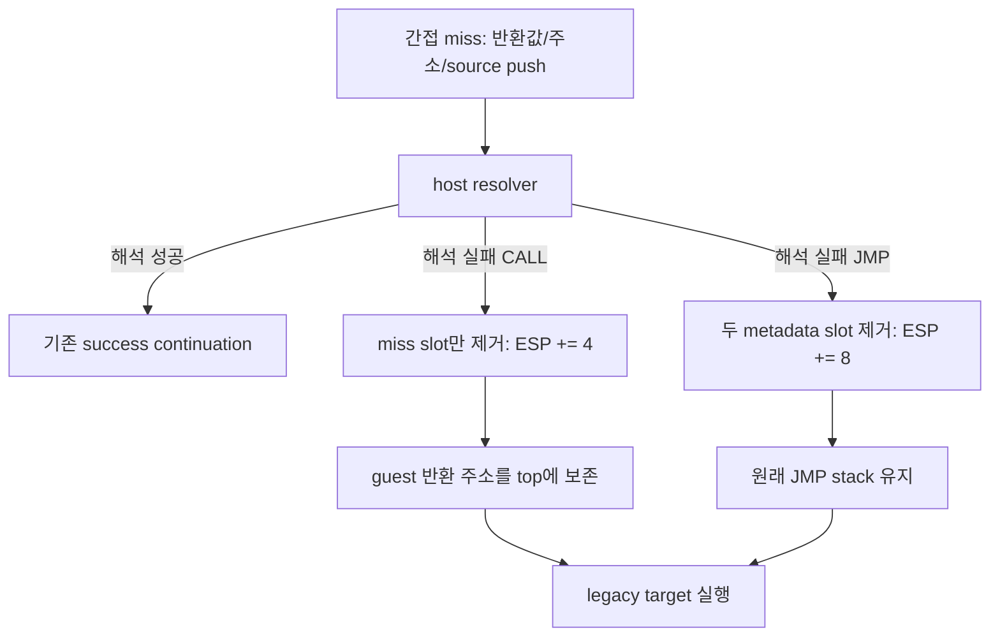

# 20260910-650 설계: Linux x64 간접 CALL fallback stack 의미 보존

## 한국어

### 문제

DBT 간접 전송 miss tail은 CALL과 JMP 모두 metadata 세 개를 guest stack에 넣고 host
resolver를 호출합니다. CALL의 첫 metadata는 guest 반환 주소이지만, 해석 실패 continuation은
현재 `LEA ESP,[ESP+8]`로 남은 두 slot을 모두 제거합니다. 따라서 legacy fallback으로
진입하는 CALL은 반환 주소까지 버리고, 피호출 함수의 첫 PUSH가 그 slot을 덮어씁니다.

실제 `pumpit2a`에서 `0x010F4ACF CALL EAX`의 대상 `0x010F920C`가 동적 AOT 해석에
실패할 때 이 경로가 재현됐습니다. 정상 호출이라면 `0x0158CC70`에 있어야 할
`0x010F4AD1` 대신, 대상 함수의 `PUSH EBX`가 `0x011A7B16`을 기록했습니다.

### 설계

두 진입 경로에서 같은 CALL 의미를 보존합니다.

1. 공용 `HandleAotIndirectTransfer`는 대상 cache 해석 전에 반환 주소 write, ESP 감소,
   call-frame 기록을 완료합니다. 따라서 cache-breakpoint 경로가 해석 실패 후 legacy
   fallback으로 넘어가도 이미 수행된 CALL stack 효과가 유지됩니다.
2. host-dispatch miss tail은 fallback stack 정리량을 instruction kind별로 생성합니다.

CALL fallback은 thunk의 `RET`가 source metadata를 제거한 뒤 miss-address slot 하나만
제거하여, 이미 push된 guest 반환 주소를 `[ESP]`에 남깁니다. JMP fallback은 기존처럼
두 slot을 제거합니다. 원본 guest 코드는 수정하지 않으며 CALL/JMP의 x86 stack 의미만
HLE/DBT 경계에서 보존합니다.

### 검증 전략

* code-cache layout probe에서 CALL fallback은 `LEA ESP,[ESP+4]`, JMP fallback은
  `LEA ESP,[ESP+8]`인지 확인합니다.
* Linux x64 Debug `repiu_core_probe` 전체를 실행합니다.
* 실제 `pumpit2a`에서 `0x0158CC70` writer와 최종 transfer provenance를 다시 측정해
  `0x010F4AD1` 보존 및 기존 zero-target frontier 이동 여부를 확인합니다.

## English

### Problem

The DBT indirect-transfer miss tail pushes three metadata values on the guest stack for
both CALL and JMP. The first CALL metadata value is the guest return address, but the
current failure continuation removes both remaining slots with `LEA ESP,[ESP+8]`.
An indirect CALL entering legacy fallback therefore discards its return address, and the
callee's first PUSH overwrites that slot.

This was reproduced in real `pumpit2a` when `0x010F4ACF CALL EAX` targeted
`0x010F920C` and dynamic AOT resolution failed. Instead of preserving `0x010F4AD1` at
`0x0158CC70`, the target function's `PUSH EBX` wrote `0x011A7B16` there.

### Design

Preserve the same CALL meaning on both entry paths. The shared
`HandleAotIndirectTransfer` commits the return-address write, ESP decrement, and call-frame
record before attempting target-cache resolution, so cache-breakpoint fallback retains the
already executed CALL semantics. Separately, the host-dispatch miss tail emits cleanup by
instruction kind: after the thunk RET removes source metadata, CALL removes only the miss
address (`ESP += 4`) while JMP removes both remaining slots (`ESP += 8`). This changes no
original guest code and preserves only the x86 CALL/JMP stack contract at the DBT/HLE
boundary.

### Verification strategy

* Assert `LEA ESP,[ESP+4]` for CALL fallback and `LEA ESP,[ESP+8]` for JMP fallback in
  the code-cache layout probe.
* Run the complete Linux x64 Debug `repiu_core_probe`.
* Re-run real `pumpit2a` writer and terminal-transfer provenance traces to confirm that
  `0x010F4AD1` is preserved and that the previous zero-target frontier moves.
