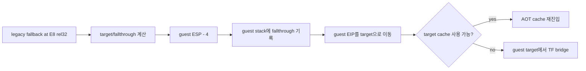

# 20260911-652 설계: Linux x64 legacy fallback direct CALL HLE

## 한국어

### 배경과 확인된 문제

Task 650은 간접 CALL `0x010F4ACF -> 0x010F920C`의 반환 주소를 guest stack에
기록했고, Task 651은 이어지는 legacy stack 명령을 guest ESP 기준으로 처리했습니다.
그런데 실제 `pumpit2a`는 여전히 `0x010F1E56 RET -> 0`에서 종료합니다.

새 실행 증거는 `0x010F920C` prologue가 일곱 PUSH 뒤 `0x010F9214`의 CMP로
끝나며, allocator `0x010F1D74`의 epilogue가 자체 frame을 정확히 복원함을
확인했습니다. 정적 xref의 두 후보 중 실제 분기는 `0x010F9258 CALL
0x010F1D74`입니다. 이 CALL은 AOT coverage가 거절된 original span에서 Trap Flag로
실행되므로 long mode의 host call stack만 변경하고 guest ESP에는 32-bit 반환 주소
`0x010F925D`를 만들지 않습니다.

### 설계

1. x64 `aot_legacy_fallback`의 shared HLE dispatcher에서 `E8 rel32` direct CALL을
   원본 명령 실행 전에 처리합니다.
2. 32-bit guest 규칙대로 target을 먼저 계산하고, guest `[ESP-4]`에 fallthrough를
   기록한 뒤 ESP를 4 감소시키고 EIP를 target으로 바꿉니다.
3. 기존 AOT call-frame 및 call/return trace bookkeeping을 같은 형식으로 남겨
   후속 RET 검증과 provenance가 유지되게 합니다.
4. target 또는 stack slot이 guest arena 밖이면 처리하지 않습니다. i386 및 AOT
   cache의 lowered direct CALL 경로는 변경하지 않습니다.
5. 처리 후 기존 `TryResumeAotAfterHandledHle`가 target cache를 선택하거나 TF bridge를
   유지합니다.

### 검증 전략

합성 arena에서 legacy fallback direct CALL을 shared HLE로 처리하여 target EIP,
guest ESP, 반환 주소, AOT call frame을 확인합니다. Linux x64 Debug 빌드와 전체 core
probe를 통과시킨 뒤 실제 `pumpit2a`에서 `0x010F9258`의 반환 주소가 생성되고
`0x010F1E56`의 RET target이 `0x010F925D`가 되는지 측정합니다.

## English

### Background and confirmed problem

Task 650 wrote the return address for indirect CALL `0x010F4ACF ->
0x010F920C` to the guest stack, and Task 651 applied the following legacy stack
instructions to guest ESP. Real `pumpit2a` still terminates at
`0x010F1E56 RET -> 0`.

New execution evidence shows that the `0x010F920C` prologue ends after seven
PUSH instructions at the CMP at `0x010F9214`, and that the allocator at
`0x010F1D74` restores its own frame exactly. Of the two static xref candidates,
the live branch reaches `0x010F9258 CALL 0x010F1D74`. That CALL executes under
Trap Flag in an original span rejected by AOT coverage, so long mode changes
only the host call stack and never creates the 32-bit guest return address
`0x010F925D` in guest ESP.

### Design

1. Handle `E8 rel32` direct CALL in the shared HLE dispatcher before original
   execution when x64 `aot_legacy_fallback` is active.
2. Follow 32-bit guest ordering: calculate the target first, write the
   fallthrough to guest `[ESP-4]`, decrement ESP by four, and set EIP to the
   target.
3. Preserve the existing AOT call-frame and call/return trace bookkeeping so
   later RET validation and provenance retain the same contract.
4. Decline targets or stack slots outside the guest arena. Do not change i386
   or lowered direct CALLs executing in the AOT cache.
5. Let the existing `TryResumeAotAfterHandledHle` select the target cache or
   preserve a TF bridge after the handled CALL.

### Verification strategy

Use a synthetic arena to dispatch a legacy-fallback direct CALL and verify its
target EIP, guest ESP, return word, and AOT call frame. Build Linux x64 Debug,
run the complete core probe, and then verify that real `pumpit2a` creates the
return address at `0x010F9258` and that RET at `0x010F1E56` targets
`0x010F925D`.
