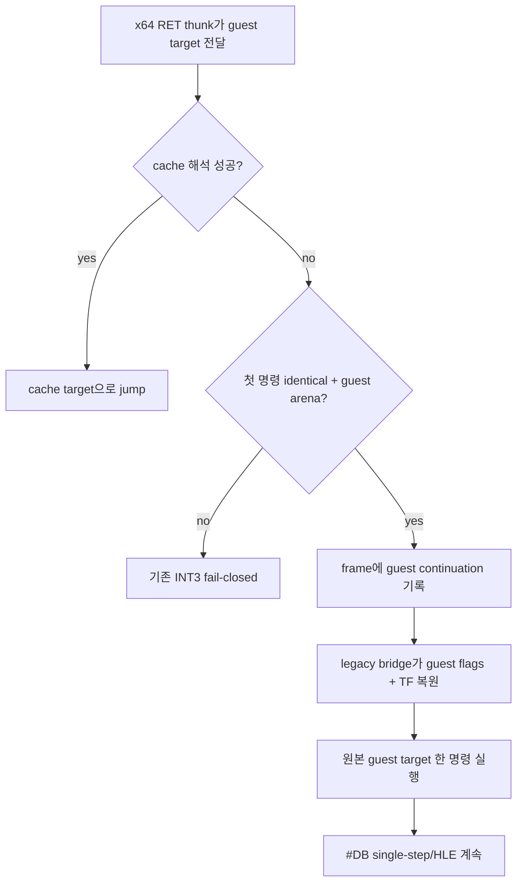

# 20260911-653 설계: Linux x64 unresolved return legacy bridge

## 한국어

### 문제

Task 652는 allocator RET가 올바른 guest target `0x010F925D`를 소비하게 했습니다.
하지만 x64 return thunk의 resolver는 그 target의 동적 AOT 번역이 `0x010F928B`
segment-override coverage에서 거절되면 0을 반환하고 즉시 fail-closed INT3로 끝납니다.
RET의 stack 효과는 이미 cache에서 완료됐으므로 RET를 재실행할 수는 없습니다.

`0x010F925D`의 첫 명령 `MOV EDX,EAX`는 32-bit와 long mode에서 동일한 register-only
명령입니다. 따라서 번역 불가 target의 첫 명령이 공용 long-mode classifier에서
`kIdenticalBytes`로 확인된 경우에 한해, guest register/ESP를 보존한 채 TF를 설정하고
그 guest target으로 이동할 수 있습니다.

### 설계

1. Linux x64 resolver가 cache 해석 실패 후 guest target의 첫 명령을
   `ClassifyLongModeBytes`로 검사합니다.
2. target이 guest arena 안이고 첫 명령이 `kIdenticalBytes`일 때 frame의
   `guest_continuation`에 target을 기록하고 legacy fallback 상태를 설정합니다.
3. resolver는 0 대신 전용 platform bridge thunk 주소를 반환합니다.
4. bridge는 저장된 guest EFLAGS에 TF를 더해 복원하고 guest EAX를 다시 복원한 뒤
   `guest_continuation`으로 jump합니다. 다음 #DB부터 기존 single-step/HLE 경로가
   이어집니다.
5. 동일성이 증명되지 않은 첫 명령, arena 밖 target, zero target은 기존 fail-closed
   동작을 유지합니다.

### 검증 전략

합성 policy probe는 동일한 명령만 bridge 대상으로 승인하고 stack 명령은 거부하는지,
Linux x64 빌드에서 bridge thunk 심볼이 실제로 연결되는지 확인합니다. 전체 core probe로
기존 경계를 회귀 검증하고, 실제 `pumpit2a` 실행 로그에서 resolver가 bridge를 선택해
`0x010F925D`를 실행한 뒤 다음 #DB/HLE 경로로 이어지는지 확인합니다. 그 실행으로 새
frontier도 함께 측정합니다.

## English

### Problem

Task 652 made the allocator RET consume the correct guest target
`0x010F925D`. The x64 return thunk resolver still returns zero and reaches its
fail-closed INT3 when dynamic AOT translation of that target is rejected by
segment-override coverage at `0x010F928B`. The RET stack effect has already
completed in the cache, so the RET itself cannot be executed again.

The first instruction at `0x010F925D`, `MOV EDX,EAX`, is a register-only
instruction with identical 32-bit and long-mode semantics. When the shared
long-mode classifier proves the first instruction is `kIdenticalBytes`, the
runtime can preserve guest registers and ESP, set TF, and continue at the guest
target.

### Design

1. After cache resolution fails, the Linux x64 resolver classifies the first
   instruction at the guest target with `ClassifyLongModeBytes`.
2. If the target is in the guest arena and the first instruction is
   `kIdenticalBytes`, store it in the frame's `guest_continuation` and enter
   legacy-fallback state.
3. Return a dedicated platform bridge thunk instead of zero.
4. The bridge restores saved guest EFLAGS with TF set, restores guest EAX, and
   jumps to `guest_continuation`. The next #DB rejoins existing single-step/HLE.
5. Preserve fail-closed behavior for unproven first instructions, targets
   outside the arena, and zero.

### Verification strategy

A synthetic policy probe verifies that only identical instructions are admitted,
that a stack instruction is refused, and that the bridge thunk symbol is linked
in the Linux x64 build. Run the complete core probe for regression coverage, then
use a real `pumpit2a` trace to verify that the resolver selects the bridge,
executes `0x010F925D`, and rejoins the next #DB/HLE path. The same run measures
the next frontier.
