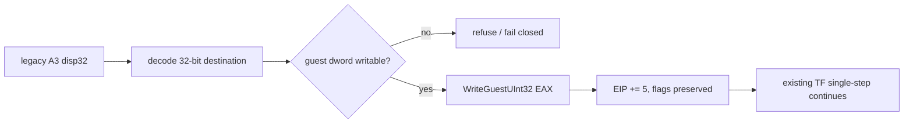

# 20260911-655 설계: legacy fallback moffs32 store HLE

## 한국어

### 문제

Task 654 이후 실제 실행은 `0x010F927C`의 `A3 98 66 1A 01`에서 멈춥니다. 32-bit
guest 의미는 `MOV [0x011A6698],EAX`이고 명령 길이는 5바이트입니다. long mode에서는
같은 `A3`가 8바이트 moffs 주소를 읽어 명령 길이와 대상 주소가 달라집니다. 이 차이는
Task 550/565 classifier와 AOT lowering에서 이미 일반적으로 정의됐지만, 동적 번역이
뒤쪽 segment 명령 때문에 전체 거절된 legacy fallback에서는 원본 bytes가 그대로 실행돼
SIGSEGV가 발생합니다.

### 설계

1. 기존 공용 `HandleTracedMemoryStoreInstruction`에 prefix 없는 `A3 disp32` 형식을
   추가합니다.
2. destination은 opcode 뒤의 little-endian 32-bit offset, value는 guest EAX,
   width는 4, instruction size는 5로 해석합니다.
3. 실제 write는 기존 `IsGuestRangeWritable`과 `WriteGuestUInt32` 경계를 사용합니다.
   따라서 arena 밖 destination은 거부하고 guest-write provenance도 그대로 남깁니다.
4. MOV는 flag를 변경하지 않으므로 EFLAGS는 보존하고 EIP만 5 증가시킵니다.
5. `A0`–`A2`, prefix가 붙은 moffs, load 방향은 이번 실제 frontier 밖이므로 확장하지
   않습니다. AOT cache의 기존 Task 565 lowering도 변경하지 않습니다.

### 검증 전략

합성 legacy HLE probe에서 `A3 disp32`가 EAX를 guest memory에 쓰고 EIP를 5만큼
전진시키며 EFLAGS를 보존하는지 확인합니다. arena 밖 destination은 거부되는지도 함께
확인합니다. Linux x64 Debug 빌드와 전체 core probe를 실행한 뒤 실제 `pumpit2a`에서
`0x010F927C` write와 그 이후 새 frontier를 측정합니다.

## English

### Problem

After Task 654, real execution stops at `A3 98 66 1A 01` at `0x010F927C`.
Its 32-bit guest meaning is `MOV [0x011A6698],EAX`, with a five-byte instruction.
In long mode, the same `A3` reads an eight-byte moffs address, changing both the
instruction length and destination. Tasks 550 and 565 already define this
difference in the classifier and AOT lowering, but when dynamic translation is
rejected as a whole by a later segment instruction, legacy fallback executes
the original bytes and raises SIGSEGV.

### Design

1. Add the unprefixed `A3 disp32` form to the existing shared
   `HandleTracedMemoryStoreInstruction`.
2. Decode the little-endian 32-bit offset after the opcode as the destination,
   guest EAX as the value, width four, and instruction size five.
3. Use the existing `IsGuestRangeWritable` and `WriteGuestUInt32` boundary, so
   an out-of-arena destination is refused and guest-write provenance is retained.
4. Preserve EFLAGS because MOV does not alter flags, and advance EIP by five.
5. Keep `A0`-`A2`, prefixed moffs, and loads out of scope for this observed
   frontier. Do not change Task 565's existing AOT-cache lowering.

### Verification strategy

In a synthetic legacy-HLE probe, verify that `A3 disp32` writes EAX to guest
memory, advances EIP by exactly five, and preserves EFLAGS. Also verify refusal
of an out-of-arena destination. Build Linux x64 Debug and run all core probes,
then measure the real `pumpit2a` write at `0x010F927C` and the next frontier.
