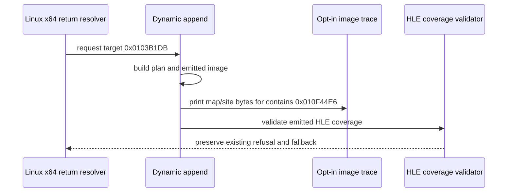

# 20260911-656 설계: Linux x64 segment-override coverage slot trace

## 한국어

### 배경

Task 655 이후 실제 Linux x64 실행은 `0x010F1D71 RET`가
`0x0103B1DB`를 반환 target으로 선택한 뒤 중단됩니다. target의 첫 명령
`8B 46 04`는 byte-identical copy로 분류되지만, 동적 CFG 안의
`0x010F44E6` `66 36 89 07`(`MOV SS:[EDI],AX`)가
`kSegmentOverrideMem`으로 기록되고 전체 HLE coverage 검증이 거절됩니다.

현재 `REPIU_AOT_FALLBACK_TRACE`는 실패한 guest 주소의 plan record만 출력합니다.
따라서 validator가 검사한 emitted cache slot의 실제 bytes와
`AotSegmentOverrideSite` offset을 알 수 없어, emission layout과 validator 기대값의
어느 항목이 다른지 확정할 수 없습니다.

### 설계

기존 dynamic trace에 다음 관측을 추가합니다.

1. `contains` 주소에 대응하는 `AotAddressMapEntry`의 cache offset, guest length,
   emitted length, long-mode 여부를 출력합니다.
2. emitted slot의 bytes를 제한된 길이로 출력합니다.
3. 같은 guest 주소의 `AotSegmentOverrideSite`가 있으면 segment register,
   guard/selector/displacement/dispatch offset 및 원본 displacement를 출력합니다.
4. 이 출력은 기존 `REPIU_AOT_FALLBACK_TRACE`가 활성화되고
   `REPIU_AOT_DYNAMIC_CONTAINS`가 image 안에서 일치할 때만 수행합니다.
5. validator, cache emission, guest instruction semantics, fallback policy는
   변경하지 않습니다. 진단 결과에 따라 별도 작업에서 수정 여부를 결정합니다.

### 검증 전략

최신 Linux x64 Debug를 빌드하고 core probe 전체를 실행합니다. 실제
`pumpit2a`에서는 `REPIU_AOT_FALLBACK_TRACE=1`,
`REPIU_AOT_DYNAMIC_TRACE=0x0103B1DB`,
`REPIU_AOT_DYNAMIC_CONTAINS=0x010F44E6`를 사용해 plan record와 emitted
segment slot을 비교합니다. 기본 환경 변수 없이 실행했을 때 출력과 동작이
늘어나지 않는지도 확인합니다.

## English

### Background

After Task 655, the real Linux x64 run stops after
`0x010F1D71 RET` selects `0x0103B1DB` as its return target. The target's first
instruction, `8B 46 04`, is classified as a byte-identical copy, but
`0x010F44E6` inside the dynamic CFG is recorded as
`66 36 89 07` (`MOV SS:[EDI],AX`) and the complete HLE coverage validation
rejects it as `kSegmentOverrideMem`.

The current `REPIU_AOT_FALLBACK_TRACE` prints only the plan record for the
failing guest address. It does not show the emitted cache slot or the
`AotSegmentOverrideSite` offsets checked by the validator, so the exact layout
mismatch cannot yet be identified.

### Design

Extend the existing opt-in dynamic trace to report:

1. The matching `AotAddressMapEntry` cache offset, guest length, emitted length,
   and long-mode state for the `contains` address.
2. The emitted slot bytes, capped at a bounded length.
3. The matching `AotSegmentOverrideSite` segment register, guard/selector/
   displacement/dispatch offsets, and original displacement when present.
4. These records only when `REPIU_AOT_FALLBACK_TRACE` is enabled and
   `REPIU_AOT_DYNAMIC_CONTAINS` matches an image entry.
5. No changes to validator behavior, cache emission, guest instruction
   semantics, or fallback policy. A separate task will decide whether the
   observed mismatch warrants a semantic fix.

### Verification strategy

Build the latest Linux x64 Debug and run the complete core probe. Run real
`pumpit2a` with `REPIU_AOT_FALLBACK_TRACE=1`,
`REPIU_AOT_DYNAMIC_TRACE=0x0103B1DB`, and
`REPIU_AOT_DYNAMIC_CONTAINS=0x010F44E6` to compare the plan record with the
emitted segment slot. Also verify that the default run has no additional output
or behavior when the environment variables are unset.
