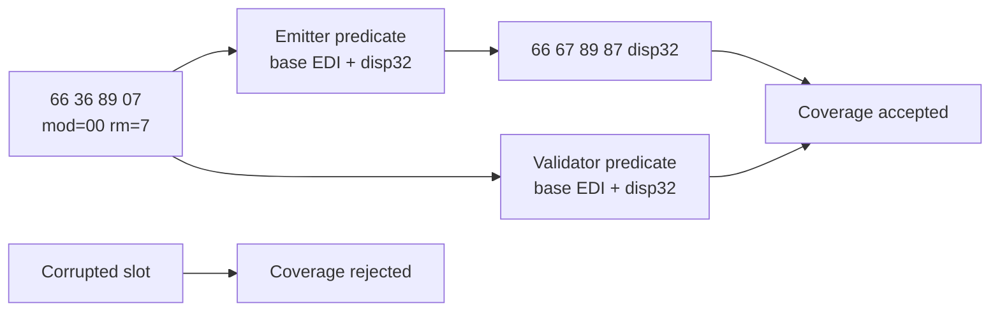

# 20260911-657 설계: Linux x64 segment coverage predicate parity

## 한국어

### 배경

Task 656의 image-slot trace는 `0x010F44E6`의 `66 36 89 07`
(`MOV SS:[EDI],AX`)에 대해 long-mode segment slot과 site metadata가 실제로
생성되었음을 확인했습니다. 그러나 `ValidateAotCodeCacheHleCoverage`는 해당
명령의 `mod=00`을 모두 absolute disp32로 해석합니다.

emitter는 `mod=00 && rm=5`만 absolute disp32로 취급하고, `rm=7`인 EDI base
형식은 base register를 보존한 disp32 형식으로 재작성합니다. 또한 무변위
형식에서는 emitter가 ModRM 다음에 suffix를 추가하지 않지만 validator는
Zydis의 무의미한 `disp.offset`에서 원본 bytes를 다시 추가합니다. 두 규칙이
달라 validator는 `66 67 89 87 disp32` slot을 잘못된 SIB absolute 형식으로
기대하거나 access 길이를 4바이트 더 길게 계산합니다.

### 설계

1. validator의 `absolute_disp32` predicate를 emitter와 같은
   `mod=00 && rm=5` 조건으로 수정합니다.
2. validator의 suffix 시작 offset을 emitter와 동일하게 계산하여
   `disp.size=0`이면 `modrm.offset + 1`, 그 외에는 displacement 끝을
   사용합니다.
3. long-mode emission probe에 `66 36 89 07`와 fallthrough return으로 구성한
   segment-override plan을 추가합니다.
4. probe는 EDI-base access bytes, site 존재, 전체 coverage 통과를 확인합니다.
5. emitted access byte를 하나 훼손한 복사본은 coverage validator가 거절하는지
   확인하여 검증 범위가 유지되는지 확인합니다.
6. guest semantics, segment patch policy, fallback path, 기본 i386 emission은
   변경하지 않습니다.

### 검증 전략

최신 Linux x64 Debug를 빌드하고 long-mode emission probe를 포함한 전체 core
probe를 실행합니다. 실제 `pumpit2a`를 다시 실행하여 기존 frontier에서
`0x010F44E6` coverage reject가 사라지는지, 그리고 다음 frontier가 어디로
이동하는지 확인합니다.

## English

### Background

Task 656's image-slot trace confirmed that the long-mode segment slot and site
metadata are actually created for `0x010F44E6`, `66 36 89 07`
(`MOV SS:[EDI],AX`). However, `ValidateAotCodeCacheHleCoverage` treats every
`mod=00` form as absolute disp32.

The emitter treats only `mod=00 && rm=5` as absolute disp32. An `rm=7` EDI-base
form is re-encoded with the base register preserved and a widened disp32. For a
zero-displacement form, the emitter also adds no suffix after the ModRM, while
the validator starts at Zydis's unused `disp.offset` and copies the original
bytes again. These rules diverge, so the validator expects
`66 67 89 04 25 disp32` instead of `66 67 89 87 disp32`, or makes the access
four bytes too long.

### Design

1. Change the validator's `absolute_disp32` predicate to the emitter's
   `mod=00 && rm=5` condition.
2. Match the emitter's suffix start: use `modrm.offset + 1` when
   `disp.size=0`, and the end of the displacement otherwise.
3. Add a long-mode emission probe using a segment-override plan containing
   `66 36 89 07` and a fallthrough return.
4. Have the probe check the EDI-base access bytes, site presence, and complete
   coverage success.
5. Corrupt one emitted access byte in a copy and verify that the coverage
   validator still rejects it.
6. Do not change guest semantics, segment patch policy, fallback paths, or the
   default i386 emission.

### Verification strategy

Build the latest Linux x64 Debug and run the complete core probe, including the
long-mode emission probe. Run real `pumpit2a` again to verify that the existing
coverage rejection at `0x010F44E6` disappears and to record the next frontier.
