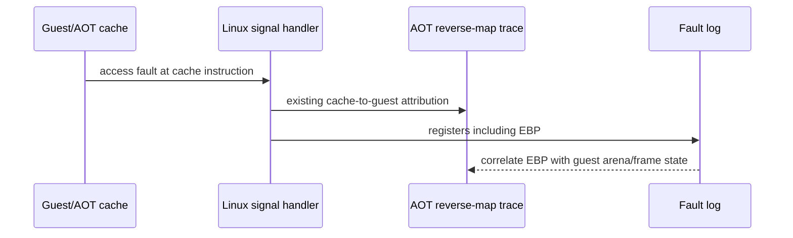

# 20260912-658 설계: Linux x64 frontier fault 상태 추적

## 한국어

### 배경

Task 657 이후 Linux x64 실행은 `0x0103B1DB` 반환 target을 정상적으로 AOT
cache에 연결합니다. 다음 실행 중단은 cache `0x200022AC`이며, reverse map은
이를 게스트 `0x010F316C`의 원본 명령 `89 45 FC`로 확인합니다. 이 명령은
`MOV [EBP-4],EAX`이고 long-mode cache에는 주소 크기 override를 포함한
`67 89 45 FC`가 그대로 배치되어 있습니다.

따라서 현재 증거만으로는 명령 번역을 수정할 근거가 없습니다. fault 주소가
반복 실행마다 달라지고 게스트 arena 밖에 있으므로, 먼저 fault 시점의 `EBP`
값을 기록하여 다음 두 가설을 구분해야 합니다.

1. `EBP`가 게스트 stack/frame 주소가 아니며, 이전 경계·호출·return 복구가
   게스트 상태를 훼손했다.
2. `EBP`는 원본 코드가 의도한 값이고, 해당 원본 명령의 메모리 접근이 실제
   실행 조건에서 유효하지 않다.

### 설계

Linux platform fault reporter의 기존 async-signal-safe unhandled fault 한 줄에
`ebp`를 추가합니다. 이 reporter는 이미 `EAX`부터 `EDI`, `ESP`, `EFLAGS`를
출력하고 있으므로 동일한 `GuestCpuContext` 값을 같은 시점에 출력합니다.
같은 값을 일반 execution trace의 opt-in 한 줄에도 추가하여 fault 직전의
정상 boundary에서 `EBP`를 비교할 수 있게 합니다.

기존 execution-layer의 `repiu-aot-fault` reverse-map trace는 그대로 유지하여
cache 주소, guest 주소, provenance, 주변 map 상태를 함께 읽을 수 있게 합니다.
정상 실행 경로에서는 환경 변수 없이 새 출력이 발생하지 않으며, fault 처리,
AOT emission, guest instruction semantics, fallback 정책은 변경하지 않습니다.

### 검증 기준

* Linux x64 Debug `repiu`와 `repiu_core_probe`가 빌드됩니다.
* `repiu_core_probe`의 전체 검사가 통과합니다.
* `REPIU_AOT_FAULT_TRACE=1`과 cache 주소 필터를 사용한 `pumpit2a` 실행에서
  reverse-map line과 `repiu-fault` line이 함께 기록되고, 새 `ebp` 값이
  확인됩니다.
* 환경 변수 없이 수행한 core probe에는 새 진단 출력이 추가되지 않습니다.

### 범위 밖

* `MOV [EBP-4],EAX`의 lowering 또는 guest code 수정
* `EBP` 보정, stack/frame 재작성, return resolver 변경
* fault를 정상 실행으로 간주하는 fallback 추가

## English

### Background

After Task 657, Linux x64 execution resolves the `0x0103B1DB` return target into
the AOT cache. The next observed stop is cache address `0x200022AC`, whose reverse
map identifies guest address `0x010F316C` and original bytes `89 45 FC`. The
instruction is `MOV [EBP-4],EAX`; long-mode emission places the byte-compatible
address-size form `67 89 45 FC`.

The current evidence does not justify changing instruction translation. The fault
address varies between runs and lies outside the guest arena, so the first step is
to record fault-time `EBP` and distinguish:

1. `EBP` is not a guest stack/frame address and was corrupted by an earlier
   boundary, call, or return restoration; or
2. `EBP` is the value intended by the original code and the memory access is
   genuinely invalid under the observed execution state.

### Design

Add `ebp` to the existing async-signal-safe Linux unhandled-fault line. The
reporter already prints `EAX` through `EDI`, `ESP`, and `EFLAGS`, so the value is
read from the same `GuestCpuContext` snapshot. Add the same field to the
opt-in normal execution trace so `EBP` can be compared at a boundary immediately
before the faulting instruction.

Keep the execution-layer `repiu-aot-fault` reverse-map trace unchanged so the
cache address, guest address, provenance, and surrounding map state remain
available for correlation. With no environment variable, normal execution gains
no new output; fault handling, AOT emission, guest instruction semantics, and
fallback policy remain unchanged.

### Verification criteria

* Linux x64 Debug builds `repiu` and `repiu_core_probe`.
* The complete `repiu_core_probe` suite passes.
* A `pumpit2a` run with `REPIU_AOT_FAULT_TRACE=1` and the cache-address filter
  records both the reverse-map line and the `repiu-fault` line, including `ebp`.
* A core-probe run with the diagnostic environment unset has no new diagnostic
  output.

### Out of scope

* Lowering or rewriting `MOV [EBP-4],EAX`
* Correcting `EBP`, rewriting stack/frame state, or changing the return resolver
* Adding a fallback that treats the fault as successful execution

### 결과 및 다음 작업

필터링된 실행에서 `0x010F316A` 직전의 `EBP`와 fault 시점의 `EBP`가 모두
`0x5E7BBC68`로 관찰되었습니다. guest `ESP`는 `0x0158C818`이었고 fault
접근 주소는 `0x5E7BBC64`였습니다. 따라서 `MOV [EBP-4],EAX`의 lowering이나
guest arena 주소 계산보다 앞선 경계에서 frame pointer 의미가 깨졌다는 결론을
확정할 수 있습니다.

정적 map trace는 `0x010F3159`의 원본이 `C8 04 00 00`(`ENTER 4,0`)이고,
long-mode AOT image에는 해당 명령 대신 `CC`가 배치됨을 확인했습니다. 이후
fallback이 원본 `ENTER` 바이트를 host long mode에서 실행하면서 host `RSP`/`RBP`
기반 frame을 만들었고, 그 결과가 다음 guest 명령까지 유지된 것으로 판단됩니다.
이 작업은 원인 확인을 위한 진단 변경만 포함하며, 의미론 수정은 다음 작업에서
guest `ENTER` HLE로 처리합니다.

## English — Result and follow-up

The filtered run recorded `EBP=0x5E7BBC68` both immediately before
`0x010F316C` and at the fault. Guest `ESP` was `0x0158C818`, while the fault
accessed `0x5E7BBC64`. This confirms that the frame-pointer meaning was broken
at an earlier boundary; the `MOV [EBP-4],EAX` lowering and guest-arena address
calculation are not the cause.

The static map trace confirmed that `0x010F3159` contains `C8 04 00 00`
(`ENTER 4,0`) and that the long-mode AOT image contains `CC` for this boundary.
The fallback then executes the original `ENTER` bytes in host long mode, creating
a frame based on host `RSP`/`RBP`, which remains visible at the following guest
instruction. This task intentionally remains diagnostic-only; the next task will
handle guest `ENTER` semantics through HLE.
