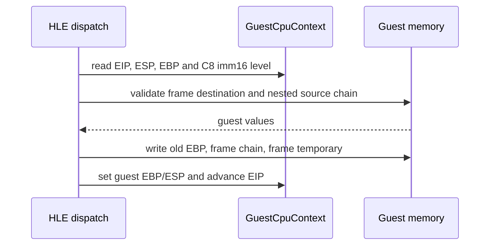

# 20260912-659 설계: Linux x64 guest ENTER HLE

## 한국어

### 배경

Task 658에서 Linux x64 AOT image의 `ENTER 4,0` 경계가 `CC`로 표시된 뒤,
reentry fallback이 원본 `C8 04 00 00`을 host long mode에서 실행하는 경로를
확인했습니다. 이 경로는 host `RSP`/`RBP`로 frame을 만들기 때문에 다음 guest
명령의 `EBP`가 guest frame pointer가 아닙니다.

### 설계 목표

원본 guest bytes와 실행 순서는 유지하면서, x64 HLE dispatch가 `ENTER`의
32비트 guest 의미론을 직접 수행하도록 합니다. guest `ESP`, guest `EBP`,
guest memory만 사용하며 host stack pointer나 host frame pointer를 변경하지
않습니다. `ENTER`의 nesting level 0~31과 16비트 allocation operand를
지원하고, guest memory 범위를 벗어나는 frame 접근은 기존 HLE 정책처럼
fail-closed 합니다.

### 처리 규칙

* opcode `C8`의 무접두 4바이트 형식만 처리합니다. 16/32비트 operand-size
  prefix가 붙은 변형은 기존 dispatch가 처리하지 않으면 그대로 거절합니다.
* allocation size는 little-endian `imm16`으로 읽습니다.
* nesting level은 `imm8 & 0x1F`로 해석합니다.
* 먼저 기존 guest `EBP`를 `guest ESP - 4`에 저장합니다.
* nesting level이 0보다 크면 이전 frame chain을 guest memory에서 읽어
  순서대로 새 stack에 저장하고, 마지막에 frame temporary 값을 저장합니다.
* 완료 후 `guest EBP = frame temporary`, `guest ESP = stack top - imm16`,
  `guest EIP += 4`로 갱신합니다. EFLAGS는 바꾸지 않습니다.
* 모든 source read와 destination write 범위를 먼저 확인하여 부분 frame을
  남기지 않도록 합니다.

근거: [Intel 64 and IA-32 Architectures Software Developer’s Manual,
Volume 1](https://www.intel.com/content/dam/www/public/us/en/documents/manuals/64-ia-32-architectures-software-developer-vol-1-manual.pdf)의
`ENTER` pseudocode가 `PUSH EBP`, frame temporary 저장, lexical-level display
복사, allocation 순서를 정의합니다.

### 구현 위치

* `src/engine/cpu_emul/instruction_emulation.h/.cpp`: `HandleEnterInstruction`
  및 guest frame-memory algorithm
* `src/engine/execution/execution_trampoline.cpp`: shared opcode dispatcher의
  `C8` case 연결
* source comments remain English-only per coding style

### 검증 전략

* Linux x64 Debug `repiu`와 `repiu_core_probe`를 빌드합니다.
* core probe 전체 27개 결과가 계속 통과하는지 확인합니다.
* 실제 `pumpit2a` 실행에서 `REPIU_ENTER_HLE_TRACE=1`로 `ENTER`가 guest
  stack을 사용했는지 확인하고, 이전 `0x010F316C` host-stack fault가
  사라지는지 확인합니다.
* nested ENTER synthetic coverage가 추가되면 frame chain, allocation,
  EIP, EFLAGS, 범위 거절을 확인합니다.

## English

### Background

Task 658 confirmed that the Linux x64 AOT image marks the `ENTER 4,0` boundary
with `CC`, after which reentry fallback executes the original `C8 04 00 00` in
host long mode. That path builds a frame from host `RSP`/`RBP`, so the following
guest instruction observes a non-guest `EBP`.

### Design goal

Preserve the original guest bytes and execution order while making x64 HLE
dispatch perform the 32-bit guest `ENTER` semantics. Use only guest `ESP`, guest
`EBP`, and guest memory; do not modify the host stack or host frame pointer.
Support nesting levels 0–31 and the 16-bit allocation operand. Refuse frame
accesses outside the guest memory range using the existing fail-closed HLE policy.

### Semantics

* Handle the unprefixed four-byte `C8` form. Operand-size-prefixed variants are
  refused unless another dispatcher handles them.
* Read allocation size as little-endian `imm16`.
* Interpret nesting level as `imm8 & 0x1F`.
* Store the old guest `EBP` at `guest ESP - 4` first.
* For a nonzero nesting level, read the previous frame chain from guest memory,
  push it in order, and then push the frame temporary.
* Finish with `guest EBP = frame temporary`, `guest ESP = stack top - imm16`,
  and `guest EIP += 4`. EFLAGS remain unchanged.
* Validate all source reads and destination writes before changing guest memory,
  avoiding a partially constructed frame.

### Implementation locations

* `src/engine/cpu_emul/instruction_emulation.h/.cpp`: `HandleEnterInstruction`
  and the guest frame-memory algorithm
* `src/engine/execution/execution_trampoline.cpp`: connect the `C8` case in the
  shared opcode dispatcher
* Source comments remain English-only per the coding style.

### Verification strategy

* Build Linux x64 Debug `repiu` and `repiu_core_probe`.
* Confirm all 27 core-probe cases still pass.
* Run `pumpit2a` with `REPIU_ENTER_HLE_TRACE=1`, confirm that `ENTER` uses the
  guest stack, and verify that the previous host-stack fault at `0x010F316C`
  disappears.
* The extended `general_stack` probe covers nested frame-chain copying,
  allocation, EIP, EFLAGS, and range refusal synthetically.

### 구현 결과 및 다음 frontier

`ENTER 4,0`은 guest stack에서 성공적으로 처리되었고 이전
`0x010F316C` host-stack access fault는 재발하지 않았습니다. 실행은 더 진행한
뒤 `guest EIP=0x010EFE5F` 부근에서 `RepiuLinuxX64ReturnThunk`의 unresolved
`INT3`에 도달했습니다. 이 return-dispatch frontier는 본 작업의 `ENTER`
수정 범위 밖이며, 별도 후속 작업에서 귀속합니다.

## English — implementation result and next frontier

`ENTER 4,0` now succeeds using the guest stack, and the previous host-stack
access fault at `0x010F316C` does not recur. Execution progresses further and
then reaches the unresolved `INT3` in `RepiuLinuxX64ReturnThunk` near guest
`EIP=0x010EFE5F`. This return-dispatch frontier is outside the `ENTER` change and
will be attributed in a separate follow-up task.
