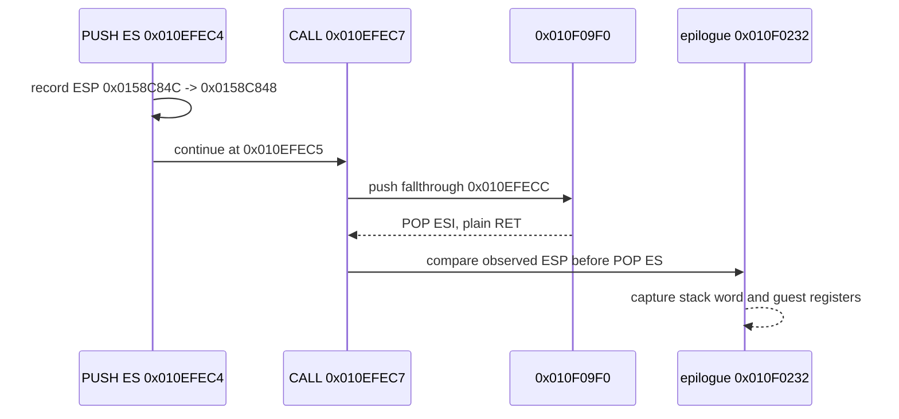

# Task 661 설계: Linux x64 epilogue stack delta 진단

## 한국어

### 목적

Task 660의 bounded stack tail은 zero-return 직전의 writer 순서를 보여
주었지만, `0x010F0232`의 `POP ES` 직전 ESP가 어느 경계에서 4바이트
높아졌는지는 아직 분리하지 못했습니다. 이번 작업은 guest 의미론을
변경하지 않고, `PUSH ES` 이후 direct CALL/복귀와 `0x010F022C` guest
`INT3`에서 `0x010F0232` HLE boundary로 이어지는 동적 경계를 관찰합니다.

### 확인된 정적·동적 전제

- `0x010EFEC4`는 `PUSH ES`이고, 기존 watch로 HLE 전후 guest ESP와
  selector를 출력할 수 있습니다.
- `0x010EFEC7`은 `CALL 0x010F09F0`이며 fallthrough는 `0x010EFECC`입니다.
- `0x010F09F0` 함수의 정적 map은 `PUSH ESI`로 시작하고 `POP ESI` 뒤
  plain `RET`로 끝납니다. 따라서 `RET imm16`이 추가 stack adjustment를
  하는 함수라는 가정은 두지 않습니다.
- `0x010F0232` trace는 `ESP=0x0158C84C`, `EBP=0x0158C848` 및
  `[ESP]=0x0158C92C`를 관찰했습니다.

### 진단 흐름

### 설계 결정

1. 기존 `REPIU_GUEST_WATCH`, `REPIU_EXECUTION_TRACE_*`, AOT guest map,
   zero-return frame, stack-tail 출력을 조합합니다.
2. 함수 prologue/epilogue의 stack width나 return target을 추측하여
   수정하지 않습니다.
3. `call_depth=1024`를 원인으로 승격하지 않고, 동적 경계가 확정될 때까지
   관찰값으로만 기록합니다.
4. 소스 코드를 변경하지 않는 진단 작업으로 마무리하고, 의미론 변경은
   별도 설계와 검증 뒤에만 수행합니다.

### 검증 전략

- `REPIU_GUEST_WATCH=0x010EFEC4`로 `PUSH ES` HLE 전후 값을 기록합니다.
- `REPIU_EXECUTION_TRACE_START=0xF022D`와 `END=0xF0237`로 epilogue
  진입 상태를 bounded capture합니다.
- `REPIU_AOT_GUEST_MAP_TRACE=0xEFEC4` 및 `0xF09F0`으로 CALL과 callee의
  원본 bytes, emitted slot, fallthrough를 대조합니다.
- Task 660 stack tail을 256개로 확장하여 같은 guest stack slot의 writer와
  CALL 순서를 함께 확인합니다.

## English

### Purpose

Task 660 made the bounded writer order visible before the zero return, but it
did not isolate where the four-byte increase before `POP ES` at
`0x010F0232` occurs. This task observes the dynamic boundary after `PUSH ES`,
the direct CALL/return through `0x010F09F0`, and the reentry from guest
`INT3` at `0x010F022C` to the `0x010F0232` HLE boundary without changing guest
semantics.

### Confirmed static and dynamic premises

- `0x010EFEC4` is `PUSH ES`; the existing watch can report its guest ESP
  transition and selector.
- `0x010EFEC7` is `CALL 0x010F09F0` with fallthrough `0x010EFECC`.
- The static map for `0x010F09F0` starts with `PUSH ESI` and ends with
  `POP ESI` followed by plain `RET`; it is not assumed to add a `RET imm16`
  adjustment.
- The `0x010F0232` trace observed `ESP=0x0158C84C`, `EBP=0x0158C848`, and
  `[ESP]=0x0158C92C`.

### Diagnostic flow

The Mermaid diagram above records the intended observation points: capture the
`PUSH ES` transition, compare the CALL fallthrough and callee return, then
capture the epilogue's pre-`POP ES` stack state.

### Design decisions

1. Combine the existing `REPIU_GUEST_WATCH`, `REPIU_EXECUTION_TRACE_*`, AOT
   guest-map, zero-return-frame, and stack-tail outputs.
2. Do not change stack width or return-target behavior based on a hypothesis.
3. Keep `call_depth=1024` as an observation until the dynamic boundary is
   established, rather than promoting it to a cause.
4. Finish this as a source-neutral diagnostic task. Any semantic change must
   have its own design and verification.

### Verification strategy

- Use `REPIU_GUEST_WATCH=0x010EFEC4` to capture the `PUSH ES` HLE transition.
- Use `REPIU_EXECUTION_TRACE_START=0xF022D` and `END=0xF0237` for a bounded
  epilogue capture.
- Use `REPIU_AOT_GUEST_MAP_TRACE=0xEFEC4` and `0xF09F0` to compare original
  bytes, emitted slots, and the CALL fallthrough.
- Expand the Task 660 stack tail to 256 records so the relevant writer and
  CALL sequence are visible together.
