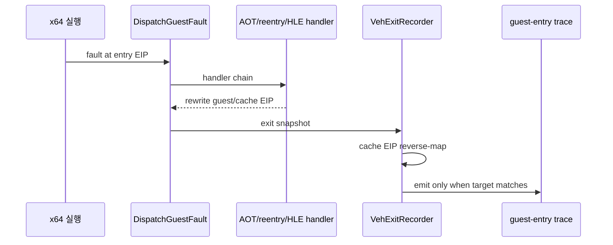

# Task 662 설계: Linux x64 guest 진입 provenance 계측

## 한국어

### 목적

Task 661은 `PUSH ES`의 guest stack 효과와 `0x010F0232 POP ES` 직전의
ESP를 분리해 확인했지만, 현재 실행이 그 주소에 어떤 fault/reentry 경로로
도달했는지는 확정하지 못했습니다. `REPIU_GUEST_WATCH=0x010F022C`가
관찰되지 않은 실행도 있었으므로, guest 주소 감시와 return-thunk 계측만으로
경로를 추정하지 않고 fault dispatcher의 실제 출구를 기록합니다.

### 설계

`REPIU_LINUX_X64_GUEST_ENTRY_TRACE=<guest-address>`를 opt-in 필터로
추가합니다. `DispatchGuestFault`의 출구를 담당하는 `VehExitRecorder`가
다음 조건을 만족할 때 한 줄을 출력합니다.

1. dispatcher 진입 guest EIP 또는 최종 guest EIP가 필터 주소이거나,
   AOT cache EIP를 guest 주소로 역매핑한 결과가 필터 주소입니다.
2. fault가 들어온 EIP, fault 종류, dispatcher 진입/종료 EIP와
   진입/종료 시점의 guest ESP를 함께 출력합니다.
3. 출력은 최대 32회로 제한하며, 필터가 없거나 불일치하면 기존 실행 상태와
   출력에 영향을 주지 않습니다.

출구에서 역매핑하는 이유는 AOT HLE translation scope가 guest handler의
처리 후 EIP를 다시 cache 주소로 바꿀 수 있기 때문입니다. 다음 흐름에서
`0x010F0232`가 실제로 fault dispatcher를 통과했는지, 그리고 직전 fault가
cache boundary인지 guest breakpoint/single-step인지 구분할 수 있습니다.

### 범위와 비범위

- 대상은 Linux x64 진단 경로입니다. 기본 실행 경로와 guest 의미론은
  변경하지 않습니다.
- fault 없이 cache native code가 직접 다음 주소로 실행되는 경우는 이
  계측의 관찰 대상이 아닙니다. 출력이 없다는 것은 “fault dispatcher
  출구에서 해당 주소를 확인하지 못했다”는 뜻으로만 해석합니다.
- stack width, RET target, DPMI/selector 상태, resolver 정책은 변경하지
  않습니다.

### 검증 전략

- `REPIU_LINUX_X64_GUEST_ENTRY_TRACE=0x010F0232`로 bounded runtime을
  실행합니다.
- 기존 zero-return frame 및 fault-exit trace와 함께 출력 순서를 비교합니다.
- Linux x64 Debug 빌드와 `repiu_core_probe`를 실행합니다.

### 설계 보완

`VehExitRecorder`는 dispatcher 진입 시점 EIP와 종료 시점 EIP를 모두
guest 주소로 해석합니다. 진입 주소 또는 종료 주소가 필터와 일치할 때
출력하므로, `0x010F0232`를 처리한 뒤 `0x010F0233`으로 전진하는 HLE
경로도 원래 진입 사실을 보존할 수 있습니다.

## English

### Purpose

Task 661 separated the guest stack effect of `PUSH ES` from the ESP observed
before `0x010F0232 POP ES`, but it did not establish which fault or reentry
path actually reaches that address. Some runs also produced no observation for
`REPIU_GUEST_WATCH=0x010F022C`, so the next step records the real fault
dispatcher exit instead of inferring the path from the guest watch and return
thunk alone.

### Design

Add the opt-in filter
`REPIU_LINUX_X64_GUEST_ENTRY_TRACE=<guest-address>`. The `VehExitRecorder`
that owns the `DispatchGuestFault` exit snapshot emits one line when either the
dispatcher-entry guest EIP or the final guest EIP matches the filter. A cache
EIP is reverse-mapped through the AOT guest map before comparison.

The line includes the fault EIP, fault kind, dispatcher-entry/final EIP, and
the guest ESP at both entry and exit. Output is capped at 32 records. With
the filter absent or unmatched, execution state and output remain unchanged.

Both entry and exit are captured because the AOT HLE translation scope may
convert a guest handler's post-processing EIP back into the next cache address.
The capture therefore preserves an entry at `0x010F0232` even when the handler
exits at `0x010F0233`, and identifies whether the fault was a cache boundary,
a guest breakpoint, or a single-step event.

### Scope and non-goals

- This is Linux x64 diagnostics only; guest semantics and the default path do
  not change.
- Fault-free native execution of the next cache instruction is outside this
  capture. No line means only that the address was not observed at a fault
  dispatcher exit.
- Do not change stack width, RET target, DPMI/selector state, or resolver
  policy.

### Verification strategy

- Run a bounded capture with
  `REPIU_LINUX_X64_GUEST_ENTRY_TRACE=0x010F0232`.
- Compare its ordering with the existing zero-return frame and fault-exit
  traces.
- Build Linux x64 Debug and run `repiu_core_probe`.
