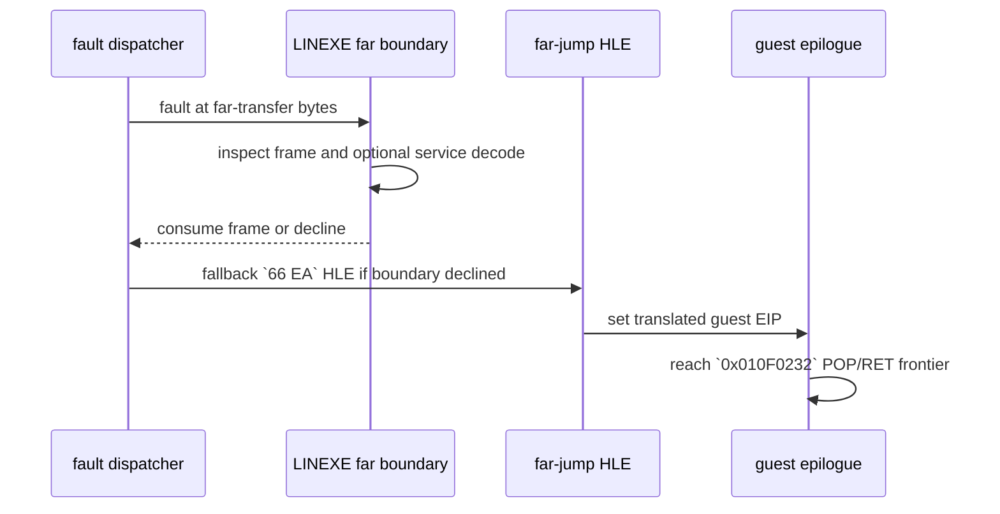

# Task 663 설계: Linux x64 LINEXE far-transfer 프레임 추적

## 한국어

### 목적

Task 662에서 `0x010F0232` 진입은 cache breakpoint가 HLE dispatcher로 재진입한 결과임을 확인했지만, `PUSH ES` 이후 기대한 ESP와 실제 `POP ES` 직전 ESP 사이의 4바이트 차이가 어느 경계에서 발생하는지는 남아 있습니다. 이 작업은 LINEXE far-transfer boundary와 far-jump HLE의 입력·출력 guest ESP 및 프레임 일부를 선택적으로 기록하여 그 경계를 분리합니다.

### 설계

새 opt-in 환경 변수 `REPIU_LINEXE_FAR_TRANSFER_TRACE=1`을 추가합니다. 해당 변수가 있을 때만 다음 두 지점을 최대 64건까지 기록합니다.

1. `HandleLinexeFarTransferBoundary` 진입 시 현재 guest EIP, 명령 bytes, EDI 기반 target selector/offset, ESP/EBP와 제한된 stack window를 기록합니다.
2. LINEXE 서비스가 실제로 복귀 프레임을 소비하는 경우 old/new ESP, 복원 레지스터와 복귀 EIP를 기록합니다.
3. `HandleFarJumpInstruction`이 `66 EA`를 직접 HLE할 때 입력 ESP와 selector-relative target 및 변환 후 EIP를 기록합니다.

### 범위와 비목표

- Linux x64 진단을 위한 opt-in 출력만 추가하며 기본 실행의 guest state와 control flow는 변경하지 않습니다.
- LINEXE 서비스의 stack cleanup, far-return frame 크기, selector resolver 정책은 변경하지 않습니다.
- 출력은 bounded 하며 환경 변수가 없거나 `0`이면 기존 출력과 동작을 유지합니다.

### 검증 전략

- Linux x64 Debug `repiu`와 `repiu_core_probe`를 빌드합니다.
- `REPIU_LINEXE_FAR_TRANSFER_TRACE=1`과 기존 guest-entry/return-frame trace를 함께 사용해 boundary가 실제로 프레임을 소비하는지 확인합니다.
- 결과를 `docs/analysis/linux-port-frontier.md`와 작업 로그에 확인됨/추정/미확정으로 구분해 반영합니다.

## English

### Purpose

Task 662 confirmed that entry at `0x010F0232` is observed through a cache
breakpoint and HLE dispatcher re-entry, but the boundary that creates the
four-byte difference between the expected ESP after `PUSH ES` and the ESP
before `POP ES` remains unknown. This task separates that boundary by tracing
the input and output guest ESP and a bounded frame window at the LINEXE
far-transfer boundary and far-jump HLE.

### Design

Add the opt-in environment variable `REPIU_LINEXE_FAR_TRANSFER_TRACE=1`. When
enabled, emit at most 64 records for these points:

1. Entry to `HandleLinexeFarTransferBoundary`, including current guest EIP,
   instruction bytes, the EDI-derived target selector/offset, ESP/EBP, and a
   bounded stack window.
2. A successful LINEXE service frame consumption, including old/new ESP,
   restored registers, and continuation EIP.
3. A direct `66 EA` HLE in `HandleFarJumpInstruction`, including input ESP,
   selector-relative target, and translated EIP.

### Scope and non-goals

- Add opt-in Linux x64 diagnostics without changing default guest state or
  control flow.
- Do not change LINEXE service cleanup, far-return frame size, or selector
  resolver policy.
- Keep output bounded; absent or zero-valued configuration preserves existing
  behavior and output.

### Verification strategy

- Build the Linux x64 Debug `repiu` and `repiu_core_probe` targets.
- Run the new trace together with the existing guest-entry and return-frame
  traces to determine whether the boundary consumes the relevant frame.
- Record confirmed, inferred, and unresolved results in
  `docs/analysis/linux-port-frontier.md` and the work log.
