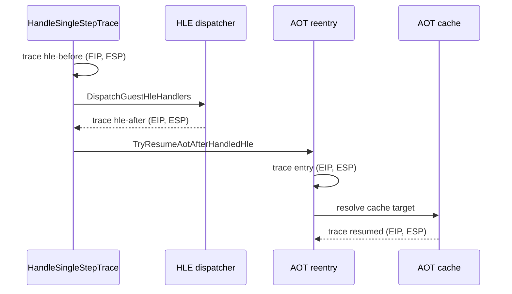

# Task 664 설계: Linux x64 AOT/HLE 재진입 guest ESP 추적

## 한국어

### 목적

Task 663에서 LINEXE far-transfer와 `66 EA` far-jump HLE이 현재 bounded
failure 경로에 포함되지 않음이 확인되었습니다. 남은 4바이트 ESP delta의
후보를 AOT/HLE 재진입 경계와 분리하기 위해, 기존
`REPIU_AOT_HLE_REENTRY_TRACE=<guest-address>`에 HLE dispatcher 전후 guest
ESP를 추가합니다.

### 설계

기존 trace helper를 공용 진단 진입점으로 확장하여 다음 시점을 기록합니다.

1. `HandleSingleStepTrace`가 HLE dispatcher를 호출하기 직전
   (`hle-before`)
2. HLE dispatcher가 guest EIP/ESP를 갱신한 직후 (`hle-after`)
3. `TryResumeAotAfterHandledHle`가 재진입 판단을 시작할 때
   (`entry` 또는 `reentry-before`에 해당하는 기존 entry 기록)
4. AOT cache resume가 성공한 직후 (`resumed`)

각 기록에는 기존 필터·bounded budget을 유지하면서 현재 guest EIP, guest
ESP, handled guest EIP, pending/legacy 상태와 cache target을 포함합니다.
기존 환경 변수가 없거나 `0`이면 출력하지 않습니다.

### 범위와 비목표

- Linux x64 실행 frontier를 위한 선택적 진단만 추가합니다.
- `GuestCpuContext::Esp`, HLE stack semantics, return resolver, cache target
  정책은 변경하지 않습니다.
- 기존 `REPIU_AOT_HLE_REENTRY_TRACE`의 필터와 출력 budget을 재사용합니다.
- stack memory를 역참조하거나 guest stack을 수정하지 않습니다.

### 검증 전략

- Linux x64 Debug `repiu`와 `repiu_core_probe`를 빌드합니다.
- `REPIU_AOT_HLE_REENTRY_TRACE=0x010F0232`로 실패 frontier의 HLE 전후 ESP를
  관찰합니다.
- `0x010EFEC4`를 별도 필터로 사용하여 `PUSH ES` HLE의 before/after ESP가
  기존 Task 661의 `0x0158C84C -> 0x0158C848`과 일치하는지 확인합니다.
- 결과를 `docs/analysis/linux-port-frontier.md`와 작업 로그에 확인됨·추정·
  미확정으로 구분하여 기록합니다.

## English

### Purpose

Task 663 showed that the LINEXE far-transfer and `66 EA` far-jump HLE paths
are not part of the current bounded failure path. To separate the remaining
four-byte ESP delta at the AOT/HLE boundary, extend the existing
`REPIU_AOT_HLE_REENTRY_TRACE=<guest-address>` with guest ESP around HLE
dispatch and AOT re-entry.

### Design

Extend the existing trace helper as a shared diagnostic entry point and record:

1. immediately before `HandleSingleStepTrace` invokes the HLE dispatcher
   (`hle-before`);
2. immediately after the HLE dispatcher updates guest EIP/ESP (`hle-after`);
3. when `TryResumeAotAfterHandledHle` begins its re-entry decision (`entry`,
   the existing entry record);
4. immediately after a successful AOT-cache resume (`resumed`).

Each record keeps the existing address filter and bounded budget, and includes
current guest EIP, guest ESP, handled guest EIP, pending/legacy state, and the
cache target. No output is emitted when the environment variable is absent or
`0`.

### Scope and non-goals

- Add opt-in diagnostics for the Linux x64 execution frontier.
- Do not change `GuestCpuContext::Esp`, HLE stack semantics, return resolution,
  or cache-target policy.
- Reuse the existing `REPIU_AOT_HLE_REENTRY_TRACE` filter and output budget.
- Do not dereference or modify guest stack memory.

### Verification strategy

- Build Linux x64 Debug `repiu` and `repiu_core_probe`.
- Run with `REPIU_AOT_HLE_REENTRY_TRACE=0x010F0232` to capture ESP before and
  after the failing frontier's HLE path.
- Run a separate filter at `0x010EFEC4` to compare the `PUSH ES` HLE delta with
  Task 661's `0x0158C84C -> 0x0158C848` observation.
- Record confirmed, inferred, and unresolved results in
  `docs/analysis/linux-port-frontier.md` and the work log.
