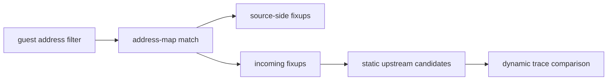

# Task 665 설계: Linux x64 AOT incoming fixup 추적

## 한국어

### 목적

Task 664는 `0x010F0232` HLE dispatcher와 AOT resume이 guest ESP를
`0x0158C860`으로 일관되게 보존함을 확인했습니다. 4바이트 delta의
upstream 후보를 좁히려면 해당 guest address로 들어오는 정적 AOT control
transfer 후보를 확인해야 합니다.

### 설계

기존 `REPIU_AOT_MAP_TRACE=<guest-address>` 출력에 incoming fixup 기록을
추가합니다. exact 또는 covering address-map match를 찾은 뒤
`placement.fixups`에서 `fixup.guest_target == match.guest_address`인 항목을
최대 32개 출력합니다.

각 항목은 다음을 포함합니다.

- guest source와 target
- `AotFixupKind`
- cache patch offset
- resolved 상태

기존 source-side fixup 출력과 구분하기 위해 별도의
`[repiu-aot-map-incoming-fixup]` prefix를 사용합니다.

### 범위와 비목표

- 정적 AOT metadata 관찰만 추가합니다.
- cache bytes, fixup resolution, branch target, guest state는 변경하지
  않습니다.
- incoming fixup이 존재한다는 사실을 동적 실행 증거로 해석하지 않습니다.
- 출력은 bounded하며 trace 환경 변수 미설정 시 기존 출력과 동작을
  유지합니다.

### 검증 전략

- Linux x64 Debug `repiu`와 `repiu_core_probe`를 빌드합니다.
- `REPIU_AOT_MAP_TRACE=0x0F0232 REPIU_AOT_MAP_CONTEXT=8`로
  `0x010F0232`의 incoming fixup 후보를 확인합니다.
- 기존 Task 664의 HLE ESP trace와 함께 실행하여 정적 후보와 실제
  bounded failure 경로를 구분합니다.
- 결과를 analysis/work-log에 확인됨·추정·미확정으로 기록합니다.

## English

### Purpose

Task 664 confirmed that the `0x010F0232` HLE dispatcher and AOT resume
preserve guest ESP at `0x0158C860`. To narrow the upstream cause of the
four-byte delta, inspect static AOT control-transfer candidates whose target is
that guest address.

### Design

Extend the existing `REPIU_AOT_MAP_TRACE=<guest-address>` output. After finding
an exact or covering address-map match, scan `placement.fixups` and print up to
32 entries where `fixup.guest_target == match.guest_address`.

Each incoming entry includes guest source and target, `AotFixupKind`, cache patch
offset, and resolved state. Use a separate
`[repiu-aot-map-incoming-fixup]` prefix so these records are distinct from
source-side fixups.

### Scope and non-goals

- Add static AOT metadata diagnostics only.
- Do not change cache bytes, fixup resolution, branch targets, or guest state.
- Do not treat an incoming fixup as proof of dynamic execution.
- Keep output bounded; absent trace configuration preserves existing output and
  behavior.

### Verification strategy

- Build Linux x64 Debug `repiu` and `repiu_core_probe`.
- Run `REPIU_AOT_MAP_TRACE=0x0F0232 REPIU_AOT_MAP_CONTEXT=8` to inspect
  incoming candidates for `0x010F0232`.
- Compare static candidates with the Task 664 HLE ESP trace to distinguish
  metadata from the actual bounded failure path.
- Record confirmed, inferred, and unresolved findings in analysis/work log.
