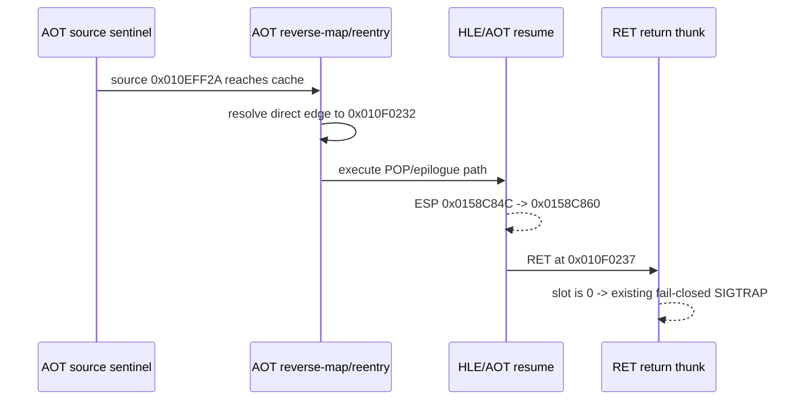

# Task 666 설계: Linux x64 direct-edge 동적 실행 확인

## 한국어

### 목적

Task 665에서 정적 AOT map으로 확인한 `0x010EFF2A -> 0x010F0232`
direct-jump가 실제 bounded failure 경로에서 실행되는지 확인합니다. 목적은
주소별 보정값을 추가하는 것이 아니라, 이미 존재하는 범용 execution sentinel,
AOT reverse-map, HLE re-entry, return-frame trace를 이용해 현재 실패 경계의
동적 provenance를 확정하는 것입니다.

### 관찰 대상

- 정적 incoming fixup: source `0x010EFF2A`, target `0x010F0232`,
  `kind=direct-jump`, `resolved=1`
- target code: `POP ES; POP EBX; POP ESI; POP EDI; POP EBP; RET`
- source sentinel hit 시 cache address와 guest ESP
- `0x010F0232` HLE 전후의 guest ESP
- `0x010F0237 RET`가 읽는 반환 슬롯과 fail-closed 경계

### 설계 결정

이번 작업은 진단 전용으로 수행하며 소스 코드나 guest semantics를 변경하지
않습니다. `REPIU_EXECUTION_TRACE_START=0x000EFF2A`는 AOT cache의 첫 바이트에
bounded `INT3` sentinel을 설치하고, 기존 re-entry 경로가 이를 guest source로
reverse-map하도록 합니다. 이후 `REPIU_AOT_HLE_REENTRY_TRACE=0x010F0232`와
return-frame trace를 함께 사용해 source 도달, HLE 진행, zero-return을 한
실행에서 비교합니다.

이 방식은 특정 EIP에서 ESP를 조정하는 예외처리가 아닙니다. sentinel은 임시
관찰 지점일 뿐이며, 실제 실행 경로와 반환 프레임이 확인되면 제거됩니다.

### 범위와 비범위

- 범위: 정적 후보와 동적 실행 경로의 일치 여부 확인
- 범위: epilogue의 원본 stack effect와 zero-return 상태 분리
- 비범위: 반환 주소 추정, zero 슬롯 보정, 특정 guest address 조건문 추가
- 비범위: AOT cache patch 정책 또는 resolver 실패 정책 변경

### 다음 구현 진입 조건

동적 결과가 source direct edge를 확정하더라도 즉시 보정하지 않습니다. 다음
수정은 반환 슬롯의 일반적인 producer 또는 call/return frame 보존 경계가
확인된 뒤, 그 공통 메커니즘에 한정합니다.

## English

### Purpose

Task 665 found a static AOT direct-jump from `0x010EFF2A` to `0x010F0232`.
Task 666 confirms whether that edge is executed on the bounded failure path. The
purpose is dynamic provenance, not an address-specific correction. The existing
generic execution sentinel, AOT reverse-map, HLE re-entry trace, and return-frame
trace are used together.

### Observed path

- Static incoming fixup: source `0x010EFF2A`, target `0x010F0232`,
  `kind=direct-jump`, `resolved=1`.
- Target bytes decode as `POP ES; POP EBX; POP ESI; POP EDI; POP EBP; RET`.
- The run records the source sentinel hit, guest ESP before and after HLE, and
  the return slot consumed by `0x010F0237 RET`.

### Design decision

This task is diagnostic-only. No source code or guest semantics are changed. The
`REPIU_EXECUTION_TRACE_START=0x000EFF2A` setting places a bounded `INT3`
sentinel at the AOT cache entry, after which the existing re-entry path
reverse-maps it to the guest source. The HLE re-entry and return-frame traces are
enabled in the same run.

This is not an EIP-specific ESP exception. The sentinel is a temporary observation
point and is not part of the production execution policy.

### Scope and non-goals

- Confirm static-to-dynamic direct-edge provenance.
- Separate the normal epilogue stack effect from the zero-return condition.
- Do not fabricate a return address or add an EIP-specific condition.
- Do not change AOT patching or resolver failure policy.

### Gate for implementation

Only implement a fix after identifying the general return-slot producer or the
common call/return frame boundary that loses it.
