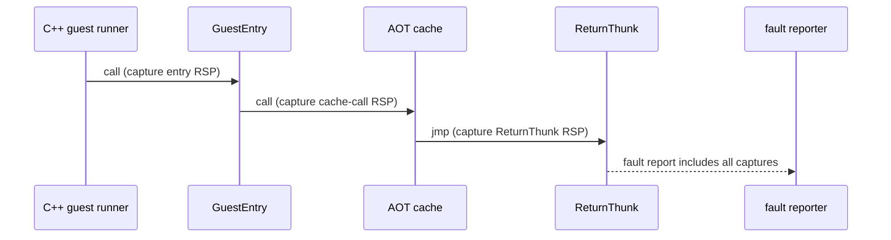

# Linux x64 host stack 경계 추적 설계

## 한국어

### 목적

Task 671의 정적 AOT 이미지 감사는 생성된 cache 안에 원본 guest stack 동작을 host `RSP`에 남기는 명령이 없음을 확인했다. 그러나 실행 중 `RepiuLinuxX64ReturnThunk`에 진입할 때 `RSP`의 상위 32비트가 사라진 fault가 관측되었다. 이 작업은 guest entry, cache 호출 직전, ReturnThunk 진입 시점의 native `RSP`를 같은 실행에서 기록해 손상 경계를 특정한다.

### 범위

* x86-64 Linux assembly 경계에 환경 비활성화 가능한 raw 주소 기록을 추가한다.
* 기존 fault report에 세 개의 기록값을 출력한다.
* guest register, guest `ESP`, AOT target 선택 및 signal resume 동작은 변경하지 않는다.
* 특정 guest EIP를 예외 처리하거나 실행 경로를 우회하지 않는다.

### 판정 기준

1. entry 값부터 낮으면 thread-entry/호출자 경계 문제다.
2. entry와 cache-call 값은 정상이고 ReturnThunk 값만 낮으면 cache 내부의 미감지 `RSP` writer 또는 경계 복귀 문제다.
3. 세 값이 정상인데 fault report만 다르면 fault-context 수집 경로를 재검토한다.

### 검증

* WSL Linux x64 debug build를 수행한다.
* `REPIU_EXECUTION_TIMEOUT_MS=0`, external hard kill을 사용해 내부 shutdown recovery와 구분한다.
* fault report의 세 주소와 `/proc/<pid>/maps`의 stack mapping을 대조한다.

## English

### Purpose

Task 671's static AOT-image audit confirmed that the generated cache contains no original guest stack operation that leaves a host `RSP` effect. Runtime evidence nevertheless shows the upper 32 bits of native `RSP` missing on entry to `RepiuLinuxX64ReturnThunk`. This task records native `RSP` at guest entry, immediately before the cache call, and at ReturnThunk entry in one run to identify the boundary where corruption occurs.

### Scope

* Add environment-independent raw address capture at the x86-64 Linux assembly boundaries.
* Include the three captured values in the existing fault report.
* Do not change guest registers, guest `ESP`, AOT target selection, or signal-resume behavior.
* Do not add a guest-EIP-specific exception or bypass.

### Decision criteria

1. A low value from entry onward identifies the thread-entry/caller boundary.
2. Normal entry and cache-call values followed by a low ReturnThunk value identify an undetected cache `RSP` writer or boundary-return issue.
3. If all captures are normal but the fault report differs, revisit fault-context collection.

### Verification

* Build the Linux x64 debug targets through WSL.
* Use an unlimited internal execution budget and an external hard kill to distinguish this from shutdown recovery.
* Compare the three addresses in the fault report with `/proc/<pid>/maps` stack mappings.
