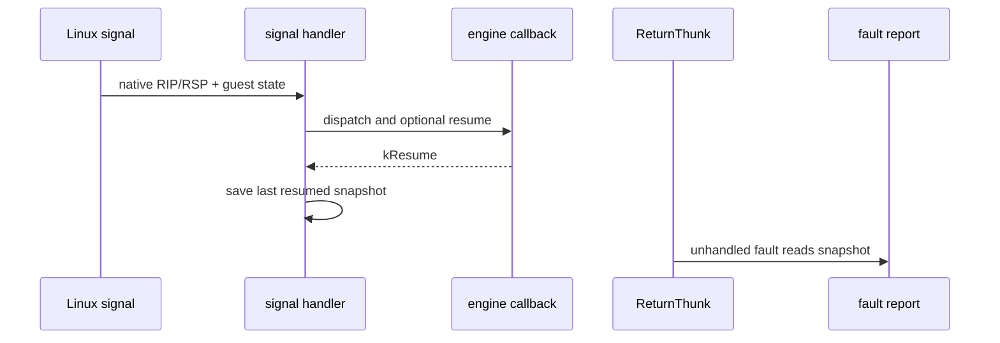

# Linux x64 마지막 정상 signal 경계 추적 설계

## 한국어

### 목적

Task 672는 guest entry와 cache 호출 직전의 native `RSP`가 정상적인 64비트 주소이고, `RepiuLinuxX64ReturnThunk` 진입 시점에만 상위 32비트가 사라지는 것을 확인했다. 다음으로 필요한 것은 그 사이에 실행된 마지막 정상 signal의 native `RIP`/`RSP`와 guest 상태이다. `SIGTRAP` single-step 직후 `RSP`가 이미 저주소라면 원본 guest 바이트를 재개한 경로가 host stack을 오염시킨 것이고, 마지막 signal까지 정상이라면 signal 이후의 cache 제어 경계를 조사해야 한다.

### 범위와 원칙

* Linux x64 signal handler에서 callback이 정상적으로 `kResume`한 마지막 signal의 native register snapshot을 선택적으로 저장한다.
* unhandled fault report에 마지막 정상 signal snapshot과 처음 관측된 저주소 `RSP` snapshot을 함께 출력한다.
* guest register, guest `ESP`, `RIP`/`RSP` writeback, AOT target 선택, signal disposition은 변경하지 않는다.
* 특정 guest EIP를 우회하거나 예외 처리하지 않는다.
* trace는 `REPIU_LINUX_X64_SIGNAL_BOUNDARY_TRACE`가 설정된 경우에만 저장한다.

### 판단 기준

1. 마지막 정상 signal의 `RSP`가 저주소이면, 그 signal 직전 실행 경로가 host `RSP`를 변경한 것이다.
2. 처음 관측된 저주소 signal의 guest `EIP`/`ESP`와 host `RIP`가 실제 전환 후보를 지정한다.
3. 마지막 정상 signal의 `RSP`가 높고 ReturnThunk에서만 저주소이면, signal resume 이후 cache control-flow 경계를 조사한다.
4. 마지막 정상 signal의 guest `EIP`/`ESP`와 host `RIP`를 함께 기록해 원본 재개인지 cache 실행인지 구분한다.

## English

### Purpose

Task 672 established that native `RSP` is a normal full-width address at guest entry and immediately before the cache call, but loses its upper 32 bits only when `RepiuLinuxX64ReturnThunk` is entered. The next evidence point is the last signal that successfully resumed before that fault. A low `RSP` there proves that the preceding resumed execution path damaged the host stack; a high `RSP` there moves the investigation to the cache control-flow boundary after signal return.

### Scope and invariants

* Optionally save the native register snapshot and guest state from the last Linux signal whose callback returned `kResume`.
* Also save the first resumed signal whose native `RSP` is in the low 32-bit range.
* Include both snapshots in the unhandled-fault report.
* Do not change guest registers, guest `ESP`, host `RIP`/`RSP` writeback, AOT target selection, or signal disposition.
* Do not add a guest-EIP-specific bypass or exception.
* Enable capture only when `REPIU_LINUX_X64_SIGNAL_BOUNDARY_TRACE` is set.

### Decision criteria

1. A low last-resumed `RSP` identifies the execution path immediately before the corruption.
2. The first low-`RSP` snapshot identifies the earliest observed transition.
3. A high last-resumed `RSP` followed by a low ReturnThunk `RSP` moves the investigation to post-signal cache control flow.
4. The guest `EIP`/`ESP` and host `RIP` distinguish original-byte resume from cache execution.
