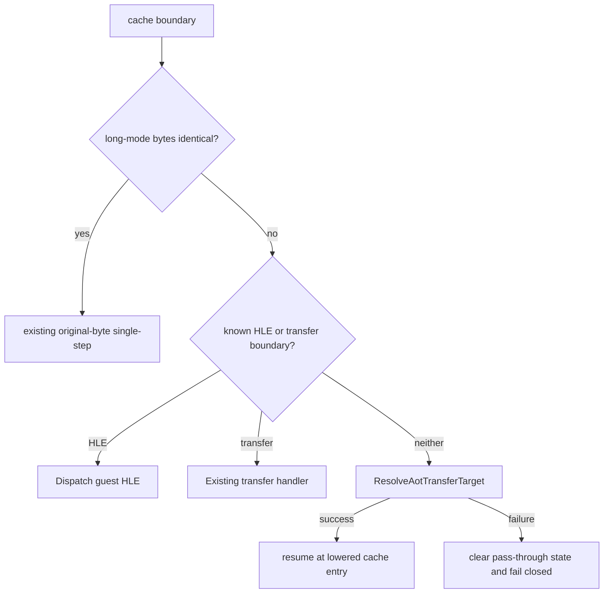

# Linux x64 re-entry 원본 명령 호환성 gate 설계

## 한국어

### 확인된 문제

Task 673에서 최초 저주소 native `RSP`는 single-step signal에서 관측되었고, host `RIP`는 원본 guest `0x010EFE62`였다. AOT map을 역조회하면 직전 `0x010EFE5F`는 원본 `ADD ESP,4`이며 cache에는 guest stack을 `R15D`로 갱신하는 `ADD R15D,4`가 생성되어 있다. cache boundary re-entry가 원본 명령을 한 번 실행하는 공통 정책 때문에 `ADD ESP,4`가 long mode의 host `RSP` 상위 32비트를 지웠다.

### 설계 결정

x64의 cache boundary가 single-step을 위해 원본 guest 주소로 이동하기 전에 `CanResumeLinuxX64LegacyTarget`으로 해당 명령의 long-mode byte compatibility를 확인한다. `kIdenticalBytes`가 아니고 HLE boundary도 아니면 원본을 실행하지 않고 `ResolveAotTransferTarget`으로 대응하는 AOT cache entry를 선택한다. cache entry를 해석할 수 없으면 pending/TF를 남긴 채 원본으로 통과하지 않고 fail-closed한다.

이 gate는 특정 guest EIP나 `ADD ESP,4`를 열거하지 않는다. 기존 long-mode classifier가 stack, width, invalid opcode, segment 및 addressing divergence를 공통으로 판정하고, 동일 classifier를 re-entry 정책에도 사용한다.

### 불변 조건

* 원본 guest executable bytes를 수정하지 않는다.
* `kIdenticalBytes`인 원본은 기존 original-byte single-step 경로를 유지한다.
* planner HLE boundary는 guest 주소에서 공통 HLE dispatcher로 직접 처리하고,
  transfer-shaped boundary는 기존 specialized transfer handler를 사용한다.
* non-identical 명령은 이미 생성된 cache 또는 공통 dynamic resolver로 이동한다.
* cache resolve 실패 시 원본 non-identical 명령을 실행하지 않는다.

## English

### Confirmed issue

Task 673 observed the first low native `RSP` on a single-step signal whose host `RIP` was the original guest address `0x010EFE62`. The AOT map shows that the preceding instruction at `0x010EFE5F` is original `ADD ESP,4`, while the cache emits `ADD R15D,4` for the guest stack. The shared cache-boundary re-entry policy executed the original instruction once, so long mode treated guest `ESP` as the host stack pointer and cleared the upper half of `RSP`.

### Design decision

Before a Linux x64 cache boundary resumes at an original guest address for single-step, consult `CanResumeLinuxX64LegacyTarget`. If the instruction is not `kIdenticalBytes` and is not a known HLE boundary, do not execute the original bytes; resolve and enter the corresponding AOT cache entry through `ResolveAotTransferTarget`. If resolution fails, clear the pending pass-through state and fail closed rather than executing a non-identical original instruction.

This is not a guest-EIP or opcode exception. The existing long-mode classifier already decides stack, width, invalid-opcode, segment, and addressing divergences; the re-entry policy now uses that same generic decision.

### Invariants

* Do not modify original guest executable bytes.
* Preserve the existing original-byte path for `kIdenticalBytes`.
* Dispatch planner HLE at the guest address and keep transfer-shaped boundaries
  on their specialized resolver paths.
* Route non-identical instructions through an existing or dynamically resolved cache entry.
* Never execute an unresolved non-identical original instruction.
