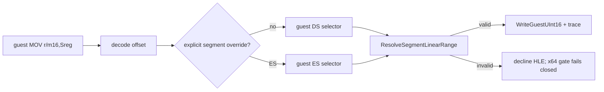

# 20260913-675 Linux x64 segment-store HLE linear resolution

## 한국어

### 확인된 문제

Task 674의 fail-closed gate가 처리하지 못한 planner-HLE 경계를 원본 long-mode 바이트로 실행하지 않도록 막은 뒤, 초기 경계 `0x010F1815`가 드러났습니다. 원본 명령은 `66 8C 05 38 66 09 00`(`MOV [disp32], ES`)입니다. 기존 `HandleSegmentStoreInstruction`은 ModRM displacement를 이미 linear address인 것처럼 사용합니다. 그러나 이 명령에는 segment override가 없으므로 displacement는 guest DS selector의 offset이며, x64 HLE는 기존 `ResolveSegmentLinearRange`를 거쳐야 합니다.

### 설계 결정

segment-store HLE의 memory form에서 다음 공통 규칙을 적용합니다.

1. ModRM/SIB decoder는 기존대로 guest offset만 계산합니다.
2. 일반 `MOV r/m16, Sreg`는 guest DS selector를 사용합니다.
3. 명시적인 `ES:` form은 guest ES selector를 사용합니다.
4. `ResolveSegmentLinearRange`가 selector table의 base/limit와 guest arena 범위를 함께 검증하고 linear address를 반환합니다.
5. 기존 `WriteGuestUInt16`을 통해 보호 변경, write trace, AOT write bookkeeping을 유지합니다.

이 변경은 `0x010F1815`를 위한 주소 예외가 아니라, segment-store memory form 전체의 protected-mode 주소 의미를 복원합니다. resolver가 주소를 검증하지 못하면 HLE는 처리하지 않고, Task 674의 x64 non-identical fail-closed gate가 원본 명령 실행을 차단합니다.

### 범위와 불변식

* 원본 guest bytes와 게임 로직은 수정하지 않습니다.
* segment-store의 selector 값과 대상 주소 계산을 분리합니다.
* low-memory, runtime arena, selector limit 검증 정책을 새로 복제하지 않습니다.
* 주소 resolver 실패 시 원본 non-identical 명령을 long mode에서 실행하지 않습니다.

## English

### Confirmed issue

After Task 674 made unhandled planner-HLE boundaries fail closed instead of
executing non-identical guest bytes in long mode, the initial boundary at
`0x010F1815` became visible. Its original bytes are
`66 8C 05 38 66 09 00` (`MOV [disp32], ES`). The existing
`HandleSegmentStoreInstruction` treats the ModRM displacement as a linear
address. With no segment override, that displacement is an offset through the
guest DS selector and must pass through `ResolveSegmentLinearRange`.

### Design decision

For the memory form of segment-store HLE:

1. Keep the existing ModRM/SIB decoder as a guest-offset decoder.
2. Use the guest DS selector for an ordinary `MOV r/m16, Sreg`.
3. Use the guest ES selector for the explicit `ES:` form.
4. Resolve selector base/limit and guest arena validity through the existing
   `ResolveSegmentLinearRange` helper.
5. Keep protection changes, write tracing, and AOT write bookkeeping in the
   existing `WriteGuestUInt16` path.

This restores protected-mode address semantics for the complete segment-store
memory family rather than adding an exception for `0x010F1815`. If resolution
fails, HLE declines and Task 674's x64 non-identical gate prevents execution of
the original bytes.

### Invariants

* Do not modify original guest bytes or game logic.
* Keep the segment value being stored separate from the segment used for
  addressing.
* Reuse existing low-memory, runtime-arena, and selector-limit validation.
* Never execute an unresolved non-identical original instruction in long mode.
