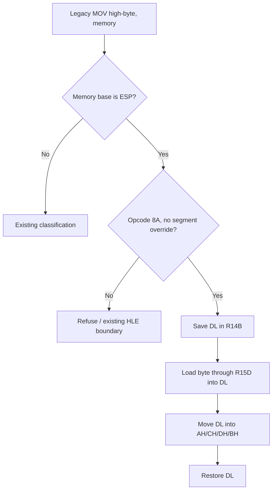

# Linux x64 스택 기준 high-byte 목적지 변환 설계

## 한국어

### 배경

Task 674의 일반적인 x64 재진입 보호를 검증하는 과정에서 게스트 주소
`0x010F3F0D`의 원본 명령 `8A 64 24 2C`가 다음 경계로 확인되었다. 이는
`MOV AH, [ESP+0x2C]`이며, x64에서 원본 바이트를 실행하면 `ESP`가 host
`RSP`를 가리키고 `AH` 인코딩도 REX 사용 여부에 따라 달라질 수 있다.

기존 high-byte lowering은 `AH/CH/DH/BH`가 ModRM source-only일 때만
지원한다. 목적지 high-byte와 `ESP` memory base가 함께 있는 이 형태는
분류기에서 거부되어 `CC` 경계가 되었고, 해당 경계는 일반적인 명령어
예외가 아니라 공통 ModRM/stack-pointer 변환 규칙의 미지원 조합이다.

### 결정

`MOV high-byte, [ESP 기반 메모리]`의 제한된 read-only memory 형태를
공통 long-mode lowering에 추가한다. 변환은 다음 의미를 보존한다.

1. 임시로 `DL`을 host scratch `R14B`에 보존한다.
2. `MOV DL, [R15+disp]`로 게스트 ESP를 R15D로 치환하여 메모리를 읽는다.
3. REX 없는 `MOV high-byte, DL`로 AH/CH/DH/BH 목적지를 갱신한다.
4. 보존한 `DL`을 복원한다.

이 변환은 flags를 변경하지 않고, 게스트 GPR 값을 보존하며, host RSP를
접근하지 않는다. 대상은 opcode `8A`, ModRM destination high-byte,
memory source, SIB base `ESP`, segment override 없음인 형태로 한정한다.
`XCHG`, read/write high-byte 형태 및 high-byte source 형태는 기존 규칙을
그대로 따른다.

### 흐름

### 검증 전략

`long_mode_compatibility_probe`에서 `8A 64 24 2C`의 분류, lowering
바이트 및 long-mode decode를 확인한다. 이어서 WSL x64 runtime을 실행하여
기존 `0x010F3F0D` 경계를 통과하고 다음 미지원 지점이 실제로 이동하는지
확인한다. 다른 high-byte memory 형태가 우연히 열리지 않았는지도 기존
refusal probe로 확인한다.

### 미확정 사항

이 변경은 목적지 high-byte와 ESP memory base의 관측된 조합만 다룬다.
다른 high-byte read/write 조합은 실행 관측과 의미 보존 증거가 생길 때
별도 lowering으로 판단한다.

## English

### Background

While validating Task 674's general x64 re-entry protection, guest address
`0x010F3F0D` was identified as original bytes `8A 64 24 2C`, or
`MOV AH, [ESP+0x2C]`. Executing those bytes in long mode would address through
host `RSP`, and the legacy high-byte encoding also changes when a REX prefix is
present.

The existing high-byte lowering admits only `AH/CH/DH/BH` as a ModRM
source-only operand. This destination-high-byte plus ESP-memory-base form was
therefore refused into a `CC` boundary. It is a missing common ModRM and
stack-pointer lowering combination, not an address-specific exception.

### Decision

Admit the restricted read-only memory form
`MOV high-byte, [ESP-based memory]` in the common long-mode lowering. Preserve
its meaning by:

1. Saving `DL` in the host scratch `R14B`.
2. Loading through `R15D` with `MOV DL, [R15+disp]`.
3. Updating the AH/CH/DH/BH destination with REX-free `MOV high-byte, DL`.
4. Restoring the saved `DL`.

The sequence preserves flags and guest GPRs and never touches host RSP. The
admitted shape is limited to opcode `8A`, a high-byte ModRM destination, a
memory source with SIB base ESP, and no segment override. `XCHG`, read/write
high-byte forms, and high-byte source forms retain their existing policy.

### Verification strategy

`long_mode_compatibility_probe` will verify classification, lowered bytes, and
long-mode decoding for `8A 64 24 2C`. The WSL x64 runtime will then confirm that
the observed `0x010F3F0D` boundary is passed and that execution reaches a later
frontier. Existing refusal probes will ensure unrelated high-byte memory forms
are not admitted accidentally.

### Open questions

This change covers only the observed destination-high-byte plus ESP-memory-base
combination. Other high-byte read/write combinations require separate evidence
and lowering decisions.
