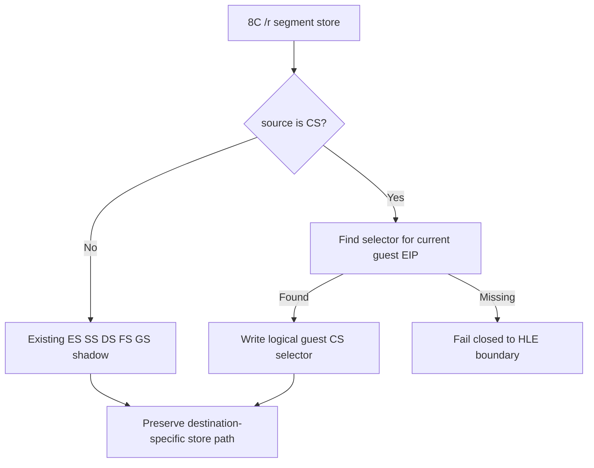

# Linux x64 segment-store HLE의 CS source 지원 설계

## 배경

Task 675에서 `MOV r/m16, Sreg`의 memory/register destination HLE를 공통
handler로 확장했다. 다음 runtime frontier에서 `8C C8` (`MOV AX, CS`)가
`kHleBoundary`로 남아 실행이 중단되었다. 현재 handler는 segment-register
field 1(CS)을 모든 `8C /r` source에서 거부하지만, CS는 `MOV r/m16, Sreg`의
유효한 source이다. 반대로 `8E /r`에서 CS를 destination으로 쓰는 것은 이
작업의 대상이 아니다.

이것은 특정 EIP의 예외가 아니라 segment-store opcode family의 불완전한
분류이다. Linux x64에서는 host CS가 guest DOS selector를 표현하지 않으므로,
guest 현재 EIP가 속한 selector table descriptor에서 logical CS를 구한다.

## 결정

`HandleSegmentStoreInstruction`의 `8C /r` 경로에서 CS source를 허용한다.

1. segment-register field 1은 `ReadGuestSegmentSelector`에서 현재 guest EIP를
   selector table로 역조회한다.
2. 역조회가 실패하면 host `SegCs`를 guest selector로 추정하지 않고 HLE를
   거부한다.
3. register destination과 DS-addressed memory destination, 기존 ES override
   memory 형태 모두 같은 selector source 규칙을 사용한다.
4. `8E /r`의 CS load 및 지원되지 않는 segment encoding은 그대로 거부한다.

## 검증 전략

* CS source가 current EIP의 selector table binding을 반환하는지 probe로
  확인한다.
* `8C C8`가 더 이상 segment-store HLE에서 거부되지 않는지 확인한다.
* WSL x64 runtime에서 `0x010F6415`를 통과하고 다음 frontier가 보고되는지
  확인한다.
* 기존 segment load, non-CS segment store, unsupported encoding의 refusal을
  유지한다.

## English

### Background

Task 675 extended the common HLE handler for `MOV r/m16, Sreg` destinations.
The next runtime frontier stopped at `8C C8` (`MOV AX, CS`) as a
`kHleBoundary`. The handler currently rejects segment-register field 1 (CS)
for every `8C /r` source, although CS is a valid source for this instruction
family. This task does not add CS as a destination of `8E /r`.

This is an incomplete opcode-family classification, not an EIP-specific
exception. Linux x64 host CS does not represent the guest DOS selector, so the
logical CS is obtained from the selector-table descriptor containing the
current guest EIP.

### Decision

Allow CS as a source in the `8C /r` path of
`HandleSegmentStoreInstruction`.

1. For segment-register field 1, `ReadGuestSegmentSelector` reverse-resolves
   the current guest EIP through the selector table.
2. If the reverse lookup fails, do not guess from host `SegCs`; refuse the HLE
   and fail closed at the existing boundary.
3. Register destinations, DS-addressed memory destinations, and the existing ES
   override memory form use the same selector-source rule.
4. CS loads through `8E /r` and unsupported segment encodings remain refused.

### Verification strategy

* Verify that the CS source resolves to the selector-table binding for the
  current guest EIP.
* Verify that `8C C8` is accepted by the segment-store HLE path.
* Run the WSL x64 runtime and confirm it passes `0x010F6415` and reaches a
  later frontier.
* Preserve existing refusals for segment loads, non-CS store cases, and
  unsupported encodings.
