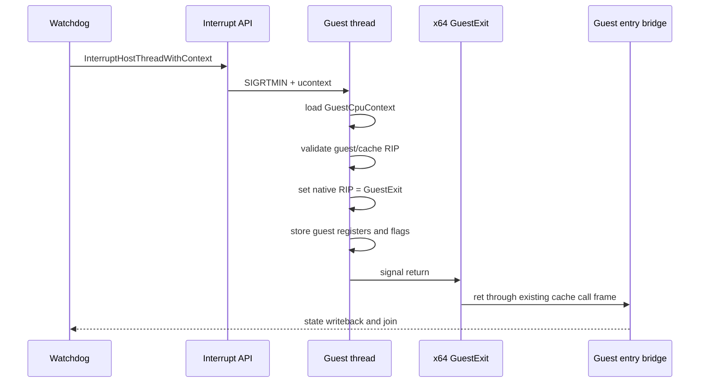

# Linux x64 coredump 복구 설계

## 한국어

### 목적

현재 Linux x64 실행에서 보이는 coredump를 원인별로 분리하고, 종료 시
발생하는 host context 손상을 공용 interrupt 경로의 규약으로 해결한다.
실행 중 AOT 경계에서 지원되지 않은 원본 명령을 만나는 문제는 종료 복구와
독립된 후속 작업으로 측정하고 해결한다.

### 확인된 원인

1. watchdog timeout이 Linux SIGRTMIN callback을 호출한다.
2. callback은 `GuestCpuContext::Eip`에 x64 recovery symbol 주소를 기록한다.
3. Linux x64 `StoreGuestCpuContext`는 32-bit EIP만 현재 RIP의 low half로
   병합하므로, recovery symbol의 full host RIP를 보존하지 못한다.
4. 그 결과 의도적으로 `UD2`를 둔 `RecoverGuestStackException`에 도달하고
   SIGILL 및 coredump가 발생한다.
5. 실행 중에는 `67 32 00`처럼 16-bit address-size 원본 명령이 단순히
   `67`을 한 번 더 붙이는 일반 lowering으로 잘못 분류되어 AOT planner HLE
   경계가 된다. 이 경계는 현재 HLE 서비스 명령이 아니므로 별도 명령 처리
   정책이 필요하다.

### 설계

interrupt API에 native host context를 전달하는 callback 형태를 추가한다.
기존 callback은 유지하여 register-only sampler 사용자를 깨뜨리지 않는다.
Linux x64 shutdown callback은 다음 공통 규약을 사용한다.

- guest/cache 영역에서만 복구를 허용한다.
- `RepiuLinuxX64GuestExit`의 full host RIP를 native context에 기록한다.
- `GuestCpuContext::Eip`에는 같은 주소의 low 32 bits를 기록하여 기존
  context 저장 함수와 일관성을 유지한다.
- host RSP는 변경하지 않는다. x64 cache entry의 `ret`가 기존 host call
  frame을 소비해야 하기 때문이다.

호출 흐름은 다음과 같다.

### 후속 AOT 경계 정책

16-bit address-size 명령은 주소별 예외처리로 우회하지 않는다. 원본 명령의
유효 주소 계산과 메모리 operand semantics를 보존하는 공용 lowering 또는
명령 emulation 계층으로 처리 가능성을 먼저 검증한다. segment override,
high-byte register, flags, guest memory protection처럼 lowering의 전제가
깨지는 경우에는 안전한 범위에서 명시적으로 거부하고 원인을 기록한다.

## English

### Purpose

Separate the coredump causes currently visible on Linux x64 and fix the
shutdown-side host-context corruption through the shared interrupt contract.
The unsupported original instruction encountered at an AOT boundary during
execution is measured and resolved as a separate follow-up from shutdown
recovery.

### Confirmed causes

1. The watchdog invokes the Linux SIGRTMIN callback on timeout.
2. The callback writes the x64 recovery symbol address into
   `GuestCpuContext::Eip`.
3. Linux x64 `StoreGuestCpuContext` merges only the 32-bit EIP into the low
   half of the current RIP, so it cannot preserve the recovery symbol's full
   host address.
4. Execution therefore reaches the intentional `UD2` in
   `RecoverGuestStackException`, producing SIGILL and a coredump.
5. During execution, an original 16-bit address-size instruction such as
   `67 32 00` is classified by a generic lowering that simply adds another
   `67`, producing an AOT planner-HLE boundary. This is not an HLE service
   instruction and requires a separate instruction policy.

### Design

Add an interrupt callback form that receives the native host context while
keeping the existing register-only callback for samplers. The Linux x64
shutdown callback follows one shared rule:

- recover only from guest/cache regions;
- write the full native RIP of `RepiuLinuxX64GuestExit`;
- write the low 32 bits of the same address into `GuestCpuContext::Eip` so the
  existing context store remains coherent; and
- leave host RSP unchanged so the x64 cache-entry `ret` consumes the existing
  host call frame.

### Follow-up AOT boundary policy

The 16-bit address-size instruction will not be bypassed with an address-list
exception. First evaluate a shared lowering or instruction-emulation layer
that preserves effective-address and memory-operand semantics. If the lowering
premises fail due to segment overrides, high-byte registers, flags, or guest
memory protection, refuse it within a documented safe boundary and record the
reason.
