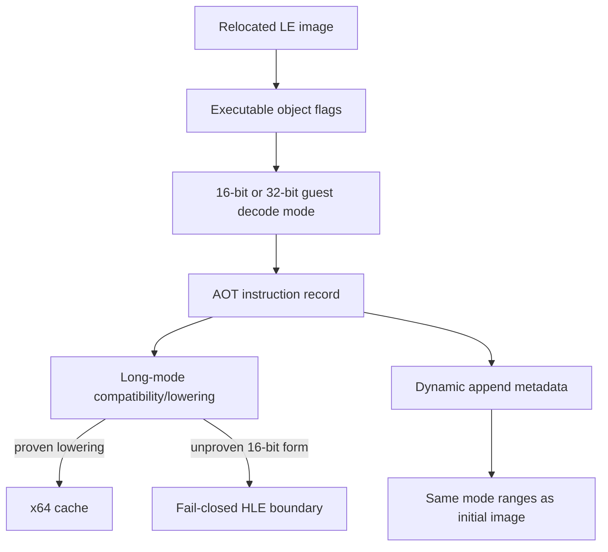

# 설계 20260914-679 — Linux x64 혼합 모드 게스트 디코드

## 목적

Linux x64 AOT 경로가 LE object의 기본 코드 모드를 보존하도록 수정합니다. 현재
planner는 모든 게스트 바이트를 `LEGACY_32`로 디코드합니다. 그 결과 `OBJALIAS16`
코드 object 3의 `BC 00 20`(`MOV SP, imm16`)을 `BC 00 20 FB 8D` 전체를 소비하는
`MOV ESP, imm32`로 오인했고, x64 cache가 `ESP=0x8DFB2000`이라는 가짜 상태를
만들었습니다.

목표는 원본 게임 코드나 특정 주소를 예외 처리하는 것이 아니라, LE object의
코드 기본 operand size를 AOT 계획·방출·동적 append가 공통으로 사용하도록 하는
것입니다.

## 확인된 원인

* object 3의 flags는 `0x1045`이며 `OBJBIGDEF`가 없어 16-bit code object입니다.
* object 3의 `0x01100022` 바이트는 `BC 00 20`으로 16-bit `MOV SP,0x2000`입니다.
* 현재 planner는 `ZYDIS_MACHINE_MODE_LEGACY_32`만 사용하여 해당 위치를 길이 5의
  32-bit `MOV ESP,imm32`로 기록합니다.
* 현재 long-mode emitter는 그 잘못된 기록을 `41 BF 00 20 FB 8D`로 낮추고,
  다음 `PUSH ES` HLE에서 범위 밖 ESP를 만나 SIGTRAP 뒤 SIGSEGV/coredump가
  발생합니다.

## 설계 결정

1. `AotInstructionRecord`에 게스트 code object의 기본 operand size를 기록합니다.
2. AOT planner는 명령 주소가 속한 executable object의 LE flags로
   `LEGACY_16` 또는 `LEGACY_32` Zydis decoder를 선택합니다. object 경계를
   넘는 잘못된 decode는 허용하지 않습니다.
3. long-mode compatibility classifier/lowerer는 기록된 guest mode를 입력으로
   받아야 합니다. 기존 32-bit 호출은 기본값으로 유지하여 기존 probe와 i386
   경로의 ABI를 보존합니다.
4. 아직 x64 lowering이 증명되지 않은 16-bit instruction은 원본 바이트를
   32-bit instruction으로 억지 변환하지 않고 fail-closed HLE boundary로
   보냅니다. 이는 잘못된 레지스터·길이·스택 상태를 만드는 것보다 안전합니다.
5. 동적 append도 초기 이미지와 동일한 executable object mode 범위를 사용합니다.
   동적 arena를 하나의 무속성 `LEGACY_32` object로 취급하지 않습니다.
6. `PUSH/POP`, `MOV SS`, far return의 stack width/base/limit ABI는 이 단위에서
   추정하지 않습니다. 이 단위는 먼저 잘못된 32-bit decode와 가짜 ESP 생성을
   제거하며, unresolved 16-bit stack semantics는 기존 fail-closed 경계를
   유지합니다.

## 흐름

## 검증 전략

* core probe에서 16-bit `BC 00 20`이 길이 3으로 디코드되고 32-bit immediate
  lowering에 들어가지 않는지 확인합니다.
* object 3의 dynamic AOT trace에서 `0x01100022`의 plan length가 3이고,
  `0x8DFB2000`을 생성하는 `41 BF`가 더 이상 방출되지 않는지 확인합니다.
* Linux x64 `repiu` target build와 core probe를 실행합니다.
* 짧은 WSL runtime smoke에서 기존 coredump 지점이 사라지고, 다음 미지원
  16-bit instruction이 있으면 그 guest EIP에서 fail-closed로 관찰되는지
  확인합니다.

---

# Design 20260914-679 — Linux x64 mixed-mode guest decoding

## Purpose

Make the Linux x64 AOT path preserve the default code mode of each LE object.
The planner currently decodes every guest byte as `LEGACY_32`. Consequently,
object 3, an `OBJALIAS16` code object, turns `BC 00 20` (`MOV SP, imm16`) into a
five-byte `MOV ESP, imm32` consuming `BC 00 20 FB 8D`, and the x64 cache creates
the fake state `ESP=0x8DFB2000`.

The goal is not an address-specific exception. The LE object's default operand
size must flow through planning, emission, and dynamic append as shared metadata.

## Confirmed cause

* Object 3 has flags `0x1045`; without `OBJBIGDEF`, it is a 16-bit code object.
* Its bytes at `0x01100022` are `BC 00 20`, a 16-bit `MOV SP,0x2000`.
* The planner currently uses only `ZYDIS_MACHINE_MODE_LEGACY_32` and records a
  five-byte 32-bit `MOV ESP,imm32`.
* The long-mode emitter lowers that wrong record to `41 BF 00 20 FB 8D`, and the
  following `PUSH ES` HLE sees an out-of-range ESP, producing SIGTRAP followed by
  SIGSEGV/coredump.

## Design decisions

1. Store the executable object's default operand size in `AotInstructionRecord`.
2. Select a `LEGACY_16` or `LEGACY_32` Zydis decoder from the LE flags of the
   executable object containing the instruction. Do not allow a decode to run
   across an object boundary.
3. Pass the recorded guest mode to the long-mode classifier/lowerer. Existing
   32-bit callers keep the default so existing probes and the i386 path retain
   their current ABI.
4. An unproven 16-bit instruction is sent to a fail-closed HLE boundary instead
   of being forced through a 32-bit re-encoding. This prevents false register,
   length, and stack state.
5. Dynamic append uses the same executable-object mode ranges as the initial
   image instead of treating the entire arena as an untyped `LEGACY_32` object.
6. This unit does not guess the stack width/base/limit ABI for `PUSH/POP`,
   `MOV SS`, or far return. It removes the bad 32-bit decode and fake ESP first,
   while preserving the existing fail-closed boundary for unresolved 16-bit
   stack semantics.

## Flow

The Korean diagram above shows the shared flow: LE object flags select the guest
decoder, the mode is carried by each plan record, the emitter either proves a
lowering or stops at HLE, and dynamic append reuses the same mode ranges.

## Verification strategy

* The core probe must decode 16-bit `BC 00 20` as length 3 and must not enter the
  32-bit immediate lowering.
* The object 3 dynamic AOT trace must report plan length 3 at `0x01100022` and
  must no longer emit `41 BF`, the instruction that created `0x8DFB2000`.
* Build the Linux x64 `repiu` target and run the core probe.
* Run a short WSL runtime smoke. The old coredump site should disappear; if a
  later 16-bit form remains unsupported, it must be observed as a fail-closed
  guest EIP rather than as a malformed 32-bit execution state.
