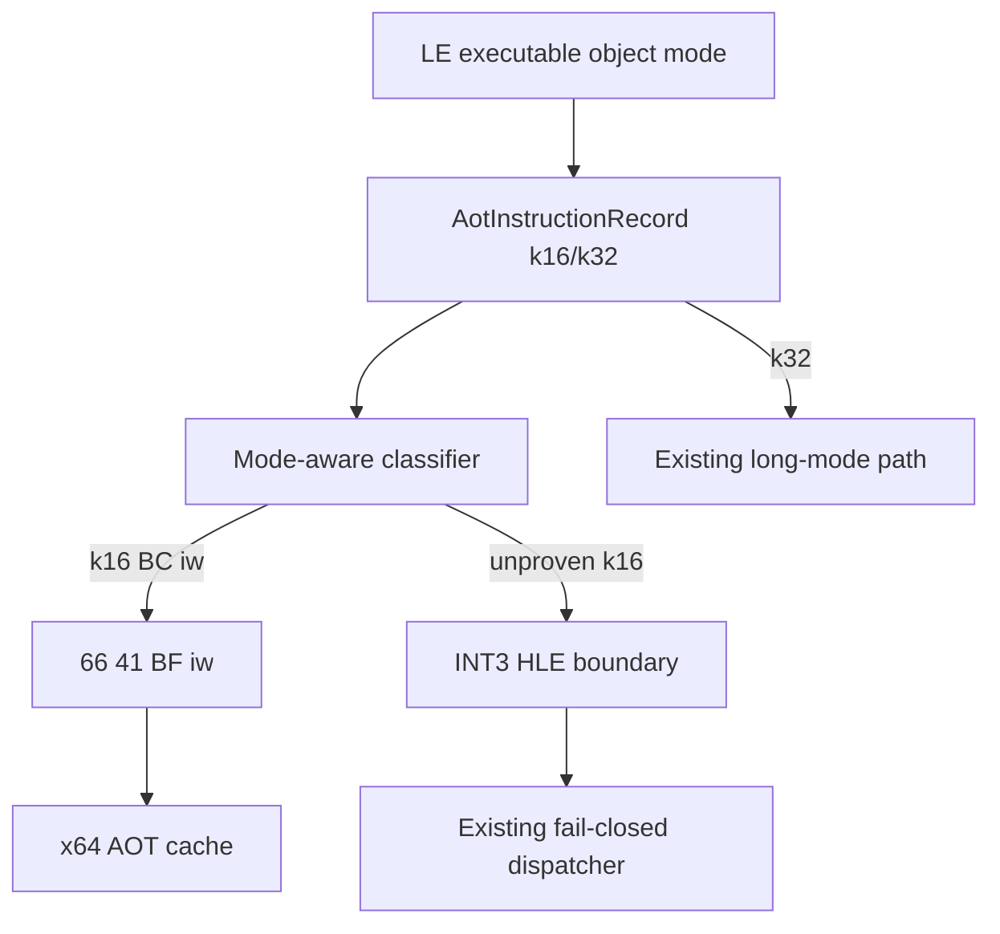

# 설계 20260914-680 — Linux x64 16-bit 스택 레지스터 lowering

## 목적

Task 679에서 object별 16/32-bit decode를 복원한 뒤 처음 도달하는 16-bit
명령인 `MOV SP, imm16`을 Linux x64 AOT cache에서 안전하게 실행합니다. 특정
guest 주소나 immediate를 검사하는 예외가 아니라, guest code mode를
classifier·lowerer·emitter가 공통으로 사용하도록 확장합니다.

## 확인된 맥락

* LE object 3은 `OBJBIGDEF`가 없는 16-bit code object입니다.
* `0x01100022`의 `BC 00 20`은 16-bit `MOV SP, 0x2000`이며, 32-bit decode로
  읽으면 다음 명령의 바이트까지 소비합니다.
* x64 cache에서 guest ESP는 host `R15D`에 보관하고 host `RSP`는 SysV
  stack으로 보존합니다.
* 16-bit `MOV SP, imm16`은 guest ESP의 low word만 바꾸고 upper word는
  보존합니다. 따라서 x64 encoding `66 41 BF iw`(`MOV R15W, iw`)가 이
  명령의 register effect와 일치합니다.

## 설계 결정

1. `ClassifyLongModeBytes`와 `LowerLongModeBytes`에 optional guest code mode
   인자를 추가합니다. 기본값은 `k32`로 하여 기존 probe와 i386 caller의
   동작을 유지합니다.
2. `k16` classifier는 현재 증명된 무접두 `BC iw`만 전용 lowering으로
   인정합니다. 나머지 16-bit 명령은 `kUnsupported`로 닫아 기존 32-bit
   semantics가 섞이지 않도록 합니다.
3. 16-bit `BC iw`의 lowering은 `66 41 BF iw`로 고정합니다. `66`은 R15의
   low word만 쓰게 하고, `41`은 destination을 guest ESP가 저장된 R15로
   선택합니다. 이 sequence는 flags를 변경하지 않습니다.
4. long-mode cache emitter는 record의 mode를 classifier/lowerer에 전달합니다.
   `k16` record의 non-copy kind는 기존 32-bit 전용 branch/return/segment
   slot으로 보내지 않고 INT3 HLE boundary로 닫습니다. 16-bit `kCopy`는
   증명된 `MOV SP, imm16`만 native lowering되고 나머지는 boundary입니다.
5. planner와 dynamic append trace에 mode 값을 출력하여 object 3의 실제
   plan/cache 경계를 주소와 바이트로 확인할 수 있게 합니다.
6. 이 단위에서는 16-bit `PUSH/POP`, `MOV SS`, far return, 16-bit address
   size, 또는 일반 16-bit HLE stack ABI를 추정하지 않습니다. 이 명령들은
   공통 stack width/base/limit semantics를 설계할 때 별도 단위로 다룹니다.

## 흐름

## 검증 전략

* compatibility probe에서 기본 `k32` API의 기존 `MOV ESP, imm32` lowering과
  mode-aware `k16` `BC iw` lowering을 각각 확인합니다.
* lowering probe는 결과 bytes가 `66 41 BF iw`이고 instruction count가 1인지,
  실제 x64 실행에서 R15 upper bits가 보존되는지 확인합니다.
* emission probe는 mode16 copy record가 전용 bytes를 얻고, mode16 non-copy
  record가 native branch/return slot이 아닌 boundary가 되는지 확인합니다.
* 가능한 Linux x64 build와 core probe를 실행합니다. WSL runtime smoke는
  현재 환경의 WSL mount 접근이 복구될 때 object 3 trace와 함께 수행합니다.

---

# Design 20260914-680 — Linux x64 16-bit stack-register lowering

## Purpose

After Task 679 restored per-object 16/32-bit decoding, make the first reached
16-bit instruction, `MOV SP, imm16`, execute safely in the Linux x64 AOT cache.
This extends the shared code-mode path through the classifier, lowerer, and
emitter rather than adding an exception for one guest address or immediate.

## Confirmed context

* LE object 3 is a 16-bit code object because it lacks `OBJBIGDEF`.
* `BC 00 20` at `0x01100022` is 16-bit `MOV SP, 0x2000`; a 32-bit decode
  consumes bytes from the following instruction.
* The x64 cache keeps guest ESP in host `R15D` and preserves host `RSP` for the
  SysV stack.
* 16-bit `MOV SP, imm16` updates only the low word of guest ESP. Therefore
  `66 41 BF iw` (`MOV R15W, iw`) preserves the required register effect.

## Design decisions

1. Add an optional guest code-mode argument to `ClassifyLongModeBytes` and
   `LowerLongModeBytes`. The default remains `k32`, preserving existing probes
   and i386 callers.
2. The `k16` classifier admits only the proven unprefixed `BC iw` form through a
   dedicated lowering. Every other 16-bit instruction remains unsupported so
   32-bit semantics cannot leak into it.
3. Lower 16-bit `BC iw` to `66 41 BF iw`. `66` selects a word write to R15,
   while `41` selects R15 as the destination holding guest ESP. The sequence
   does not modify flags.
4. The long-mode cache emitter passes record mode to the classifier/lowerer.
   A `k16` non-copy record is kept out of the existing 32-bit-only branch,
   return, and segment slots and becomes an INT3 HLE boundary. A `k16` copy is
   native-lowered only when it is the proven `MOV SP, imm16` form.
5. Include mode in planner and dynamic-append trace output so object 3's actual
   plan/cache boundary can be checked by address and bytes.
6. Do not infer 16-bit `PUSH/POP`, `MOV SS`, far returns, 16-bit address-size,
   or a general 16-bit HLE stack ABI in this unit. Those require a separate
   shared stack width/base/limit design.

## Flow

The Korean diagram shows the shared flow: LE object mode reaches each plan
record, the mode-aware classifier admits only the proven 16-bit form, the
lowerer emits the R15 word write, and all other unproven 16-bit records stop at
the existing boundary.

## Verification strategy

* The compatibility probe checks both the unchanged default `k32`
  `MOV ESP, imm32` lowering and the mode-aware `k16` `BC iw` lowering.
* The lowering probe checks `66 41 BF iw`, one emitted instruction, and actual
  x64 execution that preserves R15 upper bits.
* The emission probe checks native lowering for a mode16 copy record and a
  boundary for a mode16 non-copy record rather than a native branch/return
  slot.
* Run the Linux x64 build and core probe when available. Run the WSL runtime
  smoke with the object-3 trace after WSL mount access is restored.
