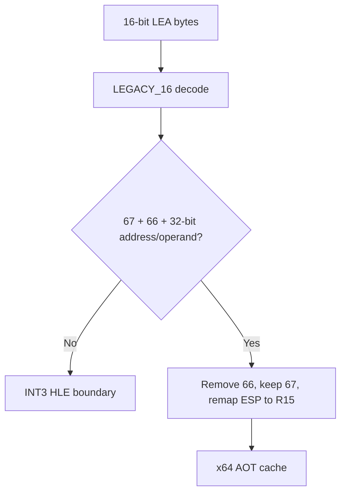

# 설계 20260915-681 — Linux x64 16비트 LEA lowering

## 목적

Task 680 이후 실제 object 3 dynamic trace에서 처음 남은 fail-closed 명령은
`67 66 8D 8C 24 00 E0 FF FF`이다. 이는 16비트 code object 안의
`LEA ECX,[ESP-0x2000]`이며, 32비트 주소 크기와 32비트 operand 크기를
명시한다. 이 설계는 해당 형식을 원본 바이트 수정 없이 Linux x64 cache에서
일반적인 mode-aware lowering 규칙으로 처리한다.

## 확인된 사실

* object 3은 `OBJBIGDEF`가 없는 16비트 code object이다.
* `67`은 16비트 code object에서 32비트 주소 계산을 선택한다.
* `66`은 16비트 기본 operand 크기를 32비트로 바꾼다.
* x64 cache에서 게스트 ESP는 R15D에 보관된다.
* 따라서 대상 명령은 x64에서 `67 41 8D 8C 27 00 E0 FF FF`로
  재인코드할 수 있다. `66`은 제거하고, `ESP`를 R15로 remap하며,
  `67`은 32비트 주소 계산을 유지한다.

## 설계 결정

1. `k16` classifier는 명시적인 `67`과 `66`을 가진 `LEA` 중
   `operand_width=32`, `address_width=32`, segment override 없음, 유효한
   32비트 GPR/ESP addressing만 lowering 대상으로 허용한다.
2. lowering은 source legacy prefix에서 operand-size `66`만 제거하고,
   address-size `67`은 유지한다. ModRM/SIB에서 게스트 ESP가 등장하면
   REX의 R/B bit와 필드를 R15에 맞게 바꾼다.
3. 주소 계산에 필요한 게스트 GPR은 현재 x64 mapping의 동일 번호 host GPR에
   남아 있다는 기존 cache 전제를 사용한다. ESP만 R15로 대체한다.
4. 16비트 주소 계산, 16비트 destination LEA, segment override, 비표준
   prefix 조합, 매핑할 수 없는 stack register form은 계속 fail-closed한다.
5. 기존 `k32` classifier/lowerer와 i386 경로의 동작은 변경하지 않는다.
6. 이 작업에서는 PUSH/POP, MOV SS, far return 또는 일반 16비트 stack ABI를
   추정하지 않는다.

## 흐름

## 검증 계획

* compatibility probe에서 해당 형식을 mode16 lowering으로 분류한다.
* lowering probe에서 기대 바이트와 실제 `ECX` 결과를 검증한다.
* emission probe에서 mode16 LEA가 native lowering되고, 기존 mode16
  non-copy boundary 정책이 유지되는지 검증한다.
* Linux x64 core probe를 실행한다.
* dynamic runtime trace에서 다음 미지원 16비트 명령이 드러나는지 확인한다.

---

# Design 20260915-681 — Linux x64 16-bit LEA lowering

## Purpose

After Task 680, the first remaining fail-closed instruction in the real object
3 dynamic trace is `67 66 8D 8C 24 00 E0 FF FF`. In the 16-bit code object this
is `LEA ECX,[ESP-0x2000]` with explicit 32-bit address and operand sizes. This
design handles that form in the Linux x64 cache through a general mode-aware
lowering rule without modifying the original guest bytes.

## Confirmed facts

* Object 3 is a 16-bit code object because it lacks `OBJBIGDEF`.
* `67` selects 32-bit address calculation in a 16-bit code object.
* `66` changes the 16-bit default operand size to 32 bits.
* The x64 cache stores guest ESP in R15D.
* The instruction can therefore be re-encoded as `67 41 8D 8C 27 00 E0 FF FF`:
  remove `66`, preserve `67`, and remap guest ESP to R15.

## Design decisions

1. The `k16` classifier admits only `LEA` with explicit `67` and `66`,
   `operand_width=32`, `address_width=32`, no segment override, and a valid
   32-bit GPR/ESP addressing form.
2. The lowering removes only the operand-size `66` from the source legacy
   prefixes and keeps the address-size `67`. If guest ESP appears in ModRM or
   SIB, it updates the REX R/B bits and the corresponding fields for R15.
3. Addressing GPRs retain the existing x64 mapping where guest GPR numbers match
   host GPR numbers; ESP is the sole replacement with R15.
4. 16-bit address calculation, 16-bit destination LEA, segment overrides,
   non-standard prefix combinations, and unsupported stack-register forms stay
   fail-closed.
5. Existing `k32` classifier/lowerer and i386 behavior remain unchanged.
6. This task does not infer PUSH/POP, MOV SS, far-return, or a general 16-bit
   stack ABI.

## Flow

The Korean diagram shows the shared path: decode the 16-bit instruction, admit
only the proven 67+66 32-bit LEA subset, remove the operand-size prefix, retain
the address-size prefix, remap ESP to R15, and otherwise stop at HLE.

## Verification plan

* The compatibility probe classifies the form as a mode16 lowering.
* The lowering probe checks the exact bytes and the resulting ECX value.
* The emission probe checks native mode16 LEA lowering while preserving the
  existing mode16 non-copy boundary policy.
* Run the Linux x64 core probe.
* Run the dynamic runtime trace to identify the next unsupported 16-bit form.

## 검증 보정

실행 검증에서 `0x0110000E`가 실제 동적 translation entry로 요청되었고,
해당 entry의 바이트는 `8D 8C 24 00`, mode16 `LEA CX,[SI+disp16]`로 확인되었다.
따라서 `67 66` 형식은 독립적인 공용 lowering으로 검증되었지만, 이번 실행의
첫 frontier가 이 형식이었다고 단정하지 않는다. 16비트 주소 계산을 보존하는
후속 lowering은 Task 682에서 별도로 설계한다.

## Verification correction

Runtime verification requested `0x0110000E` as the dynamic translation entry.
Its bytes are `8D 8C 24 00`, which decode in mode16 as `LEA CX,[SI+disp16]`.
The `67 66` form is therefore proven as an independent shared lowering, but it
is not claimed to be the first runtime frontier. A separate 16-bit address
calculation lowering is designed in Task 682.
