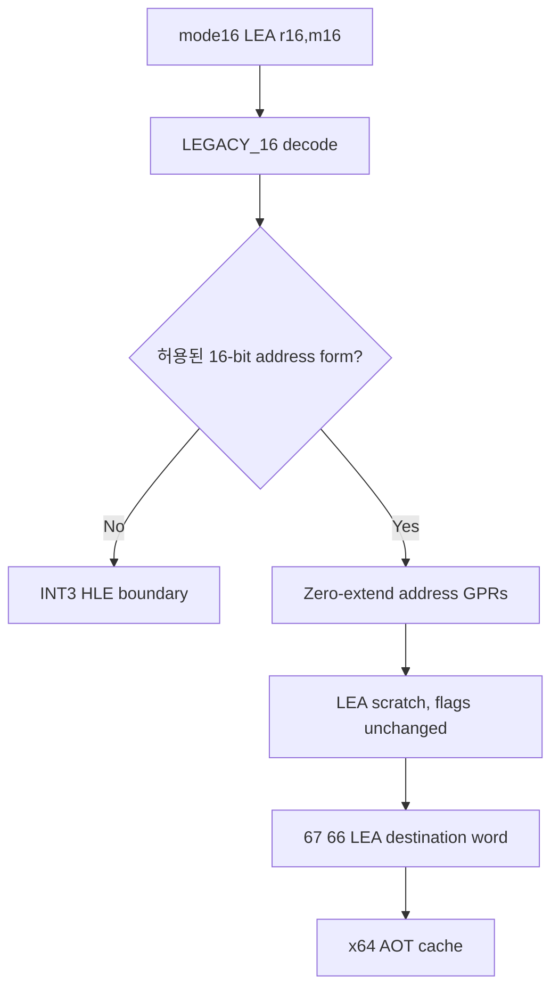

# 설계 20260915-682 — Linux x64 16비트 주소 LEA lowering

## 목적

Task 681 검증 뒤 실제 object 3 dynamic entry에서 확인된
`8D 8C 24 00`을 처리합니다. 이 바이트는 16비트 code object에서
`LEA CX,[SI+0x0024]`이며, x64에는 16비트 address-size encoding이 없으므로
원본 bytes를 실행하거나 32비트 주소 규칙으로 잘못 복사하지 않고 scratch
register를 사용하는 공용 lowering이 필요합니다.

## 확인된 사실

* mode16 decode는 operand width 16, address width 16입니다.
* `ModRM=8C`는 destination `CX`, address form `SI + disp16`이며 이 entry의
  displacement는 `0x0024`입니다.
* 16비트 effective address는 low word에서 wrap됩니다.
* `LEA`는 flags를 변경하지 않으므로 lowering sequence도 flags를 보존해야
  합니다.
* x64 AOT cache에서 `R14D`는 scratch이고 guest ESP state는 R15D입니다.

## 설계 결정

1. classifier는 prefix 없는 mode16 `LEA r16,m16` 중 segment override가
   없고, 16비트 address form이 `SI`, `DI`, `BX`, 또는 이들의 허용된 조합인
   subset만 admit합니다. BP 기반 form은 default SS base semantics가
   별도로 확정될 때까지 boundary로 둡니다.
2. lowering은 source 16비트 register를 `MOVZX R14D,r16`으로 materialize하고,
   필요한 두 번째 address register는 non-guest scratch `R10D`에 materialize한
   뒤 `LEA R14D,[R14D+R10D]`로 합칩니다. displacement-only form은
   `MOV R14D,0`으로 시작합니다.
3. 최종 destination은 `67 66 LEA r16,[R14D+disp32]`로 생성합니다.
   low word 결과만 destination에 쓰므로 16비트 destination semantics와
   16비트 wrap을 보존하며, 모든 sequence가 flags를 변경하지 않습니다.
4. destination이 guest SP이면 ModRM reg와 REX.R을 R15W에 맞게 remap합니다.
   memory operand에 SP가 나타나는 16비트 address form은 admit하지 않습니다.
5. segment override, BP 기반 address, unsupported prefix/ModRM shape는
   INT3 HLE boundary로 fail-closed합니다.
6. 주소 `0x0110000E`나 displacement `0x0024`에 종속된 예외는 추가하지
   않습니다.

## 흐름

## 검증 계획

* compatibility probe가 실제 `8D 8C 24 00`을 mode16 LEA16 lowering으로
  분류하고 BP/segment form은 거절하는지 확인합니다.
* lowering probe가 exact bytes와 flags 보존, `CX` low-word wrap 결과를
  실제 x64에서 확인합니다.
* emission probe가 mode16 LEA16을 native lowering하고 다음 boundary를
  별도 map entry로 유지하는지 확인합니다.
* Linux x64 core probe 후 object 3 dynamic trace에서 `0x0110000E`의
  `emitted_length`가 INT3 1바이트가 아닌 lowering sequence인지 확인합니다.

---

# Design 20260915-682 — Linux x64 16-bit address LEA lowering

## Purpose

Task 681 verification identified `8D 8C 24 00` as the actual object-3
dynamic entry. In a 16-bit code object it is `LEA CX,[SI+0x0024]`. x64 has no
16-bit address-size encoding, so a shared lowering must use scratch registers
without executing raw guest bytes or incorrectly copying 32-bit semantics.

## Confirmed facts

* The mode16 decode has operand width 16 and address width 16.
* `ModRM=8C` names destination `CX` and address form `SI + disp16`; this
  entry's displacement is `0x0024`.
* The effective address wraps at the low word.
* `LEA` does not modify flags, so the lowering must preserve flags as well.
* R14D is the x64 AOT scratch register and guest ESP state is in R15D.

## Design decisions

1. Admit only prefix-free mode16 `LEA r16,m16` with no segment override and a
   proven 16-bit address subset using SI, DI, BX, or allowed combinations.
   BP-based forms remain boundaries until default-SS base semantics are proven.
2. Materialize source address words with `MOVZX R14D,r16`; materialize a second
   source in non-guest scratch R10D and combine with `LEA R14D,[R14D+R10D]`.
   Displacement-only forms start with `MOV R14D,0`.
3. Emit the final destination as `67 66 LEA r16,[R14D+disp32]`. The word
   destination preserves 16-bit result and wrapping semantics, and the whole
   sequence preserves flags.
4. Remap a guest-SP destination through ModRM.reg and REX.R to R15W. Reject
   forms that name SP in the 16-bit memory address.
5. Segment overrides, BP-based addresses, unsupported prefixes/ModRM shapes,
   and other unproven forms remain INT3 HLE boundaries.
6. No exception keyed to `0x0110000E` or displacement `0x0024` is added.

## Verification plan

Run compatibility, lowering, and emission probes; then run the Linux x64 core
probe and a dynamic object-3 trace. The trace must show a lowering sequence for
`0x0110000E` rather than a one-byte INT3 entry.
