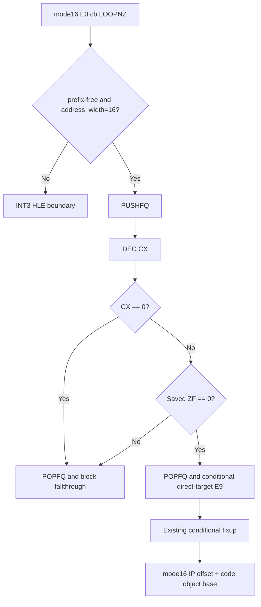

# 설계 20260915-683 — Linux x64 mode16 LOOPNZ lowering

## 목적

Task 682 이후 실제 object 3 dynamic plan의 다음 frontier인
`E0 FF`를 처리합니다. 이 바이트는 mode16 `LOOPNZ`이며 x64 long mode의
기본 loop counter는 16비트 `CX`가 아니므로 원본 바이트를 복사할 수
없습니다. 특정 주소의 예외가 아니라 mode16 `LOOPNZ` 명령군 전체를
분류하고, AOT cache의 정적 direct-edge fixup을 통해 원본 control flow를
보존하는 공용 lowering이 필요합니다.

## 확인된 사실

* runtime trace에서 `0x01100012: E0 FF`는 length 2,
  `code_mode=16`, `address_width=16`, mnemonic `LOOPNZ`로 decode됩니다.
* mode16 `LOOPNZ`는 `CX`를 16비트로 감소시키고, 결과가 0이 아니며
  명령 전의 `ZF=0`일 때만 direct target으로 분기합니다.
* `LOOPNZ` 자체는 flags를 변경하지 않습니다. 따라서 감소·조건 검사에
  사용한 host flags는 원래 guest flags로 복원되어야 합니다.
* x64 AOT mapping에서 guest `ECX`는 host `ECX`이고, guest `ESP`는
  host `R15D`이며 host `RSP`는 임시 stack으로 예약되어 있습니다.
* 기존 `kConditionalBranch`는 `direct_target` fixup과 별도 block
  fallthrough edge를 사용하므로, mode16 loop slot도 같은 metadata 계약을
  사용해야 합니다.
* 최신 실행에서 Zydis의 mode16 relative target은 `0x00000013`이라는
  segment-relative offset으로 기록되었습니다. 실제 linear guest target은
  code object base `0x01100000`을 더한 `0x01100013`이어야 합니다.

## 설계 결정

1. mode16, prefix 없는 `E0 cb`, `address_width=16`인 `LOOPNZ`만
   compatibility classifier가 별도 lowering kind로 admit합니다. address
   size override로 `ECX`를 사용하는 형태, segment/prefix가 섞인 형태 및
   다른 mode16 branch는 계속 fail-closed boundary로 둡니다.
2. 이 lowering은 `LowerLongModeBytes`의 독립 명령 byte rewriter가 아니라
   AOT plan의 target/fallthrough metadata가 필요한 control-flow lowering으로
   구현합니다. long-mode emitter가 classifier verdict를 확인한 뒤 전용
   slot을 생성합니다.
3. slot은 다음 의미의 순서를 사용합니다.

   * host `PUSHFQ`로 원래 flags를 저장합니다.
   * `DEC CX`로 mode16 counter를 감소시키고 `TEST CX,CX`로 zero 여부를
     검사합니다.
   * `R14`에 저장된 flags의 원래 ZF bit를 `BT`로 확인합니다.
   * 두 조건이 모두 참이면 flags를 `POPFQ`로 복원한 뒤 `direct_target`으로
     가는 `E9 rel32`를 실행합니다.
   * 그 외 경로도 flags를 `POPFQ`로 복원하고 slot 끝으로 떨어져 기존
     block fallthrough `E9`를 사용합니다.

   `DEC`, `TEST`, `BT`가 host flags를 덮어써도 모든 탈출 경로에서
   `POPFQ`가 원래 flags를 복원합니다. host `RSP` push/pop은 균형이 맞고
   guest `ESP`/R15는 변경하지 않습니다.
4. direct target은 기존 `AotFixupKind::kConditionalBranch` 하나로
   patch합니다. not-taken path는 slot 밖에서 기존
   `kBlockFallthrough` fixup이 처리하도록 하여 unresolved target을
   fail-closed로 중화할 때 두 edge의 patch 영역이 서로 덮어쓰지 않게
   합니다.
5. slot 내부의 짧은 `JZ`/`JC`는 local restore label로만 분기합니다.
   외부 target이 cache에 없으면 기존 `NeutraliseLongModeBranch`가 해당
   address-map entry 전체를 `INT3`로 바꾸고 원본 guest boundary로
   돌아가게 합니다.
6. `R14`는 기존 x64 emitter scratch 계약을 따르고, mode16 `LOOPNZ`를
   특정 guest address나 displacement에 묶지 않습니다.
7. planner의 mode16 relative direct-target 계산은 decoder가 반환한
   16비트 IP offset을 현재 executable code-mode range의 relocated base에
   rebasing합니다. 이 변환은 `LOOPNZ`뿐 아니라 향후 동일한 mode16 near
   branch/call에도 적용되며, 범위를 찾지 못하면 target을 fail-closed로
   거절합니다.

## 흐름

## 검증 계획

* compatibility probe가 `E0 FF`를 mode16 LOOPNZ lowering으로 분류하고
  address-size override/unsupported prefix는 거절하는지 확인합니다.
* emission probe가 x64 slot의 decode instruction count, direct-target
  fixup, slot 밖 fallthrough fixup 및 unresolved target 중화를 확인합니다.
* Linux x64 lowering 실행 probe가 `CX` wrap, 기존 `ZF` 조건, flags 복원,
  taken/not-taken 경로를 실제 실행으로 확인합니다.
* Linux x64 runtime trace에서 `0x01100012`의 1바이트 `CC`가 전용 slot으로
  바뀌며, conditional target fixup이 code-object base를 포함한 linear
  guest address로 해석되는지 확인합니다. 다음 frontier는 그 slot 내부가
  아닌 실제 guest 명령으로 이동해야 합니다.

## 실행 결과와 경계

probe 수준의 설계와 구현은 완료되었지만, live runtime은 이 slot에
도달하지 못했습니다. far transfer target `0x01100004`가 정적 AOT map에
없을 때 기존 re-entry gate가 첫 명령을 legacy-32 기준으로만 검사하여
mode16 original-byte fallback을 허용했습니다. 그 결과 mode16 `B8 07 00`이
x64에서 5바이트 `MOV EAX,0x66670007`로 소비되어 `0x0110000E`가 다음
dynamic entry가 되었습니다. 이 공통 gate 문제는 Task 684에서 별도로
수정하며, `LOOPNZ` slot을 주소별 예외로 확장하지 않습니다.

---

# Design 20260915-683 — Linux x64 mode16 LOOPNZ lowering

## Purpose

Task 682's next object-3 dynamic-plan frontier is `E0 FF`, a mode16
`LOOPNZ`. Long mode does not provide the guest's 16-bit `CX` loop-counter
semantics for the copied encoding. The shared fix is to classify the whole
mode16 `LOOPNZ` form and emit it as an AOT control-flow slot using the plan's
direct-target and fallthrough fixup contract.

## Design decisions

Admit only prefix-free mode16 `E0 cb` with 16-bit address size. Emit a
dedicated slot that saves flags with balanced host `PUSHFQ`/`POPFQ`, decrements
`CX`, tests the 16-bit result, tests the saved original ZF through `R14`, and
uses the existing conditional direct-edge fixup for the taken target. The
not-taken path exits the slot and uses the existing block-fallthrough edge.
Unresolved targets remain fail-closed through the existing whole-entry INT3
neutralisation path. This is a semantic instruction-class lowering, not an
address-specific exception and not a raw-byte copy.

## Verification plan

Run the compatibility, emission, and x64 execution probes, then the Linux x64
core probe and object-3 dynamic trace. Verify the `E0 FF` image entry is a
native multi-instruction slot, its relative target is rebased to the linear
guest address, and the next runtime fault is a later guest instruction rather
than this loop boundary.

The probe-level design and implementation are complete, but the live runtime
has not reached this slot. When the far-transfer target `0x01100004` is absent
from the static AOT map, the existing re-entry gate checks only the first
instruction with the legacy-32 default and allows a mode16 original-byte
fallback. The mode16 `B8 07 00` is then consumed in long mode as the five-byte
`MOV EAX,0x66670007`, making `0x0110000E` the next dynamic entry. This shared
gate issue is tracked separately as Task 684; the `LOOPNZ` slot will not gain an
address-specific exception.
