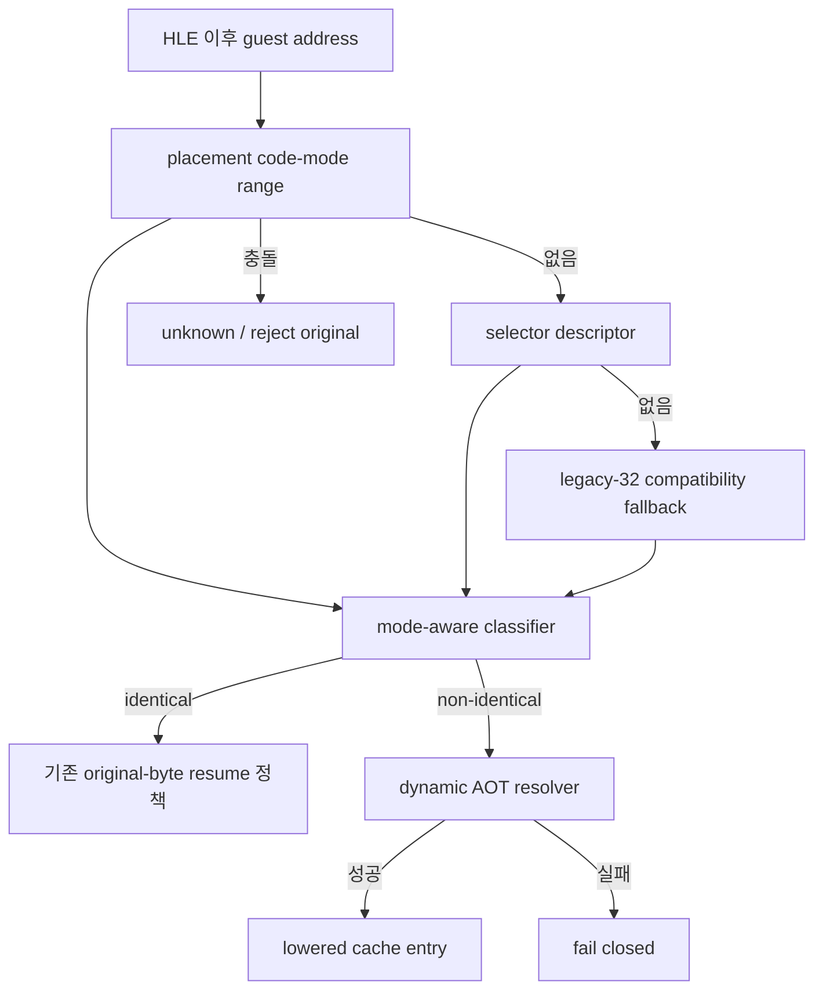

# 설계 20260915-684 — Linux x64 code-mode-aware re-entry

## 목적

Task 683의 런타임 trace에서 확인된 공용 재진입 오류를 수정합니다. AOT
placement가 보유한 executable object의 code-mode metadata를 Linux x64
legacy-byte compatibility gate에 전달하여, mode16 instruction을 long mode
원본 byte로 잘못 실행하지 않도록 합니다.

이 작업은 특정 guest EIP나 opcode를 예외 처리하지 않습니다. 원본 guest
bytes는 유지하고, 이미 존재하는 mode-aware classifier와 dynamic AOT
resolver를 공용 경로에서 연결합니다.

## 확인된 문제

`CanResumeLinuxX64LegacyTarget`가 항상 legacy-32 기본 모드로 첫 instruction을
decode합니다. object 3은 `OBJBIGDEF`가 없는 executable object이므로 mode16인데,
`0x01100004: 66 85 FF`를 legacy-32의 `TEST DI,DI`와 동일한 것으로 판정합니다.
그 결과 `B8 07 00`이 x64에서 5바이트 `MOV EAX,0x66670007`로 해석되어 원본
instruction boundary가 변경됩니다.

또한 cache miss 뒤 post-HLE dynamic translation이 opt-in으로만 실행되는
현재 정책은 non-identical original bytes를 실행할 수 있는 틈을 남깁니다.
non-identical인 경우에는 설정값과 무관하게 안전한 cache entry 해석을 시도해야
하며, translation이 실패하면 원본 bytes로 돌아가지 않고 fail-closed 해야
합니다.

## 설계 결정

### 1. code-mode metadata의 출처

재진입 대상 주소의 mode는 다음 순서로 판정합니다.

1. `ThreadContext::aot_placement->code_mode_ranges`에서 주소를 포함하는
   `RuntimeCodeModeRange`를 찾습니다.
2. placement range가 없을 때는 `ThreadContext::selector_table`의 고유
   executable descriptor를 사용합니다. descriptor의
   `code_default_operand_size`가 mode metadata입니다.
3. 둘 다 없으면 기존 호환성을 위해 legacy-32를 기본값으로 사용합니다.

placement와 selector table이 서로 다른 mode를 보고하면 안전한 쪽인
`kUnknown`으로 취급하여 original-byte resume을 허용하지 않습니다. 동일한
범위가 여러 개 매칭되는 경우도 모호한 상태이므로 허용하지 않습니다.

### 2. compatibility gate

`CanResumeLinuxX64LegacyTarget`는 선택한 code mode를
`ClassifyLongModeBytes`에 전달합니다. classifier가
`kIdenticalBytes`를 반환할 때만 원본 long-mode byte resume을 허용합니다.
mode16 `66 85 FF`처럼 operand-size divergence가 있으면 false를 반환하고,
특정 명령어 목록을 별도로 유지하지 않습니다.

### 3. cache miss 정책

`TryResumeAotAfterHandledHle`의 cache-miss 경로는 현재 instruction의
compatibility를 공용 gate로 확인합니다.

* identical: 기존처럼 `REPIU_AOT_DBT_POST_HLE_TRANSLATE`가 꺼져 있으면
  원본 경로를 유지합니다.
* non-identical: 설정값과 무관하게 `ResolveAotTransferTarget`를 호출합니다.
* resolver 실패: pending/fallback 상태를 유지한 채 원본 non-identical bytes를
  실행하지 않고 fail-closed 합니다.

이 정책은 dynamic translation opt-in을 제거하는 것이 아니라, 안전하지 않은
원본 실행만 금지하는 최소 안전장치입니다. 이미 cache hit인 경우에는 기존
cache entry 경로와 span gate를 그대로 사용합니다.

## 불변 조건

* 원본 executable bytes와 guest control-flow는 수정하지 않습니다.
* mode16 또는 metadata 충돌 instruction을 long mode 원본 byte로 실행하지
  않습니다.
* mode32의 기존 `kIdenticalBytes` 및 HLE/transfer 경계를 변경하지 않습니다.
* 주소별 예외 목록이나 object-3 전용 분기를 추가하지 않습니다.
* resolver 실패 시 잘못된 host `RSP`/operand width를 가진 원본 경로로
  되돌아가지 않습니다.

## 검증 계획

* general stack probe에 synthetic mode16 placement range를 연결하고
  `66 85 FF`가 legacy resume을 거부하는지 확인합니다.
* 동일 probe에서 mode32 `89 C2`는 계속 허용되고 `PUSH ESP`는 계속 거부되는지
  regression 확인합니다.
* Linux x64 `repiu_core_probe`를 빌드·실행합니다.
* object 3 trace에서 `0x01100004`가 mode16 non-identical dynamic translation
  경로로 들어가는지, 원본 `B8 07 00`을 직접 실행하지 않는지 확인합니다.
* 이후 실패가 mode16 `TEST`/`Jcc` lowering 경계에서 발생하면 그것을 다음
  별도 lowering 작업으로 기록합니다.

---

# Design 20260915-684 — Linux x64 code-mode-aware re-entry

## Purpose

Fix the shared re-entry error found by Task 683's runtime trace. Feed the
executable object code-mode metadata held by AOT placement into the Linux x64
legacy-byte compatibility gate, so mode16 instructions cannot be incorrectly
executed as original long-mode bytes.

This is not a guest-EIP or opcode exception. Original guest bytes remain
unchanged; the existing mode-aware classifier and dynamic AOT resolver are
connected through the shared path.

## Confirmed issue

`CanResumeLinuxX64LegacyTarget` always decoded with the legacy-32 default.
Object 3 is an executable object without `OBJBIGDEF`, so it is mode16, but
`0x01100004: 66 85 FF` was classified as the legacy-32 `TEST DI,DI` with
identical bytes. The next `B8 07 00` was therefore decoded in x64 as the
five-byte `MOV EAX,0x66670007`, changing the original instruction boundary.

The cache-miss policy also made post-HLE dynamic translation opt-in only,
leaving a path that could execute non-identical original bytes. A non-identical
instruction must attempt safe cache resolution regardless of the setting; if
translation fails, it must fail closed rather than return to original bytes.

## Design decisions

### 1. Source of code-mode metadata

Resolve the target mode in this order:

1. Find the containing `RuntimeCodeModeRange` in
   `ThreadContext::aot_placement->code_mode_ranges`.
2. If placement has no matching range, use the unique executable descriptor in
   `ThreadContext::selector_table`; its `code_default_operand_size` is the
   mode metadata.
3. If neither source is available, retain the legacy-32 default for compatibility.

If placement and selector metadata disagree, use `kUnknown` and do not permit
original-byte resume. Multiple matching ranges are also ambiguous and are not
permitted.

### 2. Compatibility gate

`CanResumeLinuxX64LegacyTarget` passes the selected code mode to
`ClassifyLongModeBytes`. Original long-mode byte resume is allowed only for
`kIdenticalBytes`. A mode16 operand-size divergence such as `66 85 FF` therefore
returns false without maintaining a special instruction list.

### 3. Cache-miss policy

The cache-miss path in `TryResumeAotAfterHandledHle` consults the shared
compatibility gate for the current instruction.

* Identical: preserve the current behavior; when
  `REPIU_AOT_DBT_POST_HLE_TRANSLATE` is disabled, keep the original path.
* Non-identical: call `ResolveAotTransferTarget` regardless of the setting.
* Resolver failure: keep the pending/fallback state and fail closed; never
  execute the original non-identical bytes.

This does not remove the dynamic-translation opt-in for safe identical paths;
it only forbids unsafe original execution. Existing cache-hit and span-gate
behavior remains unchanged.

## Invariants

* Do not modify original executable bytes or guest control flow.
* Do not execute mode16 or conflicting-metadata instructions as original long-mode
  bytes.
* Preserve existing mode32 `kIdenticalBytes` and HLE/transfer boundaries.
* Add no address-specific or object-3-specific branch.
* Do not fall back to original bytes with the wrong host RSP or operand width
  after resolver failure.

## Verification plan

* Connect a synthetic mode16 placement range in the general stack probe and
  verify that `66 85 FF` is rejected by the legacy resume gate.
* Verify that mode32 `89 C2` remains allowed and `PUSH ESP` remains rejected.
* Build and run the Linux x64 `repiu_core_probe`.
* Trace object 3 and confirm that `0x01100004` enters mode16 non-identical
  dynamic translation without executing original `B8 07 00`.
* If the next failure is the mode16 `TEST`/`Jcc` lowering boundary, record it as
  the next separate lowering task.
