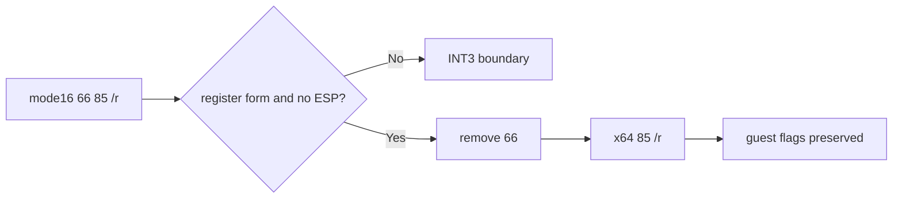

# 설계 20260915-685 — Linux x64 mode16 TEST lowering

## 목적

Task 684가 mode16 원본 byte fallback을 차단한 뒤 실제 dynamic image의 첫
경계는 `0x01100004: 66 85 FF`로 확인되었습니다. mode16에서 이 bytes는
`TEST EDI, EDI`이고, long mode에서는 같은 bytes가 operand-size override를
통해 16비트 TEST가 되므로 원본 instruction 의미와 일치하지 않습니다.

원본 guest logic과 flags를 보존하면서 이 instruction class를 x64 cache에서
일반 lowering합니다. 특정 주소나 특정 register 조합만 허용하지 않고,
prefix-free mode16 register-register `TEST r32,r32` 형태 전체를 다룹니다.

## 확인된 사실

* source code mode16에서 `66 85 /r`는 32비트 operand-size override를 선택합니다.
* x64 long mode의 기본 operand size는 32비트이므로 `66`을 제거한 `85 /r`가
  같은 register-register TEST와 flags 동작을 만듭니다.
* memory form과 address-size override, segment prefix는 guest address
  semantics가 추가로 필요하므로 이 작업에서 열지 않습니다.
* register field 또는 rm field가 guest ESP를 가리키는 form은 현재 x64 guest
  register mapping의 별도 R15 remap 계약이 필요하므로 fail-closed로 둡니다.

## 설계 결정

### Classifier

mode16에서 다음 조건을 모두 만족하는 instruction만
`k16BitTest32ToGuestGprs`로 분류합니다.

* default opcode map의 `85` / `TEST`;
* operand width 32, address width 16;
* prefix가 정확히 하나이고 `66`;
* ModRM register form (`mod=3`);
* segment prefix가 없고 guest ESP를 사용하지 않음.

그 외 mode16 TEST와 operand-size form은 기존처럼 `kOperandWidth` boundary로
남깁니다.

### Lowering

byte-only lowerer는 instruction prefix 영역에서 `66`을 제거하고 opcode와
ModRM을 복사합니다. output은 정확히 `85 /r` 2바이트, instruction count는
1입니다. TEST는 destination register를 쓰지 않고 flags만 변경하므로
upper register state나 guest stack state를 별도 조정하지 않습니다.

## 불변 조건

* 원본 executable bytes는 수정하지 않습니다.
* address-specific 분기나 object-3 전용 예외를 추가하지 않습니다.
* TEST의 flags 의미를 유지하며 guest GPR upper bits를 변경하지 않습니다.
* ESP, memory, segment, address-size 변형은 검증 전까지 열지 않습니다.
* unresolved/unsupported 다음 instruction은 기존 INT3 fail-closed 경계를
  유지합니다.

## 검증 계획

* compatibility probe에서 `66 85 FF`가 mode16 reencode와 새 lowering kind로
  분류되는지 확인합니다.
* `85 FF`와 `67 66 85 FF`, memory/ESP forms가 새 lowering을 오용하지 않는지
  확인합니다.
* lowering probe에서 output bytes, flags(ZF/CF/OF), upper register 보존을
  실제 x64 실행으로 확인합니다.
* Linux x64 core probe와 게임 dynamic trace를 실행하여 첫 SIGTRAP frontier가
  TEST 이후의 mode16 `74 39` Jcc로 이동하는지 확인합니다.

---

# Design 20260915-685 — Linux x64 mode16 TEST lowering

## Purpose

After Task 684 blocked the mode16 original-byte fallback, the first dynamic
image boundary is `0x01100004: 66 85 FF`. In mode16 these bytes are
`TEST EDI, EDI`; the same bytes in long mode select a 16-bit TEST because of
the operand-size override, so the copied encoding is not equivalent.

Add a shared lowering for this instruction class while preserving original
guest logic and flags. The implementation covers the complete prefix-free
mode16 register-register `TEST r32,r32` form, not one address or register pair.

## Confirmed facts

* In a mode16 code object, `66 85 /r` selects a 32-bit operand-size override.
* Long mode's default operand size is 32-bit, so removing `66` and emitting
  `85 /r` preserves the register-register TEST and flags behavior.
* Memory, address-size, and segment-prefix forms require additional guest
  addressing semantics and remain closed here.
* Forms naming guest ESP require the existing x64 guest-register mapping's R15
  remap contract and remain fail-closed.

## Design decisions

### Classifier

In mode16, admit only an instruction satisfying all of these conditions as
`k16BitTest32ToGuestGprs`:

* default opcode map `85` / `TEST`;
* operand width 32 and address width 16;
* exactly one `66` prefix;
* ModRM register form (`mod=3`);
* no segment prefix and no guest ESP operand.

Other mode16 TEST and operand-size forms remain `kOperandWidth` boundaries.

### Lowering

The byte-only lowerer removes `66` from the prefix region and copies the opcode
and ModRM. The output is exactly two bytes, `85 /r`, and has instruction count
one. TEST does not write a destination register; it changes flags only, so no
guest register or stack state adjustment is needed.

## Invariants

* Do not modify original executable bytes.
* Add no address-specific or object-3-specific branch.
* Preserve TEST flags and guest GPR upper bits.
* Keep ESP, memory, segment, and address-size variants closed until proven.
* Preserve the existing INT3 fail-closed boundary for later unsupported
  instructions.

## Verification plan

* Verify that compatibility classifies `66 85 FF` as the new mode16 reencode,
  while `85 FF`, `67 66 85 FF`, and memory/ESP forms do not use it.
* Verify output bytes and flags (ZF/CF/OF), plus upper-register preservation,
  through actual x64 execution in the lowering probe.
* Run the Linux x64 core probe and a game dynamic trace; confirm the first
  SIGTRAP frontier moves past TEST to the following mode16 `74 39` Jcc.
