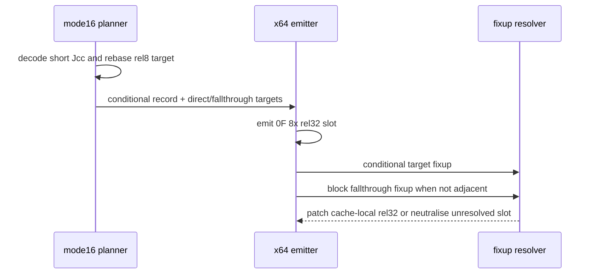

# 설계 20260915-686 — Linux x64 mode16 conditional branch lowering

## 목적

Task 685에서 mode16 TEST를 통과한 뒤 object 3의 다음 frontier는
`0x01100007: 74 39`입니다. 이는 mode16 `JZ rel8`이며, 조건 자체는 x64와
동일하지만 mode16 IP wrap과 code-object-relative target을 그대로 복사할 수
없습니다.

이번 작업에서는 mode16 conditional branch의 target metadata를 기존 planner
계약으로 사용하고, x64 direct-branch slot을 공용 emitter에서 허용합니다.
특정 Jcc mnemonic이나 주소에 종속되지 않으며, target/fallthrough fixup은
기존 CFG 계약을 재사용합니다.

## 확인된 사실

* Task 683에서 mode16 near-relative target은 code-mode range의 relocated
  base를 더해 linear guest address로 rebasing하도록 planner가 수정되었습니다.
* x64의 `0F 8x rel32`는 Jcc 조건을 유지하며, cache 내부 target에 대한
  dispatch frame이나 guest stack 조작이 필요하지 않습니다.
* mode16 short Jcc의 원본 `rel8`을 복사하지 않고 planner가 계산한
  `direct_target`으로 rel32 fixup을 생성해야 16비트 IP wrap을 보존합니다.
* mode16 `LOOPNZ`는 CX/flags semantics가 필요해 전용 slot을 사용하지만,
  일반 Jcc는 condition flag를 변경하지 않으므로 기존 direct branch slot으로
  충분합니다.

## 설계 결정

### Planner

기존 `ReadDirectTarget`의 mode16 rebasing을 그대로 사용합니다. address width
16이 아니거나 code segment base를 찾지 못하면 direct branch가 아니라 기존
indirect/fail-closed 경계로 남깁니다.

### Emitter

long-mode emission gate에서 mode16 `kConditionalBranch`만 기존
`EmitLongModeDirectBranch`에 전달합니다. direct jump, call, return, selector
관련 non-copy record는 여전히 32비트 전용 경계를 유지합니다.

emitter는 mnemonic으로 `0F 80`부터 `0F 8F`까지의 condition opcode를 선택하고,
`AotFixupKind::kConditionalBranch`로 direct target을 patch합니다. block의
fallthrough는 기존 `kBlockFallthrough` pending-edge 정책이 처리합니다.

## 불변 조건

* 원본 short Jcc bytes는 수정하지 않습니다.
* mode16 direct jump/call/return은 이 작업에서 열지 않습니다.
* target이 unresolved이면 기존 long-mode branch neutralisation으로 전체
  branch slot을 fail-closed 처리합니다.
* condition flags와 guest stack state를 branch slot이 변경하지 않습니다.
* 특정 주소나 `JZ` 하나만 허용하는 예외를 추가하지 않습니다.

## 검증 계획

* compatibility/planner probe에서 mode16 `74 cb`의 length와 rebased target을
  확인합니다.
* emission probe에서 mode16 `JZ`가 `0F 84 rel32`로 emit되고 conditional 및
  block-fallthrough fixup이 각각 resolve되는지 확인합니다.
* unresolved direct target이 branch entry를 전체 INT3로 바꾸는 기존 정책을
  regression 확인합니다.
* Linux x64 core probe와 object-3 runtime trace에서 다음 frontier가
  `0x01100009`의 mode16 `B8 07 00`으로 이동하는지 확인합니다.

---

# Design 20260915-686 — Linux x64 mode16 conditional branch lowering

## Purpose

After Task 685 passed mode16 TEST, the next object-3 frontier is
`0x01100007: 74 39`, a mode16 `JZ rel8`. The condition is the same in x64, but
the original short encoding cannot be copied because of mode16 IP wrapping and
code-object-relative target semantics.

Use the existing planner target contract and allow the x64 direct-branch slot
for mode16 conditional branches. This is shared across conditional mnemonics,
not tied to one address, and reuses the existing target/fallthrough fixup
contract.

## Confirmed facts

* Task 683 changed mode16 near-relative target planning to add the relocated
  code-mode range base and record a linear guest target.
* x64 `0F 8x rel32` preserves the Jcc condition and needs no guest-stack or
  dispatch-frame operation for a cache-local target.
* The planner-computed `direct_target` must drive the rel32 fixup instead of
  copying the original rel8, preserving mode16 IP wrapping.
* Unlike mode16 LOOPNZ, ordinary Jcc does not change flags, so the existing
  direct-branch slot is sufficient.

## Design decisions

### Planner

Reuse the existing mode16 rebasing in `ReadDirectTarget`. If address width is
not 16 or no code-segment base is available, retain the existing indirect or
fail-closed boundary.

### Emitter

In the long-mode emission gate, allow only mode16 `kConditionalBranch` records
through `EmitLongModeDirectBranch`. Direct jump, call, return, and selector
related non-copy records remain on their 32-bit-only boundary.

The emitter selects the condition opcode `0F 80` through `0F 8F` from the
mnemonic and patches the direct target with `AotFixupKind::kConditionalBranch`.
The existing pending-edge policy emits the block-fallthrough edge when it is not
physically adjacent.

## Invariants

* Do not modify original short-Jcc bytes.
* Do not open mode16 direct jump/call/return in this task.
* Preserve fail-closed whole-slot neutralisation for unresolved targets.
* The branch slot changes neither condition flags nor guest stack state.
* Add no address-specific or single-mnemonic exception.

## Verification plan

* Verify mode16 `74 cb` length and rebased target in compatibility/planner
  coverage.
* Verify mode16 JZ emits `0F 84 rel32` and independently resolves conditional
  and block-fallthrough fixups in the emission probe.
* Regress unresolved-target whole-entry INT3 neutralisation.
* Run the Linux x64 core probe and object-3 runtime trace; confirm the next
  frontier is mode16 `B8 07 00` at `0x01100009`.
