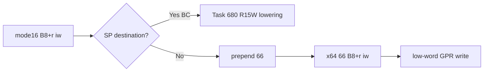

# 설계 20260915-687 — Linux x64 mode16 MOV immediate lowering

## 목적

Task 686에서 mode16 Jcc를 통과한 뒤 object 3의 다음 frontier는
`0x01100009: B8 07 00`입니다. mode16에서는 `MOV AX,7`인 3바이트
instruction이지만, x64 long mode에서 같은 bytes는 32비트 immediate를
기대하여 다음 instruction bytes까지 소비합니다.

이번 작업에서는 prefix-free mode16 `B8+r iw` immediate-to-GPR class를
일반 lowering합니다. guest SP에 해당하는 `BC iw`는 이미 별도 R15W lowering이
있으므로 이 class에서 제외하고, 나머지 GPR은 `66` operand-size prefix를
추가하여 x64에서 16비트 destination semantics를 보존합니다.

## 확인된 사실

* mode16 prefix-free `B8+r iw`는 destination GPR의 low word만 쓰고 상위
  register bits를 보존합니다.
* x64에서 `66 B8+r iw`는 동일한 low-word write semantics를 갖습니다.
* `BC iw`는 guest SP이고 host RSP를 건드리면 안 되므로 Task 680의
  `66 41 BF iw` R15W lowering을 계속 사용합니다.
* mode16 prefix, memory/segment 변형은 이 opcode class에 속하지 않거나
  별도 semantics가 필요하므로 fail-closed로 둡니다.

## 설계 결정

### Classifier

다음 조건을 만족하는 mode16 instruction을
`k16BitMovImmediateToGuestGprs`로 분류합니다.

* default opcode map의 `B8`–`BF`;
* operand width 16, address width 16, length 3;
* prefix가 없음;
* destination register가 guest SP가 아님.

`BC iw`는 classifier 순서상 기존 `k16BitStackPointerImmediateToR15`가
먼저 처리합니다.

### Lowering

원본 3바이트 뒤에 `0x66`을 붙이는 것이 아니라 앞에 하나 추가합니다.
output은 `66 B8+r iw` 4바이트, instruction count는 1입니다. `66`은 x64의
operand size를 16비트로 선택하며, immediate와 opcode register field는
그대로 유지됩니다.

## 불변 조건

* 원본 guest bytes는 수정하지 않습니다.
* `BC iw`의 guest SP semantics나 R15 mapping을 우회하지 않습니다.
* 특정 AX immediate 값이나 주소에 종속된 분기를 추가하지 않습니다.
* source register mapping과 upper GPR bits를 보존합니다.
* 다음 unsupported mode16 instruction은 기존 INT3 boundary로 남깁니다.

## 검증 계획

* compatibility probe에서 `B8 07 00`을 새 lowering kind로 분류하고,
  `BC 00 20`은 Task 680 kind를 계속 사용하는지 확인합니다.
* `66 B8 07 00` output과 prefix/length 변형 거부를 확인합니다.
* x64 lowering probe에서 upper GPR bits와 low-word immediate write를 실제
  실행으로 확인합니다.
* Linux x64 core probe와 object-3 runtime trace를 실행하여 TEST/Jcc/MOV
  immediate가 통과하고 다음 frontier가 mode16 `89 CA`인지 확인합니다.

---

# Design 20260915-687 — Linux x64 mode16 MOV immediate lowering

## Purpose

After Task 686 passed mode16 Jcc, the next object-3 frontier is
`0x01100009: B8 07 00`. In mode16 it is the three-byte `MOV AX,7`, while in
x64 long mode the same bytes expect a 32-bit immediate and consume bytes from
the next instruction.

Add a shared lowering for prefix-free mode16 `B8+r iw` immediate-to-GPR forms.
The guest-SP form `BC iw` remains on Task 680's dedicated R15W lowering; other
GPRs gain an operand-size prefix so x64 preserves the 16-bit destination
semantics.

## Confirmed facts

* Prefix-free mode16 `B8+r iw` writes only the destination GPR low word and
  preserves its upper register bits.
* x64 `66 B8+r iw` has the same low-word write semantics.
* `BC iw` names guest SP and must not touch host RSP, so it remains
  `66 41 BF iw` through Task 680.
* Prefixed, segment, and unrelated forms remain fail-closed until separately
  proven.

## Design decisions

### Classifier

Admit a mode16 instruction as `k16BitMovImmediateToGuestGprs` only when it has:

* default opcode map `B8` through `BF`;
* operand width 16, address width 16, and length 3;
* no prefix;
* a destination other than guest SP.

Classifier ordering keeps `BC iw` on the existing
`k16BitStackPointerImmediateToR15` kind.

### Lowering

Prepend one `0x66` byte to the original three bytes. The output is
`66 B8+r iw`, four bytes with instruction count one. The prefix selects x64
16-bit operand size while the immediate and opcode register field remain
unchanged.

## Invariants

* Do not modify original guest bytes.
* Do not bypass guest-SP semantics or R15 mapping for `BC iw`.
* Add no branch tied to an AX immediate value or address.
* Preserve register mapping and upper GPR bits.
* Leave later unsupported mode16 instructions on the existing INT3 boundary.

## Verification plan

* Verify `B8 07 00` uses the new lowering and `BC 00 20` keeps Task 680's
  lowering kind.
* Verify `66 B8 07 00` output and rejection of prefix/length variants.
* Execute the lowering to check upper GPR and low-word immediate writes.
* Run the Linux x64 core probe and object-3 runtime trace; confirm TEST/Jcc/MOV
  immediate pass and the next frontier is mode16 `89 CA`.
