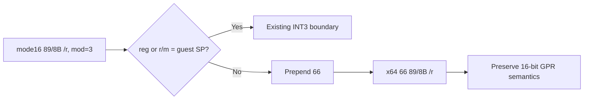

# 설계 20260915-688 — Linux x64 mode16 MOV register lowering

## 목적

Task 687에서 mode16 `B8+r iw` immediate 이동을 처리한 뒤 object 3의 다음
frontier는 `0x01100015: 89 CA`입니다. mode16에서 이 바이트는 `MOV DX,CX`인
반면, long mode에서 같은 바이트는 `MOV EDX,ECX`로 해석되어 목적 레지스터의
상위 16비트까지 덮어씁니다.

이번 작업에서는 mode16 register-register `MOV`의 공통 16비트 subset을
`66` operand-size prefix를 붙이는 방식으로 lower합니다. guest SP가 source
또는 destination인 형식은 host RSP와 guest SP의 매핑이 다르므로 별도 증명이
끝날 때까지 fail-closed로 유지합니다.

## 확인된 사실

* mode16 prefix-free `89 /r`와 `8B /r`의 mod=3 형식은 16비트 GPR 간 이동입니다.
* long mode의 `66 89 /r`와 `66 8B /r`는 동일한 16비트 register semantics를
  유지하고 상위 GPR 비트를 보존합니다.
* ModRM reg 또는 r/m이 4이면 mode16 guest SP를 의미하므로 host RSP에 직접
  매핑할 수 없습니다.

## 설계 결정

### Classifier

다음 조건을 모두 만족하는 mode16 instruction을
`k16BitMovRegisterToGuestGprs`로 분류합니다.

* default opcode map의 `89` 또는 `8B`;
* mnemonic `MOV`, operand width 16, address width 16, 길이 2;
* prefix 없음, segment override 없음;
* ModRM 존재, mod=3, ModRM offset=1;
* ModRM reg와 r/m 모두 guest SP 인코딩 4가 아님.

### Lowering

원본 2바이트 앞에 `0x66`을 붙여 `66 89 /r` 또는 `66 8B /r`를 출력합니다.
opcode와 ModRM register mapping은 유지하며 instruction count는 1입니다.

## 불변조건

* 원본 guest bytes를 수정하지 않습니다.
* guest SP가 관련된 이동을 host RSP로 잘못 연결하지 않습니다.
* memory, segment, prefix, address-specific 예외를 추가하지 않습니다.
* destination GPR의 상위 비트와 source GPR mapping을 보존합니다.

## 검증 계획

* compatibility probe에서 `89 CA`와 `8B D1`을 새 lowering으로 분류하고
  `66 89 CA`/`66 8B D1`을 확인합니다.
* `89 C4`와 `89 0C 00` 등 guest-SP/memory 변형은 새 lowering에서 제외되는지
  확인합니다.
* x64 lowering probe에서 upper GPR bits를 보존하는 실제 register 이동을
  실행합니다.
* Linux x64 core probe와 `repiu`를 빌드하고 object-3 다음 경계를 확인합니다.
* runtime trace에서 `89 CA` 이후 다음 frontier를 기록합니다.

---

# Design 20260915-688 — Linux x64 mode16 MOV register lowering

## Purpose

After Task 687 lowered the mode16 `B8+r iw` immediate move, the next object-3
frontier is `0x01100015: 89 CA`. In mode16 these bytes mean `MOV DX,CX`, while
long mode interprets them as `MOV EDX,ECX` and overwrites the destination's upper
16 bits.

This task lowers the common mode16 register-register `MOV` subset by adding the
`66` operand-size prefix. Forms involving guest SP remain fail-closed because
guest SP and host RSP use different mappings.

## Confirmed facts

* Prefix-free mode16 `89 /r` and `8B /r` mod=3 forms move between 16-bit GPRs.
* Long-mode `66 89 /r` and `66 8B /r` preserve the same 16-bit register
  semantics and upper GPR bits.
* ModRM reg or r/m value 4 names guest SP in mode16 and cannot be copied to host
  RSP.

## Design decisions

### Classifier

Admit a mode16 instruction as `k16BitMovRegisterToGuestGprs` only when it has:

* default opcode map `89` or `8B`;
* mnemonic `MOV`, operand width 16, address width 16, and length 2;
* no prefix or segment override;
* a ModRM byte at offset 1 with mod=3;
* neither ModRM reg nor r/m equal to guest SP encoding 4.

### Lowering

Prepend `0x66` to the original two bytes, producing `66 89 /r` or `66 8B /r`
with instruction count one. The opcode and ModRM register mapping remain
unchanged.

## Invariants

* Do not modify original guest bytes.
* Do not map guest-SP moves directly to host RSP.
* Add no memory, segment, prefix, or address-specific exception.
* Preserve destination upper bits and source GPR mapping.

## Verification plan

* Classify `89 CA` and `8B D1` and verify `66 89 CA`/`66 8B D1` output.
* Verify `89 C4` and memory forms such as `89 0C 00` stay outside the new
  lowering.
* Execute a lowering probe that checks upper GPR preservation.
* Build the Linux x64 core probe and `repiu`, then inspect the next object-3
  frontier.
