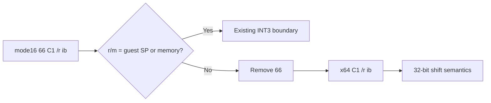

# 설계 20260915-689 — Linux x64 mode16 32-bit shift lowering

## 목적

Task 688에서 mode16 `89 CA` register 이동을 처리한 뒤 object 3의 다음
frontier는 `0x01100017: 66 C1 E9 10`입니다. mode16에서 `66`은 기본 16비트
operand를 32비트로 바꾸므로 이 instruction은 `SHR ECX,16`입니다. long
mode에서는 기본 operand가 32비트이므로 같은 `66`을 유지하면 `SHR CX,16`으로
좁아져 다음 instruction의 전제와 flags를 바꿉니다.

이번 작업에서는 mode16의 prefix `66`이 붙은 register-only `C1 /r ib` 32비트
shift subset에서 `66`을 제거하는 공통 lowering을 추가합니다. guest SP가
destination인 r/m=4 형식과 memory/prefix/address 변형은 별도 증명 전까지
fail-closed로 유지합니다.

## 확인된 사실

* mode16 `66 C1 /r ib`는 operand width 32, address width 16인 immediate-count
  shift입니다.
* long mode의 prefix-free `C1 /r ib`는 32비트 shift semantics를 사용합니다.
* register-only ModRM r/m=4는 guest SP를 가리키므로 host RSP에 직접 적용할 수
  없습니다.

## 설계 결정

### Classifier

다음 조건을 만족하는 mode16 instruction을
`k16BitShift32ToGuestGprs`로 분류합니다.

* default opcode map의 `C1`;
* operand width 32, address width 16, length 4;
* 단일 `66` prefix와 segment override 없음;
* ModRM 존재, mod=3, r/m != 4.

ModRM reg field는 shift group extension이므로 별도 register mapping 대상이
아니며, `C1`의 유효한 shift group semantics는 원본 ModRM과 immediate를
그대로 유지합니다.

### Lowering

원본의 첫 `66`을 제거하고 `C1 /r ib` 3바이트를 출력합니다. instruction
count는 1입니다.

## 불변조건

* 원본 guest bytes를 수정하지 않습니다.
* shift group과 immediate count를 변경하지 않습니다.
* guest SP를 host RSP에 직접 적용하지 않습니다.
* 특정 주소나 특정 shift count에 대한 예외를 추가하지 않습니다.

## 검증 계획

* `66 C1 E9 10`을 새 lowering으로 분류하고 `C1 E9 10`을 확인합니다.
* prefix 없는 16비트 shift, address-size 변형, memory 및 guest-SP 형식은
  새 lowering에서 제외되는지 확인합니다.
* x64 실행 probe에서 32비트 shift 결과를 확인합니다.
* Linux x64 core probe와 `repiu`를 빌드하고 다음 `CD 31` 경계를 기록합니다.

---

# Design 20260915-689 — Linux x64 mode16 32-bit shift lowering

## Purpose

After Task 688 lowered mode16 `89 CA`, the next object-3 frontier is
`0x01100017: 66 C1 E9 10`. In mode16, `66` changes the default 16-bit operand
to 32 bits, so this is `SHR ECX,16`. In long mode, retaining `66` narrows it to
`SHR CX,16` and changes the subsequent state and flags.

Add a shared lowering that removes `66` from the mode16 register-only
`C1 /r ib` 32-bit shift subset. Guest-SP destinations and memory/prefix/address
variants remain fail-closed until separately proven.

## Confirmed facts

* Mode16 `66 C1 /r ib` has operand width 32 and address width 16.
* Prefix-free long-mode `C1 /r ib` has the required 32-bit shift semantics.
* Register-only ModRM r/m=4 names guest SP and cannot operate directly on host
  RSP.

## Design decisions

### Classifier

Admit a mode16 instruction as `k16BitShift32ToGuestGprs` only when it has:

* default opcode map `C1`;
* operand width 32, address width 16, and length 4;
* exactly one `66` prefix and no segment override;
* a ModRM byte with mod=3 and r/m != 4.

The ModRM reg field is a shift-group extension, not a register mapping, so the
original ModRM and immediate remain unchanged.

### Lowering

Remove the original first `66` and emit the three-byte `C1 /r ib`, with
instruction count one.

## Invariants

* Do not modify original guest bytes.
* Preserve the shift group and immediate count.
* Do not apply guest-SP shifts directly to host RSP.
* Add no address- or shift-count-specific exception.

## Verification plan

* Classify `66 C1 E9 10` and verify the output `C1 E9 10`.
* Reject prefix-free 16-bit, address-size, memory, and guest-SP variants.
* Execute a probe that checks the 32-bit shift result.
* Build the Linux x64 core probe and `repiu`, then record the next `CD 31`
  boundary.
