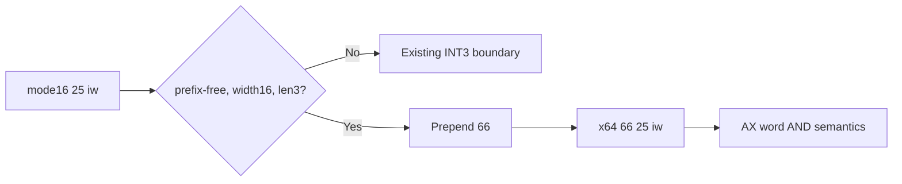

# 설계 20260915-690 — Linux x64 mode16 AND accumulator lowering

## 목적

Task 689에서 mode16 shift를 통과한 뒤 object 3의 다음 frontier는
`0x0110002A: 25 FF 0F`입니다. mode16에서 이는 `AND AX,0x0FFF`인 3바이트
instruction이지만, long mode에서 같은 bytes는 32비트 accumulator immediate
형식으로 해석되어 다음 bytes까지 소비합니다.

이번 작업에서는 prefix-free mode16 accumulator-immediate `25 iw`를 공통
lowering합니다. long mode에서 `66 25 iw`로 바꾸면 AX word semantics와
instruction boundary를 보존할 수 있습니다.

## 확인된 사실

* mode16 prefix-free `25 iw`는 operand width 16, address width 16, length 3의
  accumulator AND입니다.
* long mode의 `66 25 iw`는 AX와 16비트 immediate를 사용합니다.
* prefix/address 변형과 잘린 입력은 별도 규칙으로 증명되지 않았습니다.

## 설계 결정

### Classifier

다음 조건을 모두 만족하는 mode16 instruction을
`k16BitAndAccumulatorImmediate`로 분류합니다.

* default opcode map의 opcode `25`와 mnemonic `AND`;
* operand width 16, address width 16, length 3;
* prefix 없음.

`25`는 ModRM이나 guest SP mapping이 없는 accumulator form입니다.

### Lowering

원본 3바이트 앞에 `0x66`을 붙여 `66 25 iw` 4바이트를 출력합니다. immediate
바이트는 그대로 유지하고 instruction count는 1입니다.

## 불변조건

* 원본 guest bytes를 수정하지 않습니다.
* immediate와 accumulator semantics를 변경하지 않습니다.
* 특정 주소나 특정 immediate 값에 대한 예외를 추가하지 않습니다.

## 검증 계획

* `25 FF 0F`를 새 lowering으로 분류하고 `66 25 FF 0F`를 확인합니다.
* prefix/address/length 변형은 새 lowering에서 제외되는지 확인합니다.
* x64 실행 probe에서 AX low word와 upper RAX bits를 확인합니다.
* Linux x64 core probe와 `repiu`를 빌드하고 다음 `0E` 경계를 기록합니다.

---

# Design 20260915-690 — Linux x64 mode16 AND accumulator lowering

## Purpose

After Task 689 passed the mode16 shift, the next object-3 frontier is
`0x0110002A: 25 FF 0F`. In mode16 this is the three-byte `AND AX,0x0FFF`, while
long mode interprets the same bytes as a 32-bit accumulator immediate and
consumes bytes from the following instruction.

Add a shared lowering for prefix-free mode16 accumulator-immediate `25 iw`.
Emitting `66 25 iw` in long mode preserves AX word semantics and the instruction
boundary.

## Confirmed facts

* Prefix-free mode16 `25 iw` is an operand-width-16, address-width-16,
  length-three accumulator AND.
* Long-mode `66 25 iw` uses AX and a 16-bit immediate.
* Prefixed, address-size, and truncated variants are not yet proven.

## Design decisions

### Classifier

Admit a mode16 instruction as `k16BitAndAccumulatorImmediate` only when it has:

* default opcode map opcode `25` and mnemonic `AND`;
* operand width 16, address width 16, and length 3;
* no prefix.

Opcode `25` has no ModRM or guest-SP mapping.

### Lowering

Prepend `0x66` to the original three bytes, producing `66 25 iw` with
instruction count one. The immediate bytes remain unchanged.

## Invariants

* Do not modify original guest bytes.
* Preserve the immediate and accumulator semantics.
* Add no address- or immediate-specific exception.

## Verification plan

* Classify `25 FF 0F` and verify `66 25 FF 0F` output.
* Reject prefixed, address-size, and length variants.
* Execute a probe checking AX low-word and upper-RAX state.
* Build the Linux x64 core probe and `repiu`, then record the next `0E`
  boundary.
