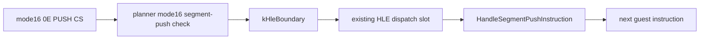

# 설계 20260915-691 — Linux x64 mode16 segment push HLE boundary

## 목적

Task 690 이후 object 3의 다음 frontier는 `0x0110002D: 0E`입니다. mode16에서
이 바이트는 `PUSH CS`이고, long mode에서는 유효한 동일 instruction으로
실행할 수 없습니다. 저장소에는 이미 `HandleSegmentPushInstruction`과 CS
selector 조회 로직이 있으므로, 이번 작업은 새 segment semantics를 만들지
않고 AOT planner가 이 instruction을 기존 HLE boundary로 연결하도록 합니다.

## 확인된 사실

* `HandleSegmentPushInstruction`은 `0E`에서 현재 guest EIP를 포함하는 selector
  descriptor를 찾아 CS 값을 guest stack에 기록합니다.
* mode16 planner는 기존 `IsHleBoundary`의 native segment-push 예외 때문에
  `0E`를 HLE가 아닌 copy record로 만들고, long-mode emitter에서 INT3 boundary로
  떨어뜨립니다.
* mode16의 prefix-free segment push만 이 연결 대상입니다. prefixed 형태는
  stack width semantics가 다를 수 있으므로 그대로 fail-closed로 둡니다.

## 설계 결정

`IsMode16SegmentPushHle` 보조 판정을 planner에 추가합니다. code mode가 mode16,
mnemonic이 PUSH, prefix가 없고 visible operand가 segment register이면 기존
`IsHleBoundary` 판정과 함께 `kHleBoundary`로 기록합니다. emitter는 기존
`EmitHleDispatchSlot`을 사용하고, 실제 selector/stack 처리는 기존 HLE가
담당합니다.

## 불변조건

* segment selector 값과 guest stack 폭을 새로 구현하거나 변경하지 않습니다.
* mode32의 기존 native segment-push 정책을 변경하지 않습니다.
* prefixed segment push와 다른 segment/system instruction은 새 판정에 포함하지
  않습니다.
* 특정 guest 주소에 대한 예외가 아니라 code mode와 decoded operand class를
  기준으로 합니다.

## 검증 계획

* synthetic mode16 object의 `0E`가 `kHleBoundary`로 계획되는지 확인합니다.
* Linux x64 core probe와 `repiu`를 빌드합니다.
* runtime plan trace에서 `hle=1`을 확인하고 `0E` 이후 다음 `50` boundary를
  기록합니다.

---

# Design 20260915-691 — Linux x64 mode16 segment push HLE boundary

## Purpose

The next object-3 frontier after Task 690 is `0x0110002D: 0E`. In mode16 this
byte is `PUSH CS`, which cannot execute as an equivalent instruction in long
mode. The repository already contains `HandleSegmentPushInstruction` and CS
selector lookup, so this task only connects the planner to that existing HLE.

## Confirmed facts

* `HandleSegmentPushInstruction` handles `0E` by finding the selector descriptor
  containing the current guest EIP and writing CS to the guest stack.
* The mode16 planner's existing native segment-push exception leaves `0E` as a
  copy record, which the long-mode emitter turns into an INT3 boundary.
* Only prefix-free mode16 segment pushes are in scope; prefixed forms may have
  different stack-width semantics and remain fail-closed.

## Design decisions

Add an `IsMode16SegmentPushHle` planner predicate. When the code mode is mode16,
the mnemonic is PUSH, there is no prefix, and a visible operand is a segment
register, record the instruction as `kHleBoundary` alongside the existing
`IsHleBoundary` result. The emitter uses the existing `EmitHleDispatchSlot`, and
the existing HLE performs selector and guest-stack handling.

## Invariants

* Do not implement or change segment selector or guest-stack semantics here.
* Do not change the existing mode32 native segment-push policy.
* Keep prefixed segment pushes and other segment/system instructions outside the
  new predicate.
* Base the rule on code mode and decoded operand class, not a guest address.

## Verification plan

* Verify a synthetic mode16 object's `0E` is planned as `kHleBoundary`.
* Build the Linux x64 core probe and `repiu`.
* Confirm `hle=1` in the runtime plan trace and record the next `50` boundary.
