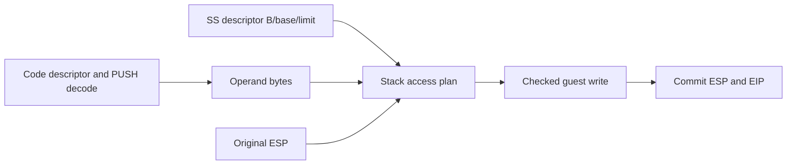

# Task 692 — 분리된 스택 폭과 주소 계산

실행 추적으로 SS=B4, base=0158A83C, limit=FFFF, flags=0092를 확인했습니다.
`MOV SP,2000` 이후 `PUSH CS`는 SS:1FFE에 word를 저장해야 하지만 기존
handler는 선형 주소 01581FFC에 dword를 저장합니다. Task 691 전후 중단은
모두 0110002E이며 planner 변경이 실행 진전을 만들었다는 기존 해석은 정정합니다.

공용 `guest_stack_access`는 descriptor와 ESP, operand byte count에서 push 후
ESP와 저장 선형 주소를 계산합니다. SS.B=0이면 SP만 갱신하고 상위 word를
보존합니다. SS.B=1이면 ESP를 갱신합니다. present/writable data/limit 및
선형 overflow를 검사하며 expand-down은 이번 단계에서 거부합니다.

전용 engine adapter는 확인된 mode16 코드의 register PUSH만 처리합니다.
prefix 없는 word와 단일 66 prefix의 dword를 지원하고 원래 ESP를 source로
읽습니다. 쓰기가 성공한 뒤에만 ESP/EIP를 갱신합니다. 기존 mode32 경로는
유지합니다. 미지원 mode16 PUSH는 기존 dword handler로 흘러가지 않도록
거부 결과와 비대상 결과를 구분합니다. 일반 POP/RETF는 후속 범위입니다.

검증은 SS.B와 operand size의 네 조합, SP wrap/상위 word 보존, limit/권한/
overflow 거부를 공용 probe로 확인하고 Linux build 및 실제 실행으로 연결을
검증합니다. 게임 정상 실행은 별도로 확인할 결과이며 이번 변경의 전제가 아닙니다.

## English

Runtime tracing confirms SS=B4, base=0158A83C, limit=FFFF, flags=0092. After
MOV SP,2000, PUSH CS should store a word at SS:1FFE; the existing handler stores
a dword at linear 01581FFC. Both Tasks 690 and 691 stopped at 0110002E; the
earlier claim that the planner change advanced execution is corrected.

Shared guest_stack_access computes the post-push ESP and linear destination
from the SS descriptor, original ESP and operand byte count. SS.B selects SP
or ESP independently of operand size. Word stack arithmetic preserves the high
word. Validate presence, writable data type, limit and linear overflow; reject
expand-down segments for now.

A dedicated engine adapter handles confirmed mode16 register PUSH operations,
with no prefix (word) or one 66 prefix (dword). Read sources before updating
ESP, and commit ESP/EIP only after a successful write. Preserve the existing
mode32 path. Distinguish unsupported mode16 PUSH from non-applicable operations
so rejection cannot fall through to the old dword handler. POP/RETF remain later work.

Probe all four stack/operand width combinations, SP wrapping and high-word
preservation, and limit/permission/overflow rejection. Build on Linux and verify
the live integration independently from eventual successful game execution.
