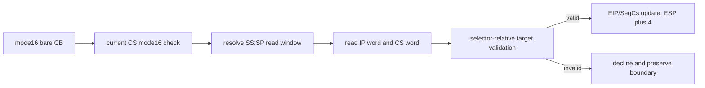

# Task 694 — Linux x64 mode16 bare `RETF` 설계

## 목적

Task 692에서 object 3의 mode16 stack sequence가 `0x01100031`의 bare
`RETF`까지 진행했습니다. 현재 `HandleFarReturnInstruction`은 mode16 code의
`66 CB`가 사용하는 32-bit operand-size frame만 처리하고, bare `CB`의
16-bit IP/CS frame은 읽지 않습니다. 이번 작업은 원본 guest code를 수정하지
않고 mode16 `CB`만 정확한 SS descriptor geometry와 selector table 검증을
통해 HLE합니다.

## 범위

* SS descriptor의 B-bit와 operand width를 분리하는 공용 stack read geometry를
  추가합니다.
* 현재 CS가 executable mode16이고 opcode가 prefix 없는 `CB`일 때만 새
  handler를 선택합니다.
* SS:SP에서 16-bit IP와 16-bit CS를 읽고, frame 전체 4바이트를 소비합니다.
* target CS를 selector table에서 executable descriptor로 검증하고
  selector-relative offset만 허용합니다.
* 성공 시 `EIP`, `SegCs`, `ESP`를 갱신하고, 실패 시 모든 context를
  fail-closed로 유지합니다.
* 기존 mode16 `66 CB`의 8-byte frame resolver와 generic 32-bit return은
  변경하지 않습니다.

## 제외 범위

* `RETF imm16` (`CA`)와 privilege transition/call-gate/outer-stack 전환
* 16-bit frame의 relocated absolute-linear fallback
* 별도 게임 주소나 특정 export에 대한 예외 처리
* 원본 실행 파일 bytes 수정

## 처리 흐름

## 설계 결정

1. stack read 계산은 `GuestStackPushAccess`와 같은 SS descriptor 정책을
   공유하되, 현재 SP에서 읽는 `GuestStackReadAccess`를 별도 구조로 둡니다.
   SS.B=0이면 SP의 low word만 갱신하고, SS.B=1이면 full ESP를 유지합니다.
2. mode16 handler는 유효한 `SegCs`가 현재 EIP를 포함하면 이를 현재 CS로
   우선 사용하고, AOT가 guest CS를 채우지 않은 문맥에서는 기존 EIP
   역조회로 보완합니다. 그 selector의 metadata가 mode16이고 prefix 없는
   `CB`일 때만 처리합니다. 32-bit code의 bare `CB`와 기존 mode16 `66 CB`는
   이 경로에 들어오지 않습니다.
3. frame은 SS descriptor base를 더한 선형 주소에서 연속 4바이트로 읽습니다.
   descriptor limit, uint32 선형 주소 overflow, guest readable range를 모두
   확인한 뒤에만 context를 변경합니다.
4. target IP는 16-bit 값으로 읽어 selector-relative offset으로만
   `TranslateSelectorOffset`에 전달합니다. 이전 `66 CB`의 관찰된 relocated
   linear fallback을 bare `CB`에 확대하지 않습니다.
5. mode16 return handler는 독립 source로 분리하고 shared/fault HLE chain의
   `CB` 위치에 adapter만 추가합니다.

## 검증 기준

* SS.B=0의 word frame geometry가 SS.base를 포함한 올바른 선형 주소와
  `ESP += 4`를 확인합니다.
* valid mode16 `CB`가 IP/CS를 읽어 executable target으로 이동합니다.
* 잘못된 selector, limit 초과, unreadable frame, mode32 current code가
  context를 보존한 채 거절됩니다.
* Linux x64 `repiu_core_probe`와 `repiu`가 빌드되고 core probe 전체가
  통과합니다.
* `pumpit2a`에서 새 handler의 live entry 또는 다음 명확한 frontier를
  trace합니다. object 3까지 도달하지 않으면 그 사실을 미확정으로 기록합니다.

참고: [Intel RET reference](https://www.felixcloutier.com/x86/ret),
[Intel segmentation reference](https://www.felixcloutier.com/x86/segment-registers),
[Open Watcom LE flag definitions](https://github.com/open-watcom/open-watcom-v2/blob/master/bld/watcom/h/exeflat.h#L1186-L1243).

## English

### Purpose

Task 692 advanced the object-3 mode16 stack sequence to the bare `RETF` at
`0x01100031`. The existing `HandleFarReturnInstruction` handles only the
32-bit operand-size frame used by `66 CB` in mode16 code; it does not read the
16-bit IP/CS frame of bare `CB`. This task adds HLE for mode16 `CB` with the
correct SS descriptor geometry and selector-table validation, without changing
the original guest code.

### Scope

* Add shared stack-read geometry that separates the SS B-bit from operand width.
* Select the new handler only for prefix-free `CB` in executable mode16 code.
* Read a 16-bit IP and 16-bit CS from SS:SP and consume four frame bytes.
* Validate the target CS as executable and accept only a selector-relative
  offset through the selector table.
* Update `EIP`, `SegCs`, and `ESP` on success; preserve all context on failure.
* Leave the existing mode16 `66 CB` eight-byte resolver and generic 32-bit
  return path unchanged.

### Out of scope

* `RETF imm16` (`CA`), privilege changes, call gates, or outer-stack switches
* A relocated absolute-linear fallback for the 16-bit frame
* Game-address or export-specific exceptions
* Modifying original executable bytes

### Design decisions

1. Share the SS descriptor policy with `GuestStackPushAccess` but use a separate
   `GuestStackReadAccess` for reads from the current SP. With SS.B=0 only the
   low word is updated; with SS.B=1 the full ESP is updated.
2. The mode16 handler prefers a valid `SegCs` that covers the current EIP and
   falls back to the existing EIP reverse lookup when an AOT context does not
   provide the guest CS. It accepts only a prefix-free `CB` in mode16 metadata.
   Bare `CB` in 32-bit code and existing mode16 `66 CB` do not enter this path.
3. Read the contiguous four-byte frame at SS.base plus the validated offset.
   Check descriptor limit, 32-bit linear overflow, and guest readability before
   changing the context.
4. Read the target IP as a 16-bit value and pass it only as a selector-relative
   offset to `TranslateSelectorOffset`. Do not extend the observed relocated
   linear fallback from `66 CB` to bare `CB`.
5. Keep the mode16 return handler in a dedicated source file and add only an
   adapter at the `CB` points in the shared/fault HLE chain.

### Verification criteria

* SS.B=0 word-frame geometry includes SS.base and advances ESP by four.
* A valid mode16 `CB` reads IP/CS and transfers to an executable target.
* Invalid selectors, limit overflow, unreadable frames, and a mode32 current
  code preserve context while declining.
* Linux x64 `repiu_core_probe` and `repiu` build, and all core probes pass.
* `pumpit2a` traces a live entry into the handler or the next clear frontier;
  if object 3 remains unreachable, record that as unresolved.

References: [Intel RET reference](https://www.felixcloutier.com/x86/ret),
[Intel segmentation reference](https://www.felixcloutier.com/x86/segment-registers),
[Open Watcom LE flag definitions](https://github.com/open-watcom/open-watcom-v2/blob/master/bld/watcom/h/exeflat.h#L1186-L1243).
