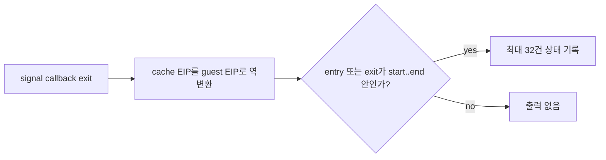

# Task 695 — Linux x64 guest-entry 범위 trace

## 목적

Task 694 이후 `pumpit2a`는 raw guest `0x010F0D96 CALL`에서 host RSP가 32비트로
잘린 상태로 fault합니다. 단일 주소 trace로 `0x010F0D69 SUB ESP,0x28` 이후 최초
low-RSP signal을 확인했지만, raw guest 구간으로 전환한 최초 callback은 정확히 한
주소를 미리 지정하는 기존 trace로 찾을 수 없습니다.

이 작업은 기존 `REPIU_LINUX_X64_GUEST_ENTRY_TRACE`의 시작 주소에 선택적 끝 주소를
더하여 좁은 guest 범위 안의 callback 진입·복귀를 순서대로 기록합니다. 실행 정책은
변경하지 않습니다.

## 사전 조사 결과

* AOT map의 `0x010F0D68`–`0x010F0D96` cache 명령은 guest ESP를 R15D로 올바르게
  낮춥니다.
* 최초 low-RSP signal은 raw guest `0x010F0D6E`이며, fault 당시 R15D guest ESP는
  정상입니다.
* signal resume RF 제거와 standalone `SUB ESP` HLE를 각각 실험했지만 live fault는
  변하지 않았습니다. 두 실험 변경은 최종 코드에서 제외했습니다.
* 따라서 아직 확인해야 할 사실은 이 구간으로 처음 복귀시킨 callback의 fault kind,
  입력 EIP, 출력 EIP, TF, AOT pending/legacy 상태입니다.

## 설계

* `REPIU_LINUX_X64_GUEST_ENTRY_TRACE=<start>`는 기존처럼 exact trace로 동작합니다.
* `REPIU_LINUX_X64_GUEST_ENTRY_TRACE_END=<end>`가 있고 `end >= start`이면 시작과 끝을
  포함하는 범위로 선택합니다.
* entry 또는 exit guest EIP가 범위에 포함되면 기존 32회 제한 trace를 출력합니다.
* 잘못된 끝 주소나 `end < start`는 exact trace로 축소합니다.
* 진단은 Linux x64에만 존재하며 기본 실행 비용과 동작은 기존처럼 환경 변수 gate 뒤에
  둡니다.

## 검증 전략

* Linux x64 core probe와 `repiu` target을 빌드합니다.
* exact 환경 변수만 사용했을 때 기존 단일 주소 선택을 확인합니다.
* `0x010F0D00`–`0x010F0DA0` 범위 live trace에서 raw guest 전환 callback을 확인하고
  다음 구현 작업의 근거로 기록합니다.

## 확인 결과

호출자 범위를 `0x010EFE00`–`0x010EFF00`으로 좁힌 trace에서 cache
`0x20001805`의 breakpoint가 guest `0x010EFEB8`로 역변환되었고,
`fatal-breakpoint` handler가 raw `0x010EFEB9`로 복귀시킨 사실을 확인했습니다.
복귀 EFLAGS에는 TF가 없었습니다. 다음 바이트는 `PUSH EDX`, 그 다음은
`CALL 0x010F0D68`이므로 이후 함수 전체가 cache lowering 없이 long mode에서
실행됩니다.

## English

### Purpose

After Task 694, `pumpit2a` faults at raw guest `0x010F0D96 CALL` with host RSP
truncated to 32 bits. A single-address trace confirmed the first low-RSP signal
after `0x010F0D69 SUB ESP,0x28`, but the existing trace cannot find the first
callback that switched into the raw guest range without knowing its exact
address in advance.

This task adds an optional end address to the existing
`REPIU_LINUX_X64_GUEST_ENTRY_TRACE` start address, recording callback entry and
resume state across a narrow guest range. It does not change execution policy.

### Preliminary findings

* AOT cache instructions for `0x010F0D68`–`0x010F0D96` correctly lower guest
  ESP to R15D.
* The first low-RSP signal is at raw guest `0x010F0D6E`, while R15D guest ESP
  remains valid.
* Experiments that cleared RF on signal resume and directly HLE-dispatched a
  standalone `SUB ESP` did not change the live fault. Both changes are excluded
  from the final code.
* The remaining question is which callback first resumes into this range, with
  which fault kind, input/output EIP, TF, and AOT pending/legacy state.

### Design

* `REPIU_LINUX_X64_GUEST_ENTRY_TRACE=<start>` retains exact matching.
* When `REPIU_LINUX_X64_GUEST_ENTRY_TRACE_END=<end>` is present and
  `end >= start`, select the inclusive range.
* Print the existing capped trace when either entry or exit guest EIP lies in
  the range.
* An invalid end or `end < start` falls back to exact matching.
* Keep this Linux x64 diagnostic behind the existing environment gate.

### Verification strategy

* Build the Linux x64 core probe and `repiu` target.
* Confirm existing exact matching when only the start variable is set.
* Trace live range `0x010F0D00`–`0x010F0DA0`, identify the callback that enters
  raw guest code, and preserve that evidence for the next implementation task.

### Result

With the caller range narrowed to `0x010EFE00`–`0x010EFF00`, the trace showed a
breakpoint at cache `0x20001805` reverse-mapped to guest `0x010EFEB8`. The
`fatal-breakpoint` handler resumed at raw `0x010EFEB9` without TF. Those bytes
are `PUSH EDX` followed by `CALL 0x010F0D68`, so the callee runs in long mode
without its cache lowerings.
