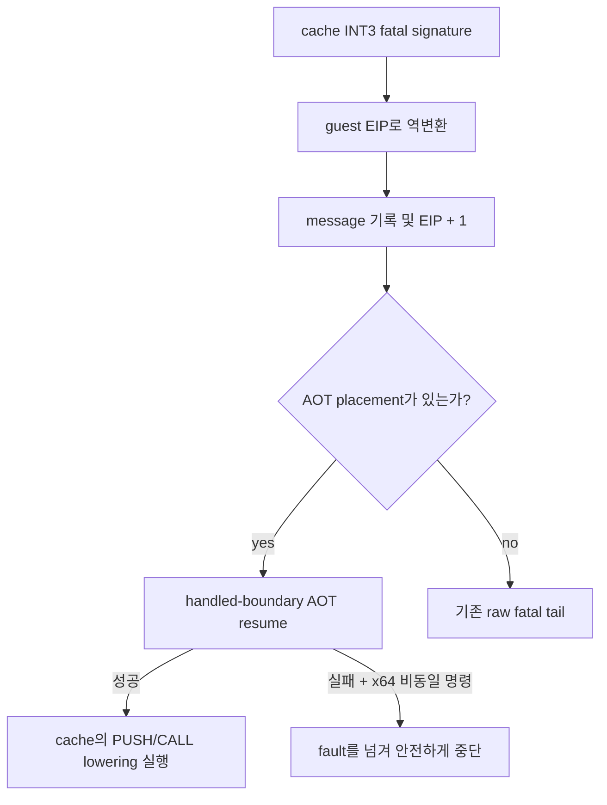

# Task 696 — Linux x64 fatal breakpoint AOT 재진입

## 목적

Task 695는 AOT cache의 원본 fatal breakpoint가 guest `0x010EFEB8`로
역변환된 뒤, `HandleOriginalFatalBreakpoint`가 다음 명령 `0x010EFEB9`로
진행시키지만 해당 주소의 cache entry를 찾지 못해 raw guest code로 복귀한다는
사실을 확인했습니다. 다음 `PUSH EDX; CALL error-printer`는 x64 long mode에서
host RSP를 직접 변경하므로 guest ESP lowering이 적용된 AOT cache에서 실행해야
합니다.

기존 아키텍처 계약대로 원본 fatal tail을 보존하되, 처리된 fatal breakpoint를
명시적인 AOT 재진입 기점으로 사용합니다.

## 설계

`TryResumeAotAfterHandledHle`에 재진입 기점 정책을 추가합니다.

* 일반 HLE 호출은 기존과 같이 `aot_reentry_pending` 또는
  `aot_legacy_fallback` 상태가 있어야 합니다.
* 원본 fatal breakpoint처럼 dispatcher가 이미 확인하고 진행시킨 guest 경계는
  명시적인 `handled boundary` 기점으로 호출할 수 있습니다. 이 경우에만 pending
  상태 gate를 우회하며, 이후 guest arena, quarantine, cache lookup/translation,
  span safety 검사는 그대로 적용합니다.
* fatal handler가 EIP를 진행시킨 경우에만 재진입을 시도합니다. x64에서 재진입에
  실패하고 다음 guest 명령이 long-mode 동일 실행 불가능하면 raw code를 실행하지
  않고 fault를 처리하지 않은 것으로 반환합니다.
* i386과 AOT 미사용 경로는 기존 raw fatal-tail 실행을 유지합니다.

## 검증 전략

1. Linux x64 core probe와 `repiu`를 빌드하고 기존 probe 회귀가 없는지 확인합니다.
2. `pumpit2a` live trace에서 `0x010EFEB8` fatal breakpoint 이후
   `0x010EFEB9`가 raw guest entry로 복귀하지 않는지 확인합니다.
3. 기존 `0x010F0D96` host-RSP 손상 fault가 사라지고 원본 fatal tail이 HLT 또는
   그보다 앞선 새롭고 구체적인 frontier까지 진행하는지 확인합니다.

## English

### Purpose

Task 695 confirmed that an original fatal breakpoint in the AOT cache is
reverse-mapped to guest `0x010EFEB8`, then `HandleOriginalFatalBreakpoint`
advances to `0x010EFEB9` without finding a cache entry and returns to raw guest
code. The following `PUSH EDX; CALL error-printer` directly changes host RSP in
x64 long mode, so it must execute through the AOT cache's guest-ESP lowering.

Preserve the original fatal tail as required by the existing architecture, but
use the handled fatal breakpoint as an explicit AOT re-entry boundary.

### Design

Add an origin policy to `TryResumeAotAfterHandledHle`.

* Ordinary HLE callers continue to require `aot_reentry_pending` or
  `aot_legacy_fallback`.
* A guest boundary already recognized and advanced by the dispatcher may
  explicitly request handled-boundary re-entry. Only this origin bypasses the
  pending-state gate; guest-arena, quarantine, cache lookup/translation, and
  span-safety checks remain unchanged.
* Attempt re-entry only when the fatal handler advanced EIP. If it fails on x64
  and the next guest instruction is not long-mode identical, do not execute raw
  code; return the fault as unhandled.
* Preserve the existing raw fatal-tail behavior on i386 and non-AOT paths.

### Verification strategy

1. Build the Linux x64 core probe and `repiu`, confirming existing probe
   behavior remains intact.
2. In a `pumpit2a` live trace, confirm that the `0x010EFEB8` fatal breakpoint no
   longer returns to raw guest `0x010EFEB9`.
3. Confirm the host-RSP corruption at `0x010F0D96` is gone and that the original
   fatal tail reaches HLT or exposes a newer, more specific frontier.
