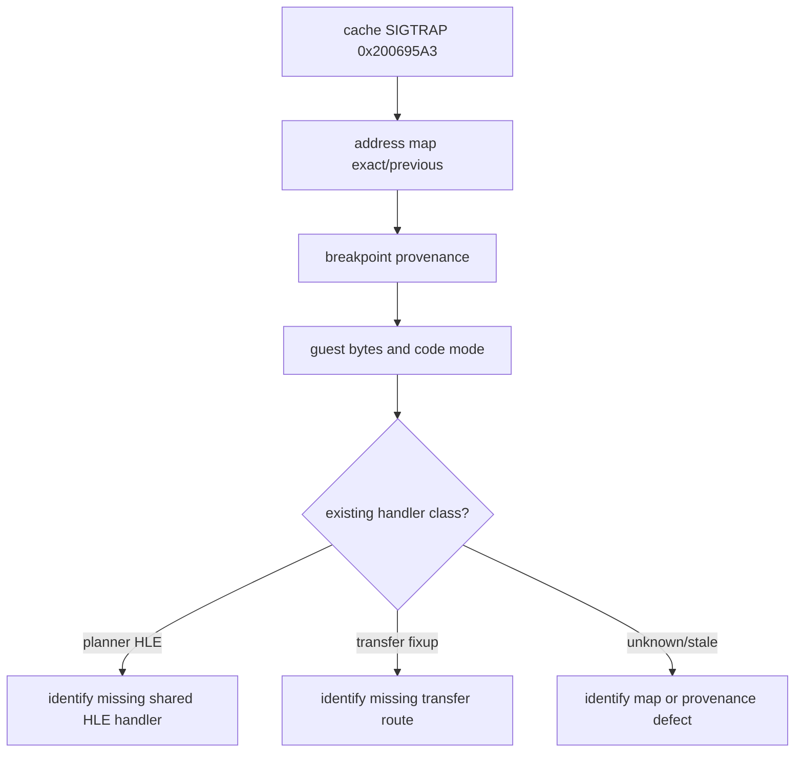

# Task 697 — Linux x64 cache boundary provenance 조사

## 목적

Task 696은 원본 fatal breakpoint 이후 continuation을 AOT cache로 재진입시켜
기존 `0x010F0D96` host-RSP 손상을 제거했습니다. 실행은 이후 guest
`0x010F777C`에 대응하는 cache `0x200695A3` SIGTRAP에서 중단됩니다. 이번
작업은 실행 정책을 바꾸기 전에 해당 trap의 address-map entry, 앞 바이트,
fixup provenance, long-mode compatibility를 확인해 정확한 경계 종류를
분류합니다.

## 조사 범위

* `REPIU_AOT_GUEST_MAP_TRACE=0x000F777C`와 context radius로 초기 address map,
  인접 guest/cache bytes, incoming/outgoing fixup을 수집합니다.
* `REPIU_AOT_FAULT_TRACE=1`과 cache-address filter로 exact/previous map 및
  `AotCacheBreakpointProvenance` 값을 확인합니다.
* `REPIU_AOT_REENTRY_COMPAT_TRACE=0x010F777C`로 long-mode identical, HLE,
  transfer 분류와 dispatcher 결정을 확인합니다.
* live fault가 타이밍에 따라 재현되지 않을 때 해당 주소가 현재 placement에도
  존재하는지 확인할 수 있도록 `REPIU_AOT_CACHE_MAP_TRACE=<cache-address>` 읽기 전용
  진단을 추가합니다. 주소가 범위 안이면 현재/직전 byte, reverse map, breakpoint
  provenance를 출력하며 cache나 실행 상태는 변경하지 않습니다.
  guest semantics, lowering, dispatch 우선순위는 이 작업에서 변경하지 않습니다.

## 판정 기준

분류 결과는 확인됨·추정·미확정으로 `docs/analysis/linux-port-frontier.md`에
기록합니다. 일반화 가능한 수정이 필요하면 별도 설계 작업으로 분리합니다.

## 검증 기준

* 실제 `pumpit2a` bounded 실행에서 동일 frontier를 재현합니다.
* guest `0x010F777C`의 bytes/code mode와 cache entry bytes를 확보합니다.
* exact 및 previous cache provenance와 관련 fixup을 식별합니다.
* 다음 구현 작업이 다뤄야 할 하나의 구체적인 경계를 제시합니다.

## English

### Purpose

Task 696 resumed the original fatal-breakpoint continuation through the AOT
cache and removed the former host-RSP corruption at `0x010F0D96`. Execution
then stopped at cache SIGTRAP `0x200695A3`, corresponding to guest
`0x010F777C`. Before changing execution policy, this task classifies that trap
by correlating its address-map entry, preceding byte, fixup provenance, and
long-mode compatibility.

### Investigation scope

* Use `REPIU_AOT_GUEST_MAP_TRACE=0x000F777C` with a context radius to collect
  the initial address map, neighboring guest/cache bytes, and incoming/outgoing
  fixups.
* Use `REPIU_AOT_FAULT_TRACE=1` with the cache-address filter to inspect exact
  and previous mappings and their `AotCacheBreakpointProvenance` values.
* Use `REPIU_AOT_REENTRY_COMPAT_TRACE=0x010F777C` to observe long-mode
  identity, HLE/transfer classification, and the dispatch decision.
* Add the read-only `REPIU_AOT_CACHE_MAP_TRACE=<cache-address>` diagnostic to
  determine whether a timing-sensitive live-fault address also exists in the
  current placement. An in-range address reports current/previous bytes,
  reverse maps, and breakpoint provenance without changing cache or execution
  state.

### Decision criteria

Classify the boundary as planner HLE, transfer fixup, or unknown/stale map
provenance. Record confirmed, inferred, and unresolved findings in
`docs/analysis/linux-port-frontier.md`. If a general implementation change is
required, handle it under a separate design task.

### Verification criteria

* Reproduce the same frontier in a bounded real `pumpit2a` run.
* Capture guest bytes/code mode and cache-entry bytes for `0x010F777C`.
* Identify exact and previous cache provenance and related fixups.
* State one concrete boundary for the next implementation task.
