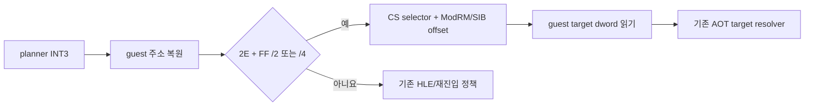

# Task 700 설계 — Linux x64 CS override 간접 점프 경계

## 목적

Task 699 실행을 막은 guest `0x010F777C`의 원시 바이트는 처음 추정한
`67 0F B6 50 01`이 아니라 `2E FF 24 9D 44 77 0F 01`이다. 앞의 바이트열은
cache breakpoint 뒤의 호스트 코드였고, 실제 guest 명령은 CS override가 붙은
`JMP dword ptr [EBX*4+0x010F7744]`이다.

Linux x64 AOT 재진입기는 이 명령을 planner HLE로만 분류하여 공용 HLE dispatcher가
거절한 뒤 fail closed했다. 기존 간접 전송 처리기는 `FF /4`를 처리하지만 접두사가
없는 형식만 인식한다. 이번 변경은 새 게임 로직을 구현하지 않고 기존 x86 간접 전송
경로가 원본 명령의 CS 주소 선택을 보존하도록 확장한다.

## 설계

* 재진입 경계 판별에서 단일 `2E` 접두사 뒤의 기존 전송 opcode를 인식한다.
* planner HLE provenance와 전송 명령 판별이 겹치면 전송 판별을 우선하여 기존
  `HandleAotIndirectTransfer`로 넘긴다.
* 간접 전송 decoder는 `2E FF /2`와 `2E FF /4`에서 접두사 길이를 명령 길이에
  포함한다.
* ModRM/SIB가 계산한 effective offset은 현재 source linear address를 포함하는 code
  selector로 해석한다. 기존 `ResolveSegmentLinearRange` 정책을 사용하므로 selector
  범위를 벗어난 LE relocated absolute address는 검증된 direct linear fallback을
  공유한다.
* pointer에서 읽은 원본 guest target은 기존 AOT target resolver로 전달한다. call의
  guest stack 효과, cache lookup, dynamic translation 정책은 변경하지 않는다.
* `REPIU_AOT_REENTRY_COMPAT_TRACE`에는 raw guest bytes를 함께 출력하여 cache bytes와
  혼동하지 않게 한다.

## 검증 전략

* synthetic probe에서 실제 형식인 `2E FF 24 9D disp32`를 구성하고 CS selector,
  jump-table target 읽기, AOT cache target 재개를 확인한다.
* Linux x64 core probe 27개 그룹과 `repiu`를 빌드한다.
* 실제 `pumpit2a` 실행에서 `0x010F777C` 경계가 간접 전송 처리기로 넘어가는지,
  다음 frontier 또는 Task 699의 `0x010F928B` probe까지 진행하는지 확인한다.

## English

### Purpose

The raw bytes at guest `0x010F777C`, which blocked Task 699, are
`2E FF 24 9D 44 77 0F 01`, not the initially inferred `67 0F B6 50 01`.
The latter bytes were host code after the cache breakpoint. The real guest
instruction is `JMP dword ptr [EBX*4+0x010F7744]` with a CS override.

Linux x64 AOT reentry classified this instruction only as planner HLE, so the
shared HLE dispatcher declined it and the boundary failed closed. The existing
indirect-transfer handler supports `FF /4`, but only without a prefix. This
change extends the existing x86 transfer path to preserve the original
instruction's CS address selection; it does not implement game logic.

### Design

* Recognize an existing transfer opcode after one `2E` prefix during reentry
  boundary classification.
* When planner-HLE provenance overlaps transfer-instruction classification,
  prefer the transfer classification and defer to `HandleAotIndirectTransfer`.
* Include the prefix in the instruction length for `2E FF /2` and `2E FF /4`.
* Interpret the ModRM/SIB effective offset through the code selector containing
  the current source linear address. Reuse `ResolveSegmentLinearRange`, including
  its validated direct-linear fallback for relocated absolute LE addresses that
  exceed the selector limit.
* Feed the original guest target read from the pointer into the existing AOT
  target resolver. Preserve call stack effects, cache lookup, and dynamic
  translation policy.
* Include raw guest bytes in `REPIU_AOT_REENTRY_COMPAT_TRACE` so they cannot be
  confused with cache bytes.

### Verification strategy

Construct the observed `2E FF 24 9D disp32` form in a synthetic probe and verify
CS selection, jump-table target reading, and AOT cache resumption. Build all 27
Linux x64 core probe groups and `repiu`. In real `pumpit2a`, verify that the
`0x010F777C` boundary reaches indirect-transfer dispatch and progresses to a new
frontier or the Task 699 probe at `0x010F928B`.
