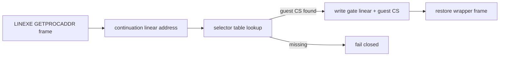

# Task 701 설계 — Linux x64 LINEXE GETPROCADDR guest CS

## 목적

Task 700 이후 실제 `pumpit2a`는 LINEXE `LOADMODULE`과 첫
`LINEXE_GETPROCADDR("_GRGLIDEINIT@0")`까지 도달하지만, 원본 loader가
`Fatal error: unable to find entry point in DLL.`로 종료한다. HLE은 gate linear
address와 함께 `GuestCpuContext::SegCs`를 결과 버퍼에 기록한다.

Win32 i386에서는 이 값이 client code selector였지만 Linux x64 signal context의
`SegCs`는 host code selector `0x33`이다. 현재 guest continuation
`0x010EFE98`을 포함하는 selector는 selector table에서 `0x24`로 확인된다. 따라서
host selector를 guest-visible far pointer에 기록한 것이 원본 loader의 selector
검사를 실패시킨다.

## 설계

* GETPROCADDR 성공 결과의 selector는 물리 `SegCs`에서 가져오지 않는다.
* LINEXE wrapper의 검증된 continuation 주소(stack index 10)를 포함하는 executable
  descriptor를 selector table에서 찾는다.
* lookup에 성공한 guest selector를 `{gate linear address, guest code selector}`의
  두 번째 dword로 기록한다.
* selector lookup 또는 결과 버퍼 쓰기가 실패하면 기존처럼 fail closed하고 guest
  frame/register를 성공 상태로 변경하지 않는다.
* module handle, export-name lookup, gate address, wrapper register/stack 복원 정책은
  변경하지 않는다.

## 검증 전략

* synthetic LINEXE GETPROCADDR frame에서 물리 `SegCs=0x33`, guest code
  selector `0x24`를 의도적으로 다르게 둔다.
* 결과 버퍼가 gate address와 `0x24`를 받는지, HLE 반환 frame이 정상 복원되는지
  확인한다.
* code selector descriptor가 없을 때 결과 버퍼와 context가 성공 상태로 바뀌지
  않는지 확인한다.
* Linux x64 core probe 27개 그룹과 `repiu`를 빌드한 뒤 실제 `pumpit2a`에서 DLL
  entry-point fatal이 사라지고 Glide gate에 진입하는지 확인한다.

## English

### Purpose

After Task 700, real `pumpit2a` reaches LINEXE `LOADMODULE` and the first
`LINEXE_GETPROCADDR("_GRGLIDEINIT@0")`, but the original loader terminates with
`Fatal error: unable to find entry point in DLL.` The HLE currently writes
`GuestCpuContext::SegCs` beside the gate linear address in the result buffer.

On Win32 i386 that value was the client code selector. In a Linux x64 signal
context, however, `SegCs` is the host code selector `0x33`. The selector table
shows that the guest continuation `0x010EFE98` belongs to selector `0x24`.
Writing a host selector into the guest-visible far pointer therefore fails the
original loader's selector check.

### Design

* Do not derive the successful GETPROCADDR result selector from physical
  `SegCs`.
* Find the executable descriptor containing the validated LINEXE wrapper
  continuation at stack index 10.
* Write that guest selector as the second dword of
  `{gate linear address, guest code selector}`.
* Fail closed before committing successful frame/register changes when selector
  lookup or result-buffer writing fails.
* Preserve module-handle, export-name, gate-address, and wrapper restoration
  policy.

### Verification strategy

Use a synthetic GETPROCADDR frame with physical `SegCs=0x33` and guest code
selector `0x24`, verifying that the output contains the gate address and
`0x24` and that the wrapper frame is restored. Verify fail-closed behavior when
the descriptor is absent. Build all 27 Linux x64 core-probe groups and `repiu`,
then run real `pumpit2a` to confirm that the entry-point fatal disappears and a
Glide gate is entered.
