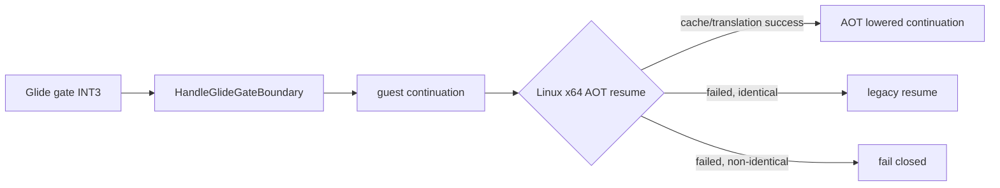

# Task 702 설계 — Linux x64 Glide gate 반환 AOT 재진입

## 문제

Task 701 이후 실제 `pumpit2a`는 `_GRGLIDEINIT@0`과
`_GRSSTQUERYHARDWARE@4` gate에 진입하지만, query 인자 포인터가 `0`으로
관측된다. 원본 `PIU.EXE`의 반환 주소 주변은 다음과 같다.

```text
0x01055AFE  CALL _GRGLIDEINIT@0 stub
0x01055B03  PUSH relocated 0x0017FB30
0x01055B08  CALL _GRSSTQUERYHARDWARE@4 stub
0x01055B0D  TEST EAX,EAX
```

첫 gate 진입 ESP는 `0x0158C884`이고 init handler의 callee cleanup 뒤 guest
ESP는 `0x0158C888`이어야 한다. 이어지는 `PUSH imm32`가 guest stack에 실행되면
query gate ESP는 `0x0158C880`, stack은 `[0x01055B0D, nonzero pointer]`여야 한다.
실제 query gate ESP는 다시 `0x0158C884`이고 stack은
`[0x01055B0D, 0]`이다.

`DispatchGuestFault`의 조기 Glide gate 경로는 handler가 EIP를 guest
continuation으로 바꾼 뒤 곧바로 resume한다. Linux x64에서는 continuation을 AOT
cache로 옮기지 않으므로 `PUSH imm32` 원본 bytes가 long mode의 host RSP에
실행된다. 다음 direct call은 AOT 경계에서 guest return address만 push하므로
guest 인자가 누락되고 host stack도 오염된다.

## 설계

* Glide gate handler가 EIP를 진행시킨 경우 Linux x64에서 기존
  `TryResumeAotAfterHandledHle`을 `kHandledGuestBoundary` origin으로 호출한다.
* cache hit, dynamic translation, span 및 quarantine 검사는 기존 공용 정책을
  그대로 사용한다.
* 재진입 실패 시 continuation의 원본 bytes가 long-mode identical일 때만 기존
  resume를 허용하고, 그렇지 않으면 fail closed한다.
* i386, AOT 미사용 실행, Glide handler semantics와 stdcall cleanup은 변경하지
  않는다.



## 검증 전략

* Linux x64 core probe 27개 그룹과 `repiu`를 재빌드한다.
* 실제 `pumpit2a`에서 query gate ESP가 init gate ESP보다 4 낮고 인자가 nonzero인지
  확인한다.
* `_GRSSTQUERYHARDWARE@4` 성공 뒤 `_GRSSTSELECT@4` 또는 그 이후 gate로 진행하는지
  확인한다.
* 기존 `query-hardware-unwritable-memory`와 host SIGTRAP이 사라지는지 확인한다.

## English

### Problem

After Task 701, real `pumpit2a` enters `_GRGLIDEINIT@0` and
`_GRSSTQUERYHARDWARE@4`, but the query argument pointer is observed as zero.
The original caller executes a relocated `PUSH 0x0017FB30` between the init
return at `0x01055B03` and the query call ending at `0x01055B0D`.

The init gate enters with ESP `0x0158C884`; callee cleanup should leave guest
ESP at `0x0158C888`. Executing the push with guest semantics would make query
gate ESP `0x0158C880` and produce `[0x01055B0D, nonzero pointer]`. Instead, the
query gate again enters at `0x0158C884` with `[0x01055B0D, 0]`.

The early Glide-gate path in `DispatchGuestFault` resumes immediately after the
handler changes EIP to the guest continuation. On Linux x64 this runs the
original `PUSH imm32` bytes against host RSP instead of re-entering the AOT
cache. The following direct-call boundary pushes only the guest return address,
losing the argument and corrupting the host stack.

### Design

* When a Glide handler advances EIP, call the existing
  `TryResumeAotAfterHandledHle` on Linux x64 with
  `kHandledGuestBoundary` origin.
* Reuse existing cache-hit, dynamic-translation, span, and quarantine policy.
* If re-entry fails, allow original-byte resume only for a long-mode-identical
  continuation; otherwise fail closed.
* Do not change i386, non-AOT execution, Glide handler semantics, or stdcall
  cleanup.

### Verification strategy

Rebuild all 27 Linux x64 core-probe groups and `repiu`. In real `pumpit2a`,
verify that query-gate ESP is four bytes below init-gate ESP, its argument is
nonzero, and execution reaches `_GRSSTSELECT@4` or a later gate without the
former query-memory failure or host SIGTRAP.
