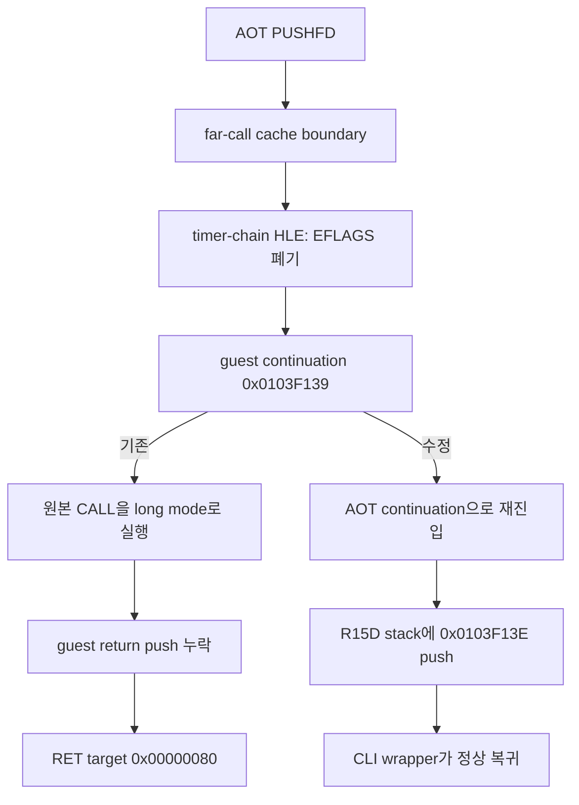

# Task 703 설계 — Linux x64 타이머 체인 경계 AOT 재진입

## 배경과 확인된 원인

Task 702 이후 `pumpit2a`는 두 번째 `_GRDITHERMODE@4` 뒤 guest `RET`에서
`0x00000080`을 복귀 주소로 소비했습니다. 대상 추적은 실패한 `RET`가
`0x010F2773`이고, 직전 guest stack slot의 올바른 direct-call 복귀 주소가
누락되었음을 확인했습니다.

원본 명령열과 경계 추적을 대조하면 흐름은 다음과 같습니다.

```text
0x0103F132  PUSHFD
0x0103F133  CALL FAR [0x0117FA24]  ; 이전 INT 8 handler 체인
0x0103F139  CALL 0x010F2772       ; CLI wrapper
0x010F2772  CLI
0x010F2773  RET
```

`HandleTimerInterruptChainBoundary`는 실행할 이전 handler가 없을 때 이미 push된
EFLAGS를 폐기하고 far call 다음인 `0x0103F139`로 EIP를 진행시킵니다. 이 stack
정리는 의도한 동작입니다. 문제는 fault-level handler가 이 guest continuation을
그대로 반환한다는 점입니다. Linux x64 long mode가 원본 `CALL`을 실행하면 host
RSP에 64-bit 복귀 주소를 기록할 뿐 R15D guest stack에는 아무것도 쓰지 않습니다.
그 결과 `CLI; RET`의 AOT return slot이 다음 기존 값 `0x00000080`을 읽습니다.



## 설계

타이머 체인 경계가 성공하여 EIP를 진행시킨 경우, Linux x64 AOT 실행에서는 기존
공용 `TryResumeAotAfterHandledHle`를
`AotHleResumeOrigin::kHandledGuestBoundary` origin으로 호출합니다. 이는 Task 702의
Glide fault-level 경계와 같은 계약입니다.

* cache hit, dynamic append, quarantine, span 판단은 공용 재진입 정책에 맡깁니다.
* 재진입에 실패하고 continuation이 long-mode byte-identical하지 않으면 fault를
  fail-closed로 반환합니다.
* i386, 비-AOT 실행, 타이머 체인의 EFLAGS 정리 및 selector 판정은 변경하지 않습니다.
* `HandleLinexeFarTransferBoundary`는 이번에 관측된 원인이 아니므로 범위에 넣지
  않습니다.

## 검증 전략

1. Linux x64 Debug `repiu_core_probe` 전체 그룹을 실행합니다.
2. Linux x64 Debug `repiu`를 빌드합니다.
3. 실제 `pumpit2a`에서 타이머 체인 경계 뒤 continuation `0x0103F139`가 AOT cache로
   재진입하는지 확인합니다.
4. `0x010F2773`의 `RET`가 `0x00000080` 대신 `0x0103F13E`를 소비하는지 확인합니다.
5. 기존 unresolved-return SIGTRAP을 통과한 다음 frontier를 기록합니다.

---

## English

### Background and confirmed cause

After Task 702, `pumpit2a` consumed `0x00000080` as a guest return address after
the second `_GRDITHERMODE@4`. Targeted tracing identified the failing `RET` at
`0x010F2773` and confirmed that its direct-call return address was absent from
the guest stack.

The original instruction sequence is `PUSHFD`, an indirect far call that chains
the previous INT 8 handler, a direct call to the `CLI` wrapper, then `CLI; RET`.
`HandleTimerInterruptChainBoundary` correctly discards the already-pushed
EFLAGS when there is no executable predecessor and advances EIP to
`0x0103F139`. The defect is returning that guest continuation without entering
the AOT cache. Long mode then executes the original direct `CALL` against host
RSP and never pushes `0x0103F13E` onto the R15D guest stack.

### Design

When the timer-chain boundary successfully advances EIP, Linux x64 AOT
execution calls the shared `TryResumeAotAfterHandledHle` with
`AotHleResumeOrigin::kHandledGuestBoundary`, matching the Task 702 fault-level
Glide contract.

* Shared cache-hit, dynamic-append, quarantine, and span policy remains in use.
* A failed resume to a non-byte-identical long-mode continuation fails closed.
* i386, non-AOT execution, EFLAGS cleanup, and selector classification are
  unchanged.
* `HandleLinexeFarTransferBoundary` is outside this task because it is not the
  observed cause.

### Verification strategy

Build and run all Linux x64 Debug core-probe groups, build `repiu`, confirm AOT
reentry at continuation `0x0103F139`, confirm the wrapper `RET` consumes
`0x0103F13E` rather than `0x00000080`, and record the next runtime frontier.
