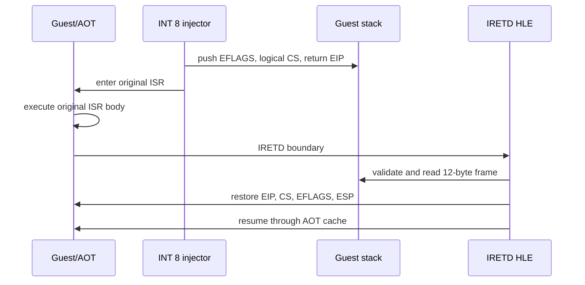

# Task 704 설계 — Linux x64 IRETD HLE와 logical guest CS frame

## 배경과 확인된 사실

Task 703 이후 실행은 guest `0x0103F1F5`의 `IRETD` cache boundary에서
`no-host-frame-to-unwind`로 종료됩니다. focused trace는 INT 8 주입과 boundary를 다음과
같이 확인했습니다.

```text
Injected INT 8, jump to 0024:0103F123, return frame 0158CBE0
guest boundary 0x0103F1F5, opcode CF (IRETD)
ESP=0x0158CBE0
[ESP+0]=0x01054480
[ESP+4]=0x00000033
[ESP+8]=0x00200206
```

현재 공용 주입기는 `GuestCpuContext::SegCs`를 frame에 기록합니다. Linux x64 signal
context의 이 값은 physical host selector `0x33`이며 guest selector가 아닙니다. 복귀
EIP `0x01054480`을 포함하는 executable guest descriptor의 selector는 `0x24`입니다.

또한 `IRETD`는 planner와 DBT HLE dispatch가 의도적으로 VEH-mediated boundary로
남기지만, Linux x64에는 해당 CPU 효과를 수행하는 handler가 없습니다. i386처럼 원본
opcode를 직접 실행하는 것은 long mode의 privilege/stack semantics와 맞지 않습니다.



## 설계

### INT 8 frame selector

Linux x64에서는 interrupt 이전 EIP를 포함하는 유일한 executable guest descriptor를
selector table에서 찾고 그 selector를 frame에 기록합니다. lookup이 실패하거나 대상이
실행 불가능하면 주입을 보류하여 불완전한 frame을 쓰지 않습니다. i386의 기존 physical
guest CS 경로는 변경하지 않습니다.

### IRETD HLE

전용 CPU-emulation handler는 32-bit code의 prefix 없는 `CF`만 처리합니다.

1. 현재 EIP가 executable 32-bit guest descriptor에 속하는지 확인합니다.
2. guest ESP의 12-byte EIP/CS/EFLAGS frame을 읽을 수 있는지 확인합니다.
3. CS slot의 하위 16-bit selector가 present/executable이고 return EIP가 그 descriptor의
   relocated linear 범위 안에 있는지 확인합니다.
4. 검증이 모두 성공하면 EIP, logical CS, EFLAGS를 복원하고 ESP를 12바이트 진행합니다.
5. 실패 시 context를 변경하지 않고 false를 반환합니다.

handler는 공용 guest HLE dispatcher와 fault-level chain 양쪽에서 사용합니다. 성공 후
Linux x64 fault-level 경로는 `kHandledGuestBoundary` 공용 AOT 재진입을 사용합니다.
원본 ISR body와 interrupt timing/pending 정책은 변경하지 않습니다.

## 검증 전략

* synthetic selector/frame으로 성공, 잘못된 selector, 읽을 수 없는 frame을 검증합니다.
* Linux x64 Debug core probe 전체를 실행합니다.
* 실제 `pumpit2a`에서 frame CS가 `0x24`인지, `IRETD` 뒤 EIP/ESP/EFLAGS가 복원되는지,
  `no-host-frame-to-unwind`가 제거되는지 확인합니다.
* 이후 새 frontier를 기록합니다.

---

## English

### Background and confirmed facts

After Task 703, execution stops at the cache boundary for guest `IRETD` at
`0x0103F1F5` with `no-host-frame-to-unwind`. The injected frame at
`0x0158CBE0` contains return EIP `0x01054480`, CS `0x33`, and EFLAGS
`0x00200206`. On Linux x64, `0x33` is the physical host CS, while the executable
guest descriptor containing the return EIP uses selector `0x24`.

`IRETD` intentionally remains a VEH-mediated planner boundary, but Linux x64
has no handler for its CPU effect. Executing the original opcode in long mode
cannot preserve 32-bit guest privilege and stack semantics.

### Design

On Linux x64, INT 8 injection writes the selector of the unique executable
guest descriptor containing the interrupted EIP. A failed or non-executable
lookup defers injection before writing a partial frame. The i386 path remains
unchanged.

A dedicated CPU-emulation handler accepts only unprefixed `CF` in 32-bit guest
code, validates and reads the 12-byte EIP/CS/EFLAGS frame, validates the target
against its executable descriptor, then restores EIP, logical CS, EFLAGS, and
ESP atomically. Failure leaves the context unchanged. Shared guest HLE and the
fault-level chain use the handler, and successful x64 fault handling resumes
through the shared handled-boundary AOT path. The original ISR body and timer
delivery policy remain unchanged.

### Verification strategy

Cover valid, bad-selector, and unreadable-frame synthetic cases; run all Linux
x64 Debug core probes; and verify the real frame selector, restored IRETD state,
removal of `no-host-frame-to-unwind`, and the next runtime frontier.
