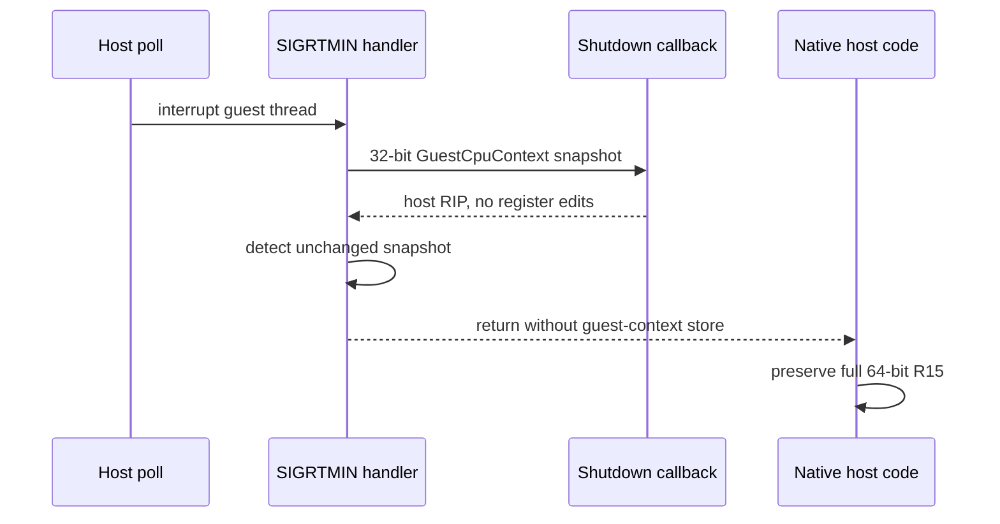

# Task 705 설계 — Linux x64 thread interrupt의 no-op context 보존

## 배경과 확인된 원인

Task 704 이후 30초와 45초 execution-timeout 실행은 모두 정확히 예산 만료 시점에
같은 native 명령 `41 8B 07` (`MOV EAX,[R15]`)에서 SIGSEGV를 재현했습니다. 두 실행의
R15는 각각 host stack pointer의 하위 32비트로 바뀌어 있었고 상위 32비트가
사라졌습니다. 정상 shutdown 표식은 fault 전에 출력되지 않았습니다.

Linux `InterruptHostThread`는 signal handler에서 native `ucontext_t`를 32-bit
`GuestCpuContext`로 읽고 callback을 호출한 뒤, callback의 수정 여부와 무관하게
`StoreGuestCpuContext`를 호출합니다. x64 변환 정책은 guest ESP를 R15D에 두므로 store가
R15를 의도적으로 zero-extend합니다. 이는 guest/AOT 문맥에는 맞지만, shutdown callback이
host code를 발견해 복귀를 거절한 no-op 문맥에서는 host가 보관하던 64-bit R15 포인터를
파괴합니다.

## 설계

interrupt callback의 반환값으로 native context write-back 필요 여부를 명시합니다.
platform layer는 callback이 true를 반환할 때만 `StoreGuestCpuContext` 또는 Windows
`SetThreadContext`를 수행합니다. callback이 외부 atomic/telemetry만 갱신한 경우는
false를 반환하며, 성공적으로 응답한 interrupt이지만 native register write-back은
생략합니다.

native-context callback은 Linux에서 제3 인자인 `ucontext_t`를 직접 수정할 수 있습니다.
현재 shutdown recovery는 native RIP와 함께 `GuestCpuContext::Eip/EFlags`도 수정하고
true를 반환합니다. 따라서 recovered 경로는 유지되고, host-code refusal과 순수
sampler만 false를 반환해 full native register state를 그대로 보존합니다. 이 명시적
계약은 구조체 padding 비교를 피하고 native-context 직접 편집도 표현합니다.

## 검증 전략

- host-thread probe에서 no-op/sampling callback의 register write-back 생략을 검증합니다.
- 편집 callback의 기존 write-back과 interrupt timeout/abandon 검증을 유지합니다.
- Linux x64 Debug `repiu`와 `repiu_core_probe`를 빌드하고 전체 probe를 실행합니다.
- 실제 `pumpit2a`에 짧은 execution timeout을 적용해 `[repiu-shutdown]` 완료와
  host-side R15 SIGSEGV 제거를 확인합니다.

---

## English

### Background and confirmed cause

After Task 704, both 30-second and 45-second execution-timeout runs reproduced
a SIGSEGV at the same native instruction, `41 8B 07` (`MOV EAX,[R15]`), exactly
when the budget expired. R15 held only the low 32 bits of a host-stack pointer;
its upper half was gone. No normal shutdown marker preceded the fault.

On Linux, `InterruptHostThread` loads native `ucontext_t` into the 32-bit
`GuestCpuContext`, invokes the callback, and unconditionally stores that
snapshot back. The x64 conversion correctly zero-extends guest ESP into R15 for
guest/AOT contexts. It corrupts a 64-bit host R15 pointer, however, when the
shutdown callback sees host code, refuses recovery, and makes no edits.

### Design

The interrupt callback return value explicitly states whether native context
write-back is required. The platform layer calls `StoreGuestCpuContext` or
Windows `SetThreadContext` only when the callback returns true. Updating
external atomic state or telemetry returns false: the interrupt was answered,
but native registers are not written back.

A native-context callback can edit Linux `ucontext_t` directly. Current shutdown
recovery also changes `GuestCpuContext::Eip/EFlags` and returns true, so its
recovered path still commits. Host-code refusal and pure sampling return false
and preserve the complete native register state. This explicit contract avoids
structure-padding comparison and also represents direct native-context edits.

### Verification strategy

Extend the host-thread probe for skipped no-op write-back while retaining edit
and timeout/abandon coverage; build Linux x64 Debug `repiu` and
`repiu_core_probe`; run all probes; and confirm that a short real `pumpit2a`
execution timeout reaches completed `[repiu-shutdown]` output without the R15
SIGSEGV.
