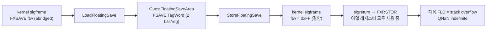

# Task 707 설계 — Linux x64 x87 tag word 변환

## 문제

Task 706 이후 Linux x64 `pumpit2a`는 Glide 초기화와 렌더 루프에 도달한다.
30초 실행에서 `_GRBUFFERSWAP@4`까지 진행하고 종료 시 `frames=2467
span_ms=8785`를 기록한다. 그러나 게스트가 처음 제출하는 삼각형의 정점이
전부 NaN이다.

```text
[repiu-live] Glide first triangle vertices: 01800F40/1 01800F7C/1 01800FF4/1
[repiu-live] Glide first triangle vertex 0 dwords: 7FC00000 7FC00000 00000000 ...
```

Task 254가 확인한 정상 동작은 첫 삼각형 세 정점이 640x480 화면 좌표라는
것이다. 즉 좌표를 만드는 x87 연산 자체가 Linux x64에서 깨져 있다.

### 확인된 근인

`src/platform/linux/guest_cpu_context.cpp`의 x86-64 전용
`StoreFloatingSave`는 FSAVE 형식 16-bit tag word를 FXSAVE 형식 abridged
8-bit tag word(`_libc_fpstate::ftw`)로 되돌릴 때 `tag != 3`인 레지스터의
비트를 세운다. 그런데 같은 파일의 `LoadFloatingSave`가 호출하는
`ClassifyFloatingTag`는 `0x00`(valid), `0x01`(zero), `0x02`(special)만
반환하고 **`0x03`(empty)을 반환하는 경로가 없다.**

결과적으로 signal 문맥을 통과한 x87 상태는 항상 `ftw = 0xFF`가 되어,
비어 있던 여덟 레지스터가 전부 "사용 중"으로 복원된다. 게스트가 다음
`FLD`를 실행하면 x87 stack overflow가 발생하고, IE가 마스킹되어 있으므로
목적지에는 QNaN indefinite가 들어간다. 이후 모든 부동소수 계산이 NaN을
전파한다.

이 동작은 이 저장소 밖에서 독립 재현했다. signal handler에서 `ftw`만
`0xFF`로 바꾸고 돌아오면, 직후의 `3.0 * 4.0`이 `0xFFC00000`이 되고
`fnstsw`가 `0x0041`(IE + C1 = stack overflow)을 보고한다.

```text
mode=0  3*4 = 12.000000 (0x41400000)  sw=0000
mode=1  handler forced ftw=0xFF
        3*4 = -nan (0xFFC00000)       sw=0041
```

관측된 `0x7FC00000`은 부호만 다른 같은 QNaN이며, 게스트 투영식 안의 뺄셈
또는 부호 반전 한 번으로 설명된다.

i386 host에는 이 결함이 없다. i386의 `_libc_fpstate`는 FSAVE 이미지라서
tag word가 필드 대 필드로 복사되고 변환이 없다.



### 변환이 왜 단순 복사가 아닌가

두 형식의 색인 공간과 폭이 다르다.

| | FSAVE tag word (`GuestFloatingSaveArea::TagWord`) | FXSAVE `ftw` |
|---|---|---|
| 폭 | 레지스터당 2 bit | 레지스터당 1 bit |
| 값 | 0 valid, 1 zero, 2 special, 3 empty | 1 사용 중, 0 비어 있음 |
| 색인 | 물리 레지스터 R0..R7 | 물리 레지스터 R0..R7 |

반면 두 형식 모두 레지스터 **내용**은 스택 상대 순서 ST(0)..ST(7)로
저장한다. 따라서 물리 색인 `j`의 내용은 `_st[(j - TOP) & 7]`에 있고,
`TOP`은 status word 비트 11..13이다. 이 회전을 빼면 `TOP != 0`인 상태에서
tag가 엉뚱한 레지스터를 가리킨다.

## 설계

* `LoadFloatingSave`(x86-64)는 abridged `ftw`를 먼저 읽는다. 비트가 0인
  물리 레지스터는 내용을 보지 않고 `0x03`(empty)로 확장한다. 비트가 1인
  물리 레지스터만 `_st[(j - TOP) & 7]`의 내용을 분류한다.
* `ClassifyFloatingTag`는 지수에서 부호 비트를 제거한 뒤 판정한다.
  `0x7FFF`는 special, `0x0000`은 significand가 0이면 zero 아니면 special,
  그 외에는 significand 최상위 비트가 서면 valid 아니면 special이다.
  이 판정은 Linux 커널의 `twd_fxsr_to_i387`과 같은 규칙이다.
* `StoreFloatingSave`(x86-64)는 물리 색인 `j`의 tag가 `0x03`일 때만
  `ftw` 비트를 0으로 둔다. 회전은 필요 없다. 역방향은 커널의
  `twd_i387_to_fxsr`과 같은 규칙이다.
* 레지스터 내용 복사는 양방향 모두 스택 상대 색인 그대로 유지한다.
* i386 경로, `GuestCpuContext` 구조, 정수 레지스터 write-back 정책,
  Task 705의 no-op callback 계약은 바꾸지 않는다.

## 검증 전략

* `guest_cpu_context` probe를 확장한다.
  * x86-64 round trip이 `TagWord`까지 정확히 일치하도록 요구한다. 지금은
    x86-64에서만 `TagWord` 비교를 건너뛰고 있고, 결함이 그 구멍으로
    지나갔다.
  * `TOP = 3`이고 물리 레지스터마다 tag가 다른 두 번째 사례를 추가해
    회전과 분류를 함께 확인한다. 기대값은 `TagWord = 0xFF27`,
    `ftw = 0x0E`이다.
* Linux x64 Debug `repiu`와 `repiu_core_probe`를 빌드하고 core probe
  전체 group을 실행한다.
* 실제 `pumpit2a` 30초 실행에서 첫 삼각형 정점이 NaN이 아니라 화면 좌표
  범위 값인지 확인한다.
* Win32 x86 빌드와 probe가 그대로 통과하는지 확인한다. 이 파일은
  Linux 전용이지만 probe는 공용이다.

---

## English

### Problem

After Task 706 the Linux x64 `pumpit2a` run reaches Glide initialization and
the render loop. A 30-second run gets as far as `_GRBUFFERSWAP@4` and reports
`frames=2467 span_ms=8785` at shutdown. Every vertex of the first triangle the
guest submits is a NaN, where Task 254 confirmed the correct behavior is three
640x480 screen coordinates. The x87 arithmetic that produces those coordinates
is therefore broken on Linux x64.

### Confirmed cause

The x86-64 `StoreFloatingSave` in `src/platform/linux/guest_cpu_context.cpp`
converts the FSAVE-format 16-bit tag word back into the FXSAVE abridged 8-bit
tag word (`_libc_fpstate::ftw`) by setting the bit for every register whose tag
is not `3`. But `ClassifyFloatingTag`, which `LoadFloatingSave` uses to build
that tag word, returns only `0x00` (valid), `0x01` (zero), and `0x02`
(special) — **it has no path that returns `0x03` (empty)**.

So x87 state that passes through a signal context always comes back with
`ftw = 0xFF`, marking all eight previously empty registers as in use. The
guest's next `FLD` overflows the x87 stack, and with IE masked the destination
receives the QNaN indefinite, after which every floating-point result
propagates a NaN.

The mechanism was reproduced outside this repository: changing only `ftw` to
`0xFF` in a signal handler turns the `3.0 * 4.0` immediately after the return
into `0xFFC00000` with `fnstsw` reporting `0x0041` (IE + C1, stack overflow).
The observed `0x7FC00000` is the same QNaN with the opposite sign, which one
subtraction or negation inside the guest's projection accounts for.

The i386 host does not have this defect: its `_libc_fpstate` is the FSAVE
image, so the tag word is copied field for field with no conversion.

### Why the conversion is not a copy

The two formats differ in width and in value encoding — 2 bits per register
with four states versus 1 bit per register with two — while both index the tag
by *physical* register R0..R7 and store the register *contents* in
stack-relative ST(0)..ST(7) order. The contents of physical register `j` are
therefore at `_st[(j - TOP) & 7]`, with `TOP` in status-word bits 11..13.
Without that rotation the tag describes the wrong register whenever
`TOP != 0`.

### Design

* x86-64 `LoadFloatingSave` reads the abridged `ftw` first. A physical
  register whose bit is clear expands to `0x03` (empty) without its contents
  being examined; only a register whose bit is set has the contents at
  `_st[(j - TOP) & 7]` classified.
* `ClassifyFloatingTag` masks the sign bit out of the exponent before
  judging: `0x7FFF` is special, `0x0000` is zero when the significand is zero
  and special otherwise, and anything else is valid when the significand's top
  bit is set and special otherwise. This is the rule the Linux kernel's
  `twd_fxsr_to_i387` uses.
* x86-64 `StoreFloatingSave` clears the `ftw` bit for physical index `j` only
  when that tag is `0x03`. No rotation is needed in this direction, matching
  the kernel's `twd_i387_to_fxsr`.
* Register-content copies keep their stack-relative index in both directions.
* The i386 path, the `GuestCpuContext` structure, integer register write-back
  policy, and the Task 705 no-op callback contract are unchanged.

### Verification strategy

* Extend the `guest_cpu_context` probe: require the x86-64 round trip to match
  `TagWord` exactly (today x86-64 alone skips that comparison, which is the
  hole this defect passed through), and add a second case with `TOP = 3` and a
  different tag per physical register so the rotation and the classification
  are checked together. The expected values are `TagWord = 0xFF27` and
  `ftw = 0x0E`.
* Build Linux x64 Debug `repiu` and `repiu_core_probe` and run every
  core-probe group.
* Confirm on a real 30-second `pumpit2a` run that the first triangle's
  vertices are screen coordinates rather than NaNs.
* Confirm the Win32 x86 build and probes still pass; the source is
  Linux-only but the probe is shared.
