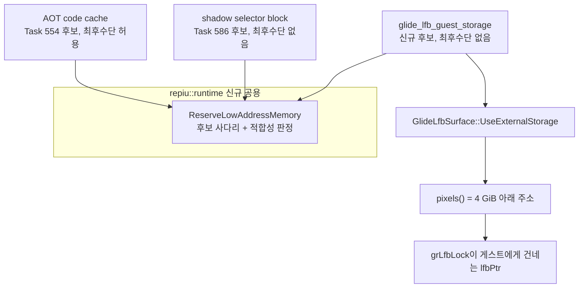

# Task 708 설계 — Glide LFB staging surface의 32비트 주소 보장

## 문제

Task 707이 x87 결함을 고친 뒤 Linux x64 `pumpit2a`는 처음으로 LFB 경로에
들어갔고 거기서 SIGSEGV로 끝난다.

```text
[repiu-live-debug] grLfbLock granted #1 type=1 buffer=1 writeMode=0 origin=0
                   lfbPtr=0xEC02A530 stride=1280 640x480
[repiu-fault] unhandled signal=0xb eip=0x201b4c1f access=0xec02a530
              ebx=0xec02a534 bytes=67 89 7b fc 83 c1 04 67 89 13 ...
```

`linexe_glide_boundary.cpp`의 `grLfbLock` handler는 게스트에게 건네는
`lfbPtr`을 다음과 같이 만든다.

```cpp
const auto staging_pointer = static_cast<std::uint32_t>(
    reinterpret_cast<std::uintptr_t>(
        context->glide_lfb_surface.pixels()));
```

`GlideLfbSurface`의 저장소는 `std::vector<std::uint8_t>`, 즉 host 힙이다.
Win32 x86에서는 힙이 32비트 주소 공간 안에 있으므로 이 캐스트가 무손실이다.
x86-64에서는 614,400바이트 할당이 4 GiB 위에 놓이고, 절단된 주소가 게스트에게
전달된다. 게스트는 그 주소에 32비트 주소 크기 접두어가 붙은 `MOV [EBX],EDX`로
기록하고 즉시 폴트가 난다.

## 이미 두 번 나온 문제

이것은 이 저장소에서 세 번째로 같은 모양의 문제다. **host가 소유한 메모리의
주소를 32비트 필드에 넣어야 하는데, x86-64의 기본 할당은 4 GiB 위에 있다.**

| 소비자 | 32비트 필드 | 해결 |
|---|---|---|
| AOT code cache (Task 554) | `AotCodeCachePlacement::base_address` | 후보 사다리 `0x20000000`.. + 무힌트 최후수단 |
| shadow selector block (Task 585/586) | 가드 슬롯의 `cmp word ptr [disp32]` | 후보 사다리 `0x1F000000`.. , 최후수단 없음 |
| **LFB staging surface (이 작업)** | `GrLfbInfo_t::lfbPtr` | 후보 사다리, 최후수단 없음 |

두 기존 구현은 같은 사다리를 각자 갖고 있다. 세 번째를 또 복사하는 대신 공용
단위로 뽑는다.

### 두 구현이 다른 한 가지

code cache는 후보가 전부 찼을 때 무힌트 요청을 최후수단으로 쓰고, 4 GiB 초과
결과도 돌려준다. 호출자 쪽에 "AOT code cache is outside the x86 address range"
거부가 따로 있기 때문이다. shadow selector block은 최후수단이 없다. Task 586이
기록했듯 x86-64에서 무힌트 `mmap`은 4 GiB 위를 확정적으로 돌려주므로, 그것은
최후수단이 아니라 "실패한 뒤 해제까지 하는 실패"다.

LFB는 shadow selector 쪽과 같다. 게스트가 역참조할 주소이므로 4 GiB 위 결과는
쓸모가 없다. **최후수단 없이, 이유를 말하며 실패한다.**

## 왜 arena가 아닌가

대안은 staging surface를 게스트 arena(`0x01000000`–`0x095D7000`) 안에 두는
것이었다. 채택하지 않는다.

1. **Win32 x86에서 이미 arena 밖에 있고 정상 동작한다.** `thread_context.h`의
   기존 주석이 설계 257 §3.1을 인용해 그렇게 적어 뒀다 — 게스트가 flat DS로
   기록하므로 arena 안에 있을 필요가 없다. x64의 결함은 "arena 밖"이 아니라
   "4 GiB 위"다. 낮은 예약은 동작하는 구조를 x64에서 복원하고, arena 배치는
   동작하는 구조를 바꾼다.
2. **arena 슬랙에는 이미 임자가 있다.** 게스트 DPMI 힙이 거기 산다 — Task 707이
   추적한 정점 버퍼 `0x01800F40`이 그 예이고, LINEXE Glide thunk는
   `0x095D0300`이다. 614,400바이트를 떼려면 DPMI 할당기와 조율해야 한다.
3. **arena 안에 두면 엔진의 모든 술어가 그것을 게스트 메모리로 본다.**
   `IsGuestRangeReadable`, guest write watch, AOT page coherence가 게스트가 매
   프레임 덮어쓰는 600 KB를 대상으로 삼게 된다. 얻는 것이 없다.

## 설계



### 1. 공용 낮은 주소 예약

`include/repiu/runtime/low_address_reservation.h`와
`src/runtime/low_address_reservation.cpp`를 새로 만든다. 요청은 후보 목록,
용량, 그리고 64비트 host에서 무힌트 최후수단을 허용하는지를 받는다.

적합성 판정은 첫 바이트가 아니라 **마지막 바이트**를 본다.

```text
address <= UINT32_MAX  그리고  capacity - 1 <= UINT32_MAX - address
```

이것은 shadow selector의 기존 판정을 일반화한 것이고, code cache의 판정
(첫 바이트만)보다 엄격하다. 엄격해지는 방향이므로 회귀가 아니다.

결과에는 `fits_32bit`를 둔다. 후보가 답한 경우와 32비트 host의 무힌트 요청은
언제나 참이고, 64비트 host의 무힌트 최후수단만 거짓일 수 있다. code cache는
그 경우에도 예약을 받아 자기 거부 메시지를 유지한다.

### 2. 기존 두 소비자를 공용 단위 위에 다시 얹기

`ReserveAotCodeCacheMemory`와 `ReserveAotShadowSelectorBlock`의 공개 API,
후보 목록, 메시지 문자열, 최후수단 정책은 그대로 둔다. 사다리 코드만 공용
단위 호출로 바뀐다.

### 3. `GlideLfbSurface`의 외부 저장소

`repiu::hle`는 지금 `repiu::platform`이나 `repiu::runtime`에 의존하지 않는다.
그 층을 유지한다. surface는 저장소를 **받을 수** 있게만 한다.

```cpp
// 호출자가 소유하는 저장소를 설치한다. 이후 Resize는 이 저장소를 쓰고,
// 들어가지 않는 크기를 거부한다.
bool UseExternalStorage(std::uint8_t* base, std::size_t byte_count);
```

용량은 고정해도 임의의 상한이 아니다. `DecodeGlideResolution`은 resolution 7
(640x480) 하나만 받아들이고 나머지를 거부하므로, 지원되는 모든 창은 같은
614,400바이트다. 해상도가 늘어나면 `Resize`가 들어가지 않는다고 거부하며,
그것이 알아야 할 바로 그 지점이다.

`pixels()`, `byte_count()`는 설치된 저장소를 보고한다. 설치되지 않으면 기존
`std::vector` 경로 그대로다. probe가 만드는 surface들은 그대로 힙을 쓴다.

### 4. 예약 소유자

`src/engine/boundary/glide_lfb_guest_storage.{h,cpp}`를 새로 만든다. 낮은
예약 하나를 소유하고, surface에 설치하고, 해제한다. `ThreadContext`는
`shadow_selector_reservation`과 같은 방식으로 멤버를 갖고 소멸자에서 푼다.
멤버는 `glide_lfb_surface`보다 **먼저** 선언해 소멸 순서가 surface를 먼저
없애도록 한다.

`linexe_glide_boundary.cpp`의 통합 지점에는 `Resize` 앞에 놓이는 멱등한 호출
하나만 남긴다.

### 5. 후보 주소

기존에 쓰이는 낮은 주소를 피한다 — arena는 `0x095D7000`까지, shadow selector는
`0x1F000000`부터, code cache는 `0x20000000`부터, 엔진 이미지는 `0x40000000`.

```text
0x1D000000, 0x25000000, 0x2D000000, 0x35000000, 0x3D000000
```

매핑은 `MAP_FIXED_NOREPLACE`이므로 이미 임자가 있는 후보는 덮어쓰지 않고
실패하고 다음으로 넘어간다.

## 검증 전략

* 새 `low_address_reservation` probe: 후보가 답하는 경우, 후보가 전부 찬 경우,
  최후수단 허용/불허, 마지막 바이트 적합성 판정.
* `glide_lfb_region` probe에 외부 저장소 사례를 더한다 — 설치 뒤 `pixels()`가
  그 저장소를 가리키는지, 들어가지 않는 `Resize`가 거부되는지.
* 기존 `code_cache_placement` probe가 회귀 없이 통과하는지.
* Linux x64 core probe 전체, Win32 x86 core probe 전체.
* 실제 `pumpit2a` 30초 실행에서 `lfbPtr`이 4 GiB 아래이고 SIGSEGV 없이 예산을
  채우는지.

## 확인되지 않은 것

이 작업은 게스트가 LFB에 **기록할 수 있게** 한다. 기록한 내용이 화면에 옳게
나타나는지는 별개의 질문이고, 이 작업의 완료 조건이 아니다.

---

## English

### Problem

With the Task 707 x87 defect fixed, the Linux x64 `pumpit2a` run entered the
LFB path for the first time and ended there in a SIGSEGV. The `grLfbLock`
handler in `linexe_glide_boundary.cpp` builds the `lfbPtr` it hands the guest
by casting `context->glide_lfb_surface.pixels()` to `std::uint32_t`. That
surface is backed by a `std::vector<std::uint8_t>` — host heap. On Win32 x86
the heap is inside the 32-bit address space and the cast is lossless; on
x86-64 a 614,400-byte allocation lands above 4 GiB, the guest receives a
truncated address, writes through it with a 32-bit-address-size
`MOV [EBX],EDX`, and faults at once.

### The same problem for the third time

This is the third instance of one shape in this repository: **host-owned memory
whose address has to fit a 32-bit field, where the x86-64 default allocation is
above 4 GiB.** The AOT code cache (Task 554) solved it with a candidate ladder
from `0x20000000` plus an unhinted last resort; the shadow selector block
(Tasks 585/586) with a ladder from `0x1F000000` and no last resort. Each
carries its own copy of the ladder. Rather than add a third copy, the ladder
moves into a shared unit.

The two differ in one way. The code cache keeps an unhinted last resort and
accepts a result above 4 GiB, because the caller has its own "AOT code cache is
outside the x86 address range" refusal behind it. The shadow selector block has
none: as Task 586 recorded, an unhinted `mmap` on x86-64 reliably answers above
4 GiB, so that is not a fallback but a failure that also has to release. The
LFB is the shadow selector's case — the guest will dereference the address, so
a result above 4 GiB is useless. It **fails with a reason instead**.

### Why not the arena

Placing the staging surface inside the guest arena
(`0x01000000`–`0x095D7000`) was the alternative. It is not taken.

1. **It is already outside the arena on Win32 x86 and works there.** The
   existing comment in `thread_context.h` cites design 257 §3.1 saying exactly
   that: the guest writes it with native instructions under the flat DS, so it
   does not need to live in the arena. The x64 defect is not "outside the
   arena" but "above 4 GiB". A low reservation restores the working topology on
   x64; an arena placement changes it.
2. **The arena slack is already spoken for.** The guest's DPMI heap lives there
   — the vertex buffer at `0x01800F40` that Task 707 traced is one — and the
   LINEXE Glide thunks sit at `0x095D0300`. Carving out 614,400 bytes would
   have to be coordinated with the DPMI allocator.
3. **Inside the arena, every engine predicate would treat it as guest memory.**
   `IsGuestRangeReadable`, the guest write watch and AOT page coherence would
   all cover 600 KB the guest overwrites every frame, for no gain.

### Design

**A shared low-address reservation.** New
`include/repiu/runtime/low_address_reservation.h` and
`src/runtime/low_address_reservation.cpp`. A request carries the candidate
list, the capacity, and whether a 64-bit host may fall back to an unhinted
request. The fit test looks at the **last** byte, not the first —
`address <= UINT32_MAX && capacity - 1 <= UINT32_MAX - address` — which
generalizes the shadow selector's existing test and is stricter than the code
cache's first-byte test. Stricter is not a regression. The result carries
`fits_32bit`, always true for a candidate answer and for a 32-bit host's
unhinted request, and possibly false only for a 64-bit host's last resort,
which the code cache still accepts so it can keep its own refusal message.

**The two existing consumers move onto it.** The public APIs, candidate lists,
message strings and last-resort policies of `ReserveAotCodeCacheMemory` and
`ReserveAotShadowSelectorBlock` are unchanged; only the ladder code becomes a
call.

**External storage for `GlideLfbSurface`.** `repiu::hle` depends on neither
`repiu::platform` nor `repiu::runtime` today, and that layering is kept. The
surface only gains the ability to be *given* storage:
`UseExternalStorage(std::uint8_t* base, std::size_t byte_count)`. `Resize` then
uses it and refuses a size that does not fit. A fixed capacity is not an
arbitrary cap here: `DecodeGlideResolution` accepts resolution 7 (640x480) and
refuses everything else, so every window this engine opens is the same 614,400
bytes; if a resolution is added later, `Resize` refusing to fit is the right
place to find out. Without installed storage the existing `std::vector` path is
unchanged, so the surfaces the probes build still use the heap.

**Ownership.** New `src/engine/boundary/glide_lfb_guest_storage.{h,cpp}` owns
one low reservation, installs it into the surface, and releases it.
`ThreadContext` holds it the way it already holds
`shadow_selector_reservation` and frees it in the destructor, declared *before*
`glide_lfb_surface` so destruction order takes the surface down first. The
integration point in `linexe_glide_boundary.cpp` keeps only one idempotent call
ahead of `Resize`.

**Candidates.** Chosen clear of the low addresses already in use — the arena up
to `0x095D7000`, the shadow selector block from `0x1F000000`, the code cache
from `0x20000000`, and the engine image at `0x40000000`: `0x1D000000`,
`0x25000000`, `0x2D000000`, `0x35000000`, `0x3D000000`. The mapping is
`MAP_FIXED_NOREPLACE`, so an occupied candidate fails and the ladder moves on
rather than displacing whatever holds it.

### Verification strategy

* A new `low_address_reservation` probe: a candidate answering, every candidate
  taken, the last resort allowed and refused, and the last-byte fit test.
* A case added to the `glide_lfb_region` probe: after installation `pixels()`
  points at the given storage, and a `Resize` that does not fit is refused.
* The existing `code_cache_placement` probe passing unchanged.
* Every Linux x64 and Win32 x86 core-probe group.
* A real 30-second `pumpit2a` run whose `lfbPtr` is below 4 GiB and which
  reaches its budget without a SIGSEGV.

### Not established by this task

This task makes the LFB **writable** by the guest. Whether what it writes then
appears correctly on screen is a separate question and is not a completion
condition here.
