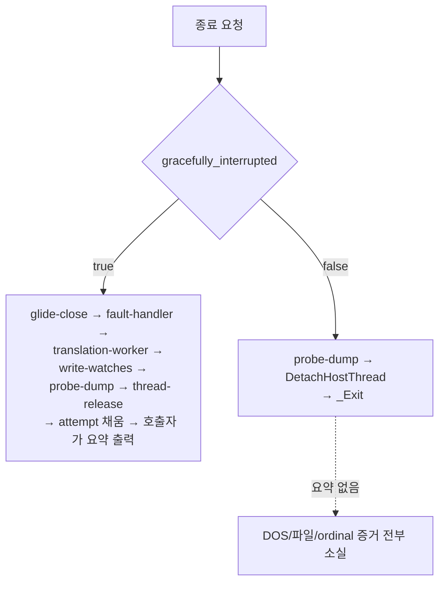

# Task 709 설계 — 회수 거절 경로의 최종 실행 요약

## 문제

Task 708 뒤 Linux x64 `pumpit2a`는 30초를 완주하지만 **화면은 여전히 검다.**
`REPIU_GLIDE_DRAW_DIAG=1`로 Win32 x86과 같은 장면을 비교하면 갈라지는 지점이
정확히 보인다.

| | Win32 x86 | Linux x64 |
|---|---|---|
| 삼각형 xy | `(80.00,379.93)(335.93,379.93)(80.00,124.00)` | 같음 (반올림만 다름) |
| 정점 dword 8 (oow) | `3F800000` = 1.0 | `00000000` |
| 정점 dword 9/10 (s/t) | `0` / `43800000` = 256.0 | `0` / `0` |
| `combine` | `3/other=1` | `1/other=2` |
| `texEnabled` | `1` | `0` |
| 삼각형 #3 뒤 non-black 픽셀 | 28,230 | **0** |

Glide gate 열은 **#1부터 #50까지 ordinal과 반환 주소가 완전히 일치**하다가
#51에서 갈라진다.

```text
Win32 #51 ordinal=46  _GRTEXTEXTUREMEMREQUIRED@8   ret=0x…4A20F
Win32 #52 ordinal=49  _GRTEXDOWNLOADMIPMAPLEVEL@32 ret=0x…4A296
Win32 #53..#58        TEXCLAMPMODE / TEXFILTERMODE / TEXMIPMAPMODE /
                      TEXSOURCE / TEXCOMBINE / HINTS
Linux #51 ordinal=80  _GRALPHACOMBINE@20           ret=0x…4B501
```

즉 **Linux x64는 게스트의 텍스처 업로드 블록 전체를 건너뛴다.** 텍스처가 없으니
s/t가 0이고 combine이 다르고, 사각형은 검은색으로 검은 배경에 그려진다. 좌표가
옳은데도 화면이 검은 이유가 이것이다.

게스트 스택 포인터는 gate #1부터 두 host가 8바이트 차이나지만 **그 차이는
일정하고 반환 주소는 #50까지 동일하다.** 누적되는 표류가 아니므로 이 분기의
원인이 아니다.

### 왜 여기서 막히는가

다음 질문은 "게스트가 왜 텍스처 업로드를 건너뛰었는가"이고, 그것을 보려면
게스트의 DOS 파일 접근을 봐야 한다. Win32 로그에는 그 증거가 있다.

```text
Win32 DOS path trace #… service=chdir result=success …   (9건)
Win32 DOS path trace #… service=chdir result=failure …   (7건)
Win32 DOS file I/O #… op=read handle=… before=… after=…  (40건)
```

**Linux x64 로그에는 이 줄이 하나도 없다.** 같은 실행에서 Win32는 945줄,
Linux는 133줄을 남긴다.

이것은 게스트가 파일을 열지 않았다는 뜻이 **아니다.** 이 줄들은 loader의 최종
요약(`PrintExecutionAttempt`)이 `MinimalExecutionAttempt`를 읽어 출력하는
것인데, Linux 실행이 그 지점에 도달하지 못한다.

## 확인된 원인

`execution_trampoline.cpp`의 종료 블록은 게스트 스레드를 회수했는지로 갈린다.



거절 경로가 `_Exit`로 끝나는 이유는 Task 507/508이 기록한 그대로이며 옳다.
아직 실행 중인 게스트 스레드 아래에서 fault handler를 떼면 다음 INT3나 trap
flag를 받을 것이 없어 커널 기본 처분이 코어를 덤프한다. 여섯 번 중 두 번이
그렇게 죽었다.

**바뀌어야 하는 것은 정리 작업이 아니라 보고다.** `_Exit`는 `attempt`를
호출자에게 돌려주지 않으므로, 호출자가 출력할 기회 자체가 없다. Linux x64는
모든 실행에서 이 갈래로 내려가므로(`recovered=0`), 요약을 한 번도 본 적이 없다.
이 공백은 Task 249부터 관측돼 있었다.

## 설계

### 최종 보고 콜백

새 단위 `repiu::engine::FinalExecutionReport`를 둔다.

```cpp
using FinalExecutionReportCallback =
    void (*)(const MinimalExecutionAttempt&, void* user);

void SetFinalExecutionReport(FinalExecutionReportCallback callback, void* user);
bool EmitFinalExecutionReport(const MinimalExecutionAttempt& attempt);
bool FinalExecutionReportEmitted();
```

* trampoline은 `_Exit` 직전에 `attempt`를 채우고 `EmitFinalExecutionReport`를
  부른다.
* host는 시작할 때 `PrintExecutionAttempt`를 부르는 콜백을 등록한다.
* 정상 경로의 기존 출력도 같은 `EmitFinalExecutionReport`를 지나가게 해서
  **한 번만** 출력되도록 한다. 등록이 없으면 아무 일도 하지 않는다.
* 함수 포인터와 `void*`를 쓴다. 이 경로는 `std::function`의 할당을 도입할 자리가
  아니고, 기존 positional 인자 목록 세 개를 늘리지 않는 편이 낫다.

### 거절 경로에서 무엇을 채우는가

`CopyThreadObservationToAttempt`(`live_telemetry_snapshot.cpp` 927–2351행)는
**스칼라와 POD 배열만 복사하고 `std::string`은 건드리지 않는다.** 확인했다.
따라서 이 호출은 게스트 스레드가 살아 있어도 안전하다. 최악의 경우 카운터가
갱신되는 중에 읽혀 값이 조금 낡거나 찢어질 뿐이고, 진단 값으로는 받아들일 수
있다. 아무것도 출력하지 않는 것보다 확실히 낫다.

`attempt`의 `std::string` 필드(`hle_message`, `hle_stdout_output`,
`hle_stderr_output`)는 **이 경로에서 건드리지 않는다.** 그 문자열들은 게스트
스레드가 HLE 처리 중에 쓰는 것이므로, 동시에 복사하면 진단이 프로세스를 죽일 수
있다. `message`에는 이 갈래에서 왔음을 말하는 고정 문자열을 넣는다.

`guest_thread_stopped = false`는 이미 이 갈래가 설정하고 있고, 요약이 그것을
출력하므로 독자는 어느 갈래의 요약인지 구분할 수 있다.

### 바꾸지 않는 것

Task 507/508의 정리 정책은 그대로다. fault handler 제거, Glide close,
translation worker join, page protection 복원은 여전히 이 갈래에서 하지 않는다.
종료 코드도 그대로다.

## 검증 전략

* 새 `final_execution_report` core probe group: 등록 없이 emit해도 안전한지,
  등록 뒤 한 번만 불리는지, 두 번째 emit이 아무 일도 하지 않는지, user 포인터가
  그대로 전달되는지.
* Linux x64에서 30초 `pumpit2a` 실행이 `immediate-exit` 전에 요약을 출력하는지.
  특히 `Win32 DOS path trace`와 `Win32 DOS file I/O` 줄이 나타나는지.
* Win32 x86에서 요약이 **한 번만** 출력되는지(중복 회귀 확인).
* 두 host의 core probe 전체.

## 이 작업이 답하지 않는 것

이 작업은 텍스처 업로드가 왜 생략되는지를 **답하지 않는다.** 그 질문을 볼 수
있게 만드는 것이 전부다. 근인 추적은 다음 작업이다.

---

## English

### Problem

After Task 708 the Linux x64 `pumpit2a` run completes its 30 seconds, but **the
screen is still black.** Comparing the same scene against Win32 x86 under
`REPIU_GLIDE_DRAW_DIAG=1` shows exactly where the two diverge: the triangle
coordinates agree to rounding, but on Linux the vertex `oow` is `0` where
Windows has `1.0`, the texture coordinates are `0/0` where Windows has
`0/256.0`, the color combine is `1/other=2` against `3/other=1`, texturing is
disabled, and the third triangle leaves 0 non-black pixels where Windows leaves
28,230.

The Glide gate sequence matches **exactly — ordinal and return address — for
the first 50 gates**, then diverges at #51: Windows enters
`_GRTEXTEXTUREMEMREQUIRED@8`, `_GRTEXDOWNLOADMIPMAPLEVEL@32` and the
clamp/filter/mipmap/source/combine/hint block, while Linux goes straight on to
`_GRALPHACOMBINE@20`. **Linux x64 skips the guest's entire texture-upload
block.** With no texture the s/t coordinates are zero and the combine differs,
so the quads are drawn black on black. That is why correct coordinates still
produce a black screen.

The guest stack pointer differs by 8 bytes between the hosts from gate #1
onward, but that difference is constant and the return addresses agree through
gate #50, so it is not drift and not the cause of this branch.

### Why the investigation stops here

The next question is why the guest skipped the upload, and answering it means
looking at the guest's DOS file access. The Win32 log has that evidence — nine
successful and seven failed `chdir` traces and forty file-I/O traces — and
**the Linux x64 log has none of it.** The same run writes 945 lines on Win32
and 133 on Linux.

That absence does not mean the guest opened no files. Those lines come from the
loader's final summary, `PrintExecutionAttempt`, reading
`MinimalExecutionAttempt` — and the Linux run never reaches it.

### Confirmed cause

The shutdown block in `execution_trampoline.cpp` branches on whether the guest
thread was recovered. The refused arm ends in `_Exit`, for the reason Tasks
507 and 508 recorded and which is correct: removing the fault handler under a
still-running guest thread leaves its next INT3 or trap flag with nothing to
receive it, and the kernel's default disposition dumps core — two of six
measured runs died exactly that way.

**What has to change is the reporting, not the cleanup.** `_Exit` never returns
`attempt` to its caller, so the caller has no opportunity to print. Linux x64
takes this arm on every run (`recovered=0`), so it has never once produced a
summary. The gap has been observed since Task 249.

### Design

A new `repiu::engine::FinalExecutionReport` unit holds a registered callback:
`SetFinalExecutionReport`, `EmitFinalExecutionReport`, and
`FinalExecutionReportEmitted`. The trampoline fills `attempt` and emits just
before `_Exit`; the host registers a callback that calls
`PrintExecutionAttempt`; and the normal path's existing print goes through the
same emit, so the summary appears exactly **once**. With nothing registered,
emitting does nothing. A function pointer and a `void*` are used rather than
`std::function`: this path is no place to introduce an allocation, and it is
better than lengthening three existing positional parameter lists.

**What the refused arm fills.** `CopyThreadObservationToAttempt`
(`live_telemetry_snapshot.cpp`, lines 927–2351) copies only scalars and POD
arrays and touches no `std::string`; that was checked. It is therefore safe to
call with the guest thread still live. The worst case is a counter read while
it is being updated, giving a slightly stale or torn diagnostic value, which is
acceptable and plainly better than printing nothing.

The `std::string` members of `attempt` — `hle_message`, `hle_stdout_output`,
`hle_stderr_output` — are **deliberately left alone here**, because the guest
thread writes them while servicing HLE and copying one concurrently could let a
diagnostic kill the process. `message` gets a fixed string naming this arm.
`guest_thread_stopped = false` is already set here and is printed by the
summary, so a reader can tell which arm produced it.

**Unchanged:** the Task 507/508 cleanup policy. The fault handler, the Glide
close, the translation-worker join and the page-protection restore are still
not done on this arm, and the exit code is the same.

### Verification strategy

* A new `final_execution_report` core-probe group: emitting with nothing
  registered is safe, a registered callback is invoked exactly once, a second
  emit does nothing, and the user pointer arrives unchanged.
* A 30-second Linux x64 `pumpit2a` run printing the summary before
  `immediate-exit`, and specifically showing the `Win32 DOS path trace` and
  `Win32 DOS file I/O` lines.
* A Win32 x86 run printing the summary exactly once, guarding against a
  duplicate.
* Every core-probe group on both hosts.

### What this task does not answer

It does not say why the texture upload is skipped. It only makes that question
observable. Tracing the cause is the next task.
