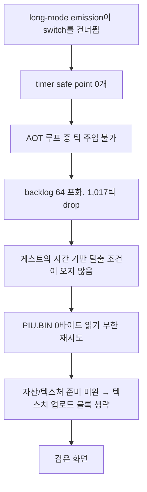

# Task 710 설계 — Linux x64 long-mode timer safe point

## 문제

Task 709이 복구한 요약으로 Linux x64와 Win32 x86의 같은 장면을 비교하면 이렇게
갈린다.

| | Win32 x86 | Linux x64 |
|---|---:|---:|
| `handled DOS open count` | 11 | 11 |
| `handled DOS seek count` | 25 | 24 |
| **`handled DOS read count`** | **122** | **1,110,359** |
| `AOT timer safe points enabled/sites` | `true/1067` | **`true/0`** |
| `AOT timer safe-point trap/injected/deferred` | `5731/5685/46` | **`0/0/0`** |
| timer tick due/injected/dropped/remaining | `6294/5839/455/0` | `2823/1742/**1017**/**64**` |

열기와 탐색은 같은데 읽기만 9,000배다.

### 읽기 루프의 정체

10초 예산으로 잡은 Linux 실행의 trace 꼬리가 그 루프를 그대로 보여 준다.

```text
#769583 op=read handle=0x0005 before=0x010F0FDF after=0x010F0FDF
        requested=4096 actual=0 error=0x0000 eip=0x010F4BDF path=…/PIU/PIU.BIN
        (동일한 줄이 계속)
```

`PIU.BIN`은 **560바이트**인데 파일 위치가 `0x010F0FDF`(17,764,319)다. 그 위치는
`origin=0x00`인 seek이 만들었고, 게스트가 `CX:DX`에 넘긴 값은 게스트 주소처럼
생긴 쓰레기다. 그래서 모든 읽기가 0바이트를 돌려주고 게스트는 무한히 재시도한다.

### 그런데 이것은 Linux 고유 결함이 **아니다**

같은 구간을 1.5초 예산으로 잡은 Win32 실행도 똑같이 한다.

```text
#12 op=seek handle=0x0005 before=0x00000230 after=0x0458CC60 origin=0x00
    offset=72928352 path=…\PIU\PIU.BIN
#13..#22 op=read … requested=4096 actual=0 … (반복)
```

Win32의 seek 목적지 `0x0458CC60`은 게스트 **스택** 주소이고, Linux의
`0x010F0FDF`는 게스트 **코드** 주소다. 둘 다 쓰레기이고 값만 다르다. 게스트는
이 재시도 루프에 **원래 들어간다.**

**다른 것은 빠져나오느냐다.** Win32는 1.5초에 읽기 37회, 4초에 116회, 30초에
122회로 곧 빠져나온다. Linux는 10초에 769,639회를 하고도 빠져나오지 못한다.

## 확인된 원인

이 루프는 시간으로 끝난다. 그리고 Linux x64에서는 시간이 게스트에게 도달하지
않는다.

`aot_code_cache.cpp`의 emitter는 backward edge마다 timer safe point를 심는다.
게스트가 AOT 코드 안에서 도는 동안 타이머 요청을 받을 수 있게 하는 장치다.

```cpp
if (options.enable_timer_safe_points && IsBackwardEdge(instruction))
{
    EmitTimerSafePoint(instruction, image);
}
```

호출 지점은 세 곳이고 **전부 같은 `switch` 안**에 있다. 그런데 long-mode
emission은 그 `switch`에 닿기 전에 `continue`로 빠진다.

```cpp
if (options.enable_long_mode_emission)
{
    …
    long_mode_entry_instructions.push_back(…);
    continue;          // ← switch 전체를 건너뛴다
}
switch (instruction.kind) { … EmitTimerSafePoint … }
```

그래서 Linux x64는 **safe point를 하나도 심지 않는다.** 로그의 `true/0`이
그것이다. 결과로 타이머 틱이 AOT 실행 중에 전달되지 못하고, backlog가 상한
64에 붙어(`remaining=64`) 1,017틱이 버려진다. 게스트의 시간 기반 탈출 조건이
오지 않으므로 루프가 끝나지 않는다.



## 설계

### 1. long-mode 경로에서도 safe point를 심는다

`EmitTimerSafePoint`를 long-mode 분기에서도, backward edge 판정이 같은 조건으로
부른다. 판정(`IsBackwardEdge`)은 게스트 명령에 대한 것이므로 host와 무관하고 그대로
쓴다.

### 2. long mode에서 `cmp dword ptr [abs32],0`을 바르게 인코딩한다

현재 emitter가 쓰는 바이트는 이렇다.

```text
83 3D <disp32> 00      ; 32-bit: cmp dword ptr [disp32], 0
```

ModRM `0x3D`는 mod=00, rm=101이다. **32비트에서는 절대 disp32이고 long mode
에서는 RIP 상대다.** 그대로 두면 safe point가 엉뚱한 곳을 읽는다. long mode에서는
SIB 형식을 써야 한다.

```text
83 3C 25 <disp32> 00   ; long mode: cmp dword ptr [disp32], 0
                       ; mod=00 rm=100(SIB), scale=0 index=100(없음) base=101(disp32)
```

이 변환은 새 발명이 아니다. `aot_long_mode_compatibility.cpp`가 이미 같은
치환을 하고 있고(`(modrm & 0xC7) == 0x05` → `Byte(0x25U)`), 같은 규칙을 여기에
적용한다. 이 인코딩 차이 때문에 site 레코드의 `request_address_offset`이 한
바이트 뒤로 밀리므로, 오프셋은 emitter가 계산한 값을 그대로 기록한다.

### 3. 요청 플래그를 32비트가 이름 부를 수 있는 곳에 둔다

`ResolveAotTimerSafePoints`는 플래그 주소를 이렇게 만든다.

```cpp
const std::uintptr_t request_value =
    reinterpret_cast<std::uintptr_t>(&placement->timer_safe_point_request);
if (request_value > std::numeric_limits<std::uint32_t>::max())
{
    return false;                      // x64에서는 여기서 거부된다
}
```

`AotCodeCachePlacement`는 host 객체이므로 x86-64에서 4 GiB 위에 있다. 이것은 이
저장소에서 **네 번째로 같은 모양의 문제**다 — code cache(554), shadow selector
block(586), LFB staging surface(708)에 이어서다.

넷째에는 새 예약을 만들지 않는다. **code cache 자체가 이미 4 GiB 아래에
있으므로**(Task 554), 플래그를 code cache 예약 안의 고정 위치에 둔다. 주소
공간을 더 쓰지 않고, 이미 성립한 불변식 하나를 재사용하는 쪽이다.

`placement->timer_safe_point_request`는 그 위치를 가리키는 포인터가 되고, 기존
4 GiB 검사는 그대로 남긴다 — 검사가 통과하는 것이 이제 우연이 아니라 배치의
결과라는 점만 달라진다.

## 검증 전략

* `long_mode_emission` probe에 safe point 사례를 더한다. backward edge가 있는
  계획에서 long mode가 i386과 **같은 수의 site**를 내는지, 그리고 그 바이트가
  `83 3C 25`인지.
* `long_mode_compatibility` probe가 회귀 없이 통과하는지.
* Linux x64 core probe 전체, Win32 x86 core probe 전체. Win32의 site 수
  (`1067`)와 방출 바이트는 바뀌면 안 된다.
* 실제 `pumpit2a` 10초 Linux 실행에서 `handled DOS read count`가 769,639에서
  Win32급(수십~수백)으로 떨어지는지. 이것이 이 작업의 판정이다.
* `AOT timer safe points enabled/sites`가 `true/0`이 아니게 되고, 틱
  `dropped`와 `remaining`이 내려가는지.

## 확인되지 않은 것

게스트가 `PIU.BIN`에 쓰레기 offset으로 seek하는 것은 **두 host 공통**이고 이
작업의 대상이 아니다. 원본 동작으로 보이며, 시간이 정상적으로 흐르면 Win32처럼
빠져나올 것으로 예상하지만 확인되지 않았다.

safe point가 복구되면 텍스처 업로드 블록까지 진행하는지도 예상일 뿐이다. 그
연결은 실행으로 확인한다.

---

## English

### Problem

With the summary Task 709 restored, the same scene on the two hosts differs in
one place: opens (11 vs 11) and seeks (25 vs 24) agree, while **reads are 122 on
Win32 against 1,110,359 on Linux x64**. Alongside that,
`AOT timer safe points enabled/sites` reads `true/1067` on Win32 and **`true/0`**
on Linux, the safe-point trap/injected counters are `5731/5685` against `0/0`,
and the tick backlog sits at its 64 limit with 1,017 ticks dropped.

A 10-second Linux run shows the loop directly: `PIU.BIN` is **560 bytes**, the
file position is `0x010F0FDF` (17,764,319) from a `SEEK_SET` whose `CX:DX` held
a guest-address-shaped value, so every 4096-byte read returns 0 and the guest
retries forever.

**This is not a Linux-specific defect.** A 1.5-second Win32 run does the same
thing — its bogus seek lands at `0x0458CC60`, a guest *stack* address, and it
too spins on zero-length reads. The guest enters this retry loop by design. What
differs is leaving it: Win32 is out after 37 reads at 1.5 s, 116 at 4 s and 122
at 30 s, while Linux has done 769,639 by 10 s and never leaves.

### Confirmed cause

The loop ends on time, and on Linux x64 time never reaches the guest.

The emitter plants a timer safe point on every backward edge so a guest spinning
inside AOT code can still take a timer request. All three
`EmitTimerSafePoint` call sites sit inside one `switch`, and the long-mode
emission path `continue`s past that `switch` before reaching it. So Linux x64
plants **no safe points at all** — the `true/0` in the log. Ticks cannot be
injected while the guest runs AOT code, the backlog pins at its limit of 64,
1,017 ticks are dropped, and the guest's time-based exit condition never
arrives.

### Design

**Plant safe points on the long-mode path too**, under the same
`IsBackwardEdge` test, which judges the guest instruction and is
host-independent.

**Encode the absolute compare correctly for long mode.** The emitter writes
`83 3D <disp32> 00`, whose ModRM has mod=00 and rm=101 — an absolute `disp32` in
32-bit mode and **RIP-relative in long mode**. Long mode needs the SIB form,
`83 3C 25 <disp32> 00` (rm=100 selecting SIB; scale=0, index=none, base=disp32).
This is not a new invention: `aot_long_mode_compatibility.cpp` already performs
the same substitution for `(modrm & 0xC7) == 0x05`. The encoding is one byte
longer, so the site record keeps whatever offset the emitter computed rather
than a constant.

**Put the request flag where a 32-bit displacement can name it.**
`ResolveAotTimerSafePoints` takes the address of
`placement->timer_safe_point_request` and refuses anything above 4 GiB — which
on x86-64 is where that host object lives. This is the **fourth** instance of
the same shape in this repository, after the code cache (554), the shadow
selector block (586) and the LFB staging surface (708). The fourth one gets no
new reservation: **the code cache is already below 4 GiB** by Task 554, so the
flag moves to a fixed location inside that reservation. It costs no address
space and reuses an invariant that already holds. The existing 4 GiB check
stays; what changes is that passing it becomes a consequence of placement
rather than luck.

### Verification strategy

* Extend the `long_mode_emission` probe: a plan with a backward edge must yield
  the **same number of sites** under long mode as under i386, and the emitted
  bytes must be `83 3C 25`.
* `long_mode_compatibility` must not regress.
* Every core-probe group on both hosts; Win32's site count (`1067`) and emitted
  bytes must be unchanged.
* On a real 10-second Linux `pumpit2a` run, `handled DOS read count` must fall
  from 769,639 to the Win32 order of magnitude. That is this task's criterion.
* `AOT timer safe points enabled/sites` must stop reading `true/0`, and the
  dropped and remaining tick counts must fall.

### Not established

The guest seeking `PIU.BIN` to a garbage offset happens on **both hosts** and is
out of scope; it appears to be original behavior, and the expectation that Linux
will leave the loop as Win32 does once time flows correctly is an expectation,
not a measurement. That the restored safe points carry execution as far as the
texture-upload block is likewise a prediction, to be settled by running it.

---

## 구현 중 정정 (2026-09-18)

구현과 실행이 이 설계의 두 부분을 바꿨다. 원문은 결정 당시의 기록으로 남기고, 바뀐
것을 여기에 적는다.

### 정정 1 — 요청 플래그는 code cache 안이 아니라 별도 낮은 페이지

설계 3은 요청 플래그를 code cache 예약 안의 고정 위치에 두자고 했다. **그렇게 할
수 없다.** code cache는 배치된 뒤 execute-read로 보호되고, 요청 플래그는 telemetry
poller가 다른 스레드에서 아무 때나 **쓴다.** RX 매핑 안의 플래그는 첫 틱에서
폴트가 난다.

그래서 설계가 대안으로 제시했던 쪽을 택했다. 64비트 host에서만 Task 708의
`ReserveLowAddressMemory`로 RW 페이지 하나를 4 GiB 아래에 잡는다(후보
`0x1E000000`부터, 최후수단 없음). shadow selector block과 같은 구조다 — 방출된
코드가 disp32로 읽는 RW 데이터 페이지. i386에서는 placement 멤버를 그대로 쓰므로
Win32 동작은 바뀌지 않는다.

플래그 주소는 저장하지 않고 `AotTimerSafePointRequestWord`가 매번 계산한다.
placement는 대입으로 초기화되므로 멤버를 가리키는 포인터를 저장하면 이전 값을
가리킨 채 남는다.

### 정정 2 — 루프는 시간으로 끝나지 않는다 (가설 반증)

설계의 인과 사슬 — safe point 부재 → 틱 전달 불가 → 루프 미탈출 — 은 **틀렸다.**

safe point는 이제 Win32와 같은 수로 심기고 실제로 발동한다. 그런데 `PIU.BIN`
루프 동안 두 host의 타이머 상태가 **똑같다.**

| 루프 구간 | Win32 x86 (1.5초) | Linux x64 (10초) |
|---|---|---|
| tick due / injected / dropped | 27 / **0** / 27 | 171 / **0** / 171 |
| safe point trap / injected / deferred | 25 / **0** / 25 | 171 / **0** / 171 |
| INT 8 chain HLE count | **0** | **0** |
| DOS read count | **37** | **754,759** |

틱은 보류된 것이 아니라 **버려졌다**(`dropped`). 이 시점에는 게스트가 아직 INT 8
처리기를 설치하지 않아서 주입할 벡터가 없다. 두 host 모두 그렇다. 그러므로
Win32가 37회 만에 루프를 빠져나오는 이유는 **타이머와 무관하다.**

이 작업의 판정 기준이었던 "10초 실행의 read count가 크게 떨어진다"는
**충족되지 않았다.**

### 정정 3 — safe point의 CS 조회는 아직 고치지 않는다

x64 `InjectPendingInterrupts`는 게스트의 논리 CS를 `eip`로 selector 표에서
찾는다. safe point에서 `eip`는 cache 주소라 조회가 실패하고 틱이 보류된다. 루프
구간 이후(INT 8 처리기 설치 뒤)에 이것이 실제로 주입을 막는다(30초 실행
`trap/injected=1009/0`).

cache 주소를 게스트 주소로 되돌려 조회하게 고쳐 봤다. 주입은 일어나기 시작했지만
**주입된 ISR 경로가 30초 안에 크래시했다** — cache `0x20127B00`, 게스트
`0x0103F1F5`(INT 8 처리기 epilogue의 `STI`)에서 처리되지 않은 SIGTRAP,
`exit=133`. 이 수정은 완주하던 실행을 크래시로 바꾸므로 **되돌렸다.** 조회 수정
자체는 옳다고 보지만, 그 뒤의 ISR 경로가 먼저 고쳐져야 한다.

같은 이유로 safe point 주입 뒤 x64 AOT 재진입 블록(Task 702/703 패턴)은
**코드에 남아 있지만 이번 실행에서 한 번도 실행되지 않았다.** CS 조회가 먼저
보류하기 때문이다.

## English — corrections made during implementation

**Correction 1 — the request flag is a separate low page, not inside the code
cache.** Design part 3 proposed a fixed slot inside the code-cache reservation.
That cannot work: the cache is protected execute-read once placed, and the
telemetry poller **writes** the flag from another thread at any moment, so a
flag inside the RX mapping would fault on the first tick. The alternative the
design named was taken instead: on a 64-bit host only, one RW page below 4 GiB
from Task 708's `ReserveLowAddressMemory` (candidates from `0x1E000000`, no last
resort) — the same shape as the shadow selector block. i386 keeps the placement
member, so Win32 is unchanged. The flag's address is computed on every access by
`AotTimerSafePointRequestWord` rather than stored, because the placement is reset
by assignment and a stored pointer into the member would outlive it.

**Correction 2 — the loop does not end on time (hypothesis falsified).** Safe
points are now planted in the same number as Win32 and do fire, but during the
`PIU.BIN` loop the two hosts' timer state is **identical**: ticks due are all
**dropped** (27 on Win32 at 1.5 s, 171 on Linux at 10 s), zero injected, safe
points all deferred, INT 8 chain count zero. At that point the guest has not
installed its INT 8 handler on either host, so there is no vector to inject.
Win32 leaves the loop after 37 reads for a reason that has **nothing to do with
the timer**. This task's criterion — the 10-second read count falling sharply —
was **not met**.

**Correction 3 — the safe point's CS lookup is not fixed yet.** x64
`InjectPendingInterrupts` looks up the guest's logical CS by `eip`, which at a
safe point is a cache address, so the lookup fails and the tick is deferred —
which after the loop, once the INT 8 handler exists, really does block injection
(`trap/injected=1009/0` at 30 s). Mapping the cache address back to its guest
address made injection start, but the injected ISR path then **crashed within 30
seconds**: an unhandled SIGTRAP at cache `0x20127B00`, guest `0x0103F1F5` (the
`STI` in the INT 8 handler's epilogue), `exit=133`. Because it turns a completing
run into a crash, that change was **reverted**. The lookup fix is believed
correct, but the ISR path behind it has to be fixed first. For the same reason
the x64 AOT re-entry block after a safe-point injection (the Task 702/703
pattern) **remains in the code but never executed** in this task's runs.
