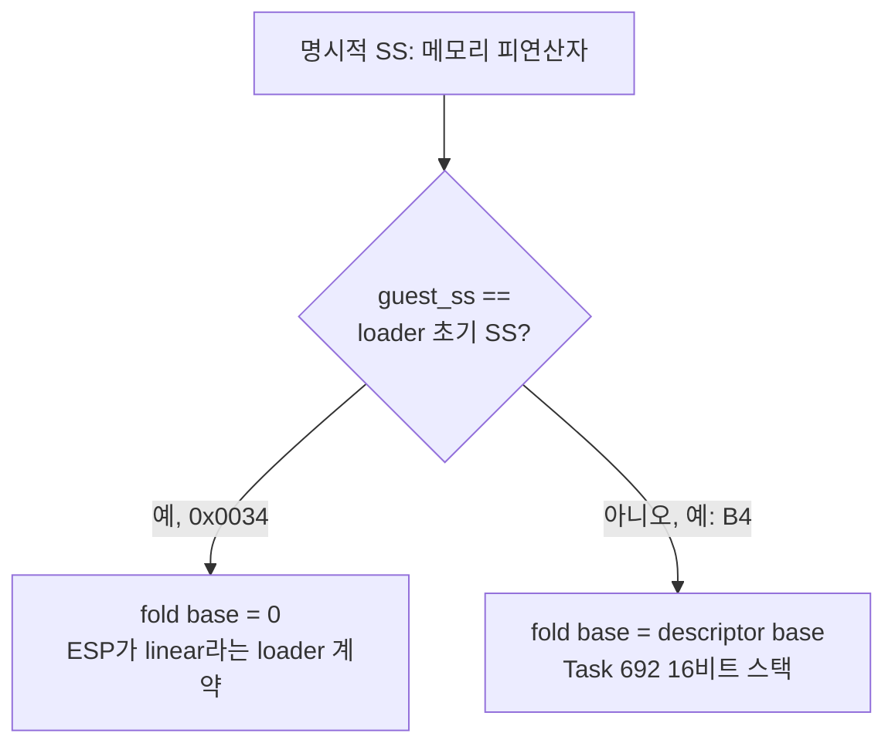

# Task 712 설계 — flat 스택 선택자의 명시적 SS override

## 문제

Task 711이 확인했다. Watcom `lseek`(object 2 오프셋 `0xE44D0`)은 `INT 21h AH=42h`의
결과를 **명시적 `SS:` override**로 스택에 쓰고 `[esp]`로 읽는다.

```text
mov edi,esp
... int 21h ...
mov ss:[edi],ax        ; 66 36 89 07
mov ss:[edi+2],dx      ; 66 36 89 57 02
mov eax,[esp]
```

게스트 SS는 loader가 준 선택자 `0x0034`이고 descriptor base가 object 4의
`0x01110000`(Linux)이다. 그런데 loader가 준 초기 `ESP`는 **linear** 주소다
(`0x0158CC90` = object 4 base + limit). AOT segment-override fold는 그 선택자의
descriptor base를 더하므로 `ss:[edi]`가 `edi + 0x01110000`으로 가고 `[esp]`에
닿지 않는다. `lseek`은 낡은 슬롯 값을 돌려주고, PIU.BIN 로더의 레코드 수가
1,110,269가 되어 Linux에서 읽기가 110만 회를 넘는다.

커밋하지 않은 실험(SS fold base = 0)에서 읽기가 1,110,356 → 91로 떨어졌다
(Win32 122).

## 왜 "SS base를 무조건 0"이 아닌가

게스트가 SS를 실제로 다른 선택자로 바꾸는 경우가 있다. Task 692가 확인했다 —
object 3은 DPMI `AX=0007`로 선택자 `B4`의 base를 `0x0158A83C`로 정하고
`MOV SS,BX; MOV SP,2000`을 실행한다. 이 16비트 스택에서는 descriptor base가
**진짜**이고, mode16 PUSH HLE(`mode16_stack_push.cpp`)도 그 base를 더한다.

## 원칙

**명시적 `SS:` override는 같은 SS 아래의 암묵적 스택 접근과 같은 주소로 가야
한다.** `push`, `pop`, `[esp]`와 `ss:[esp]`는 x86에서 같은 메모리다.

* SS가 loader의 초기 스택 선택자일 때: 32비트 코드의 암묵적 스택 접근은 native로
  실행되고 host의 flat 세그먼트를 쓴다. `ESP`가 linear인 것이 loader 자신의
  계약이다. 그러므로 **실효 base는 0**이다.
* SS가 게스트가 스스로 설정한 다른 선택자일 때(예: `B4`): 암묵적 접근도 그
  descriptor base를 쓴다. **descriptor base를 그대로 쓴다.**



## 설계

* `ThreadContext`에 `flat_stack_selector`를 둔다. 실행 시작 때 `guest_initial_ss`로
  정한다. 이 값은 "이 선택자일 때 `ESP`는 linear"라는 loader의 계약을 이름으로
  남긴 것이다.
* `BuildAotSegmentTable`에서 SS 항목(`seg == 2`)의 선택자가 `flat_stack_selector`와
  같고 정책이 `kNativeFolded`이면 fold `base`를 0으로 둔다. 선택자 0이나 DOS
  low-memory 정책은 건드리지 않는다.
* 이 함수는 fold 표를 만드는 **유일한** 곳이고, Task 289의 descriptor fingerprint
  비교(`aot_resolved_segments`)도 이 함수의 결과끼리 비교한다. 그래서 재해석이
  진동하지 않는다.
* `limit`은 fold에 쓰이지 않고 trace 출력에만 쓰이므로 그대로 둔다.
* descriptor 자체(`selector_table`)는 바꾸지 않는다. DOS allocator
  (`dos_int21_services.cpp`)와 mode16 경로가 그 base를 다른 목적으로 읽기 때문이다.

## 범위 밖

* **DS/ES.** 초기 DS도 `0x0024`(base `0x01010000`)이고 데이터 포인터는 linear라 같은
  문제가 있을 수 있다. 그러나 명시적 `ds:`/`es:` override가 초기 선택자로 실행되는지
  측정하지 않았다. 이 작업은 측정된 SS만 고친다.
* 텍스처 업로드 생략(Task 713).

## Win32 회귀 관찰

이 수정은 **Win32 동작도 바꾼다.** Win32도 같은 fold 표를 쓰고, trace상 PIU.BIN
복원 seek가 쓰레기 offset으로 간다. 수정 뒤에는 PIU.BIN 레코드 테이블이 Win32에서도
처음으로 채워질 것으로 예상한다. 게임 동작이 바뀔 수 있으므로 같은 조건의 수정 전후
Win32 실행을 비교한다.

| 비교 항목 | 확인하는 것 |
|---|---|
| DOS read / seek / open count | PIU.BIN 루프가 35 레코드로 끝나는지, 다른 파일 접근이 바뀌지 않는지 |
| PIU.BIN 복원 seek offset | 쓰레기가 아니라 0인지 |
| Glide gate 열 #1–#96 | ordinal·반환 주소가 수정 전과 같은지, 어디서 달라지는지 |
| 첫 삼각형, 삼각형 #1–#12 | 좌표·텍스처·combine이 같은지 |
| frames / 종료 | 30초 완주, 폴트 없음 |
| core probe | 전체 통과 |

차이가 나면 그것이 회귀인지(원래 동작하던 것이 깨짐), 수정의 정당한 결과인지
(PIU.BIN이 이제 읽힘) 구분해 기록한다.

## 검증 전략

* segment-table 단위 probe: 초기 SS 선택자일 때 SS fold base가 0이고, 다른 SS
  선택자에서는 descriptor base이며, ES/DS 항목은 바뀌지 않는지.
* Linux x64: 10초·30초 실행의 DOS read count, PIU.BIN seek, gate #51.
* Win32 x86: 위 표의 전후 비교.

---

## English

### Problem

Task 711 confirmed that the Watcom `lseek` (object-2 offset `0xE44D0`) stores the
`INT 21h AH=42h` result through an **explicit `SS:` override** and reads it back from
`[esp]`. The guest SS is the loader's selector `0x0034`, whose descriptor base is
object 4's `0x01110000` on Linux, while the loader's initial `ESP` is **linear**
(`0x0158CC90`, object-4 base plus limit). The AOT segment-override fold adds that
descriptor base, so `ss:[edi]` goes to `edi + 0x01110000` and misses `[esp]`;
`lseek` returns a stale slot, the PIU.BIN loader's record count becomes 1,110,269,
and Linux reads more than a million times. An uncommitted experiment folding SS
with base 0 cut the reads from 1,110,356 to 91 (Win32: 122).

### Why not "SS base always 0"

The guest does switch SS to other selectors. Task 692 confirmed that object 3
sets selector `B4`'s base to `0x0158A83C` through DPMI `AX=0007` and runs
`MOV SS,BX; MOV SP,2000`. On that 16-bit stack the descriptor base is **real**,
and the mode16 PUSH HLE adds it too.

### Principle

**An explicit `SS:` override must reach the same address as an implicit stack
access under the same SS** — on x86, `push`, `pop`, `[esp]` and `ss:[esp]` are the
same memory. With the loader's initial stack selector, 32-bit implicit stack
accesses run natively on the host's flat segments and `ESP` is linear by the
loader's own contract, so the **effective base is 0**. With any other selector the
guest set itself (such as `B4`), implicit accesses use its descriptor base, so the
**descriptor base is used**.

### Design

* `ThreadContext` gains `flat_stack_selector`, set to `guest_initial_ss` when
  execution starts; it names the loader's contract that `ESP` is linear under that
  selector.
* In `BuildAotSegmentTable`, when the SS entry (`seg == 2`) has that selector and
  its policy is `kNativeFolded`, the fold `base` becomes 0. Selector 0 and the DOS
  low-memory policy are untouched.
* This function is the **only** place the fold table is built, and Task 289's
  descriptor-fingerprint comparison (`aot_resolved_segments`) compares its outputs
  with each other, so re-resolution cannot oscillate.
* `limit` is used only by a trace print, not by the fold, and is left alone.
* The descriptor itself (`selector_table`) is not changed, because the DOS
  allocator and the mode16 paths read that base for other purposes.

### Out of scope

DS/ES: the initial DS is `0x0024` (base `0x01010000`) with linear data pointers, so
it may share the defect, but whether explicit `ds:`/`es:` overrides execute under
the initial selectors was not measured; this task fixes only the measured SS. The
skipped texture upload is Task 713.

### Observing Win32 regression

This fix **changes Win32 behavior too**: Win32 uses the same fold table, and its
PIU.BIN restore seek also goes to a garbage offset. After the fix the PIU.BIN
record table is expected to be filled on Win32 for the first time, which may change
what the game does. A before/after Win32 run under identical conditions compares
the DOS read/seek/open counts, the PIU.BIN restore-seek offset, Glide gates #1–#96
by ordinal and return address, the first triangle and triangles #1–#12, frames and
termination, and the core probe. Any difference is classified as either a
regression (something that worked now breaks) or a legitimate consequence (PIU.BIN
is now actually read).

### Verification strategy

* A segment-table probe: the SS fold base is 0 under the initial SS selector, the
  descriptor base under another SS selector, and ES/DS entries are unchanged.
* Linux x64: DOS read count, PIU.BIN seeks and gate #51 at 10 and 30 seconds.
* Win32 x86: the before/after comparison above.
